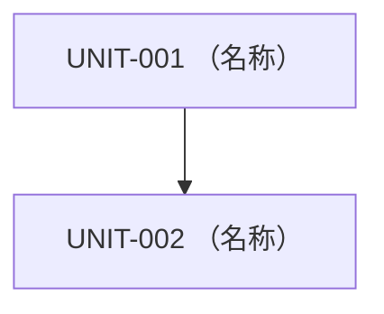
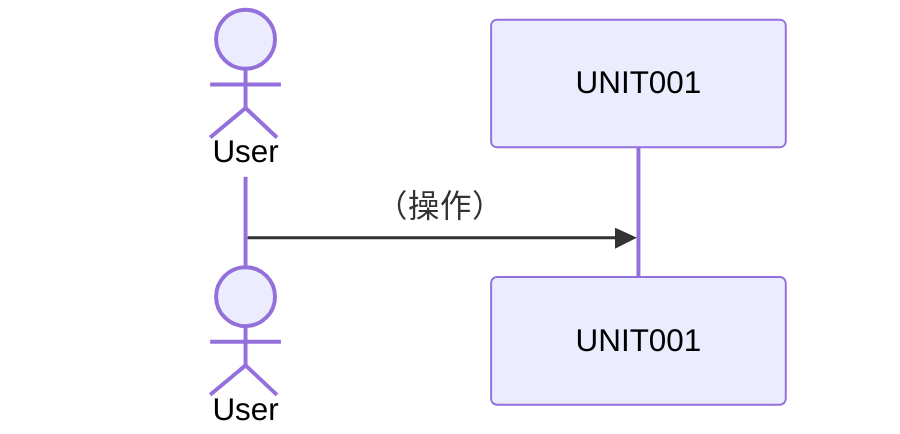

# SW205 ソフトウェアアーキテクチャ設計書

> 【AIへの指示】新規作成時は本スケルトンをコピーし、`（…）` のプレースホルダを埋めること。見出しの追加・削除・順序変更をしないこと。
> `UNIT-EX`・`ADR-EX`（記入例）は理解したら削除すること。文章は `docs/guidelines/asdoq_writing_rules.md`（執筆ルール12箇条）に従って書くこと。

- **文書ID**: SW205
- **プロジェクト名**: （プロジェクト名）
- **版数**: 0.1（承認ごとに更新）
- **最終更新日**: （YYYY-MM-DD）
- **承認状態**: 未承認

## 1. 概要
### 1.1 目的と位置づけ
（この設計書が定義する範囲）

### 1.2 適用範囲
（対象システムの境界）

### 1.3 参照ドキュメント
- `docs/artifacts/SW105_ソフトウェア要求仕様書.md`（版数: ）
- `docs/artifacts/SWP6_ソフトウェア総合テスト仕様書・報告書.md`（版数: ）

### 1.4 用語定義
（SW105の用語定義に追加が必要な技術用語のみ）

## 2. システム構成
### 2.1 システム全体構成
（デバイスや外部システムとの境界。Mermaid図推奨）

### 2.2 主たるソフトウェア要素
（主要な役割と構成要素の概要）

## 3. ソフトウェア構成（静的構造）
### 3.1 ソフトウェア全体構成
（レイヤ構造・MVC等の基本方針と、その採用理由）

### 3.2 機能ユニットの定義

> 【AIへの指示】ユニットは1件ずつ以下のブロック形式で書く。UNIT-IDは `UNIT-001` から連番。
> 対応要求のREQ-IDは、SW105を開いて転記する（記憶から書かない）。
> Agentic Testability必須ルール: ①ロジックとI/Oの分離 ②外部依存（DB・API・時刻）は注入可能に ③1ユニット1責務。

#### UNIT-EX: （記入例）CSVインポートサービス
- **責務**: CSVファイルを検証し、勤怠レコードとしてDBに登録する。
- **対応要求**: REQ-EX
- **公開インターフェース**: `importCsv(file: File): ImportResult`（成功件数を返す。列数不正時は `InvalidCsvError(行番号)` を送出）
- **依存先**: UNIT-002（DBアクセス。リポジトリインターフェース経由で注入）
- **検証条件**: 不正CSV入力時に `InvalidCsvError` が送出され、リポジトリの書き込みが呼ばれないこと。

#### UNIT-001: （ユニット名）
- **責務**: （1文で言い切る）
- **対応要求**: （REQ-ID列挙）
- **公開インターフェース**: （関数/API名、引数と型、戻り値と型、エラー）
- **依存先**: （UNIT-ID。なければ「なし」）
- **検証条件**: （単体で合否判定できる条件）

## 4. 制御方式（動的振る舞いとリソース割り当て）
### 4.1 メモリ構成とレイアウト
（組込み等で必要な場合のみ。不要なら「対象外」）

### 4.2 ソフトウェア制御方式
（並行処理方式、状態遷移方針。主要ユースケースのシーケンス図を1つ以上）

### 4.3 性能見積り
（SW105の性能要求に対する定量的な見積もり）

## 5. 機能ユニット詳細
（各ユニットが外部に公開するインタフェースの詳細。3.2で不足する場合のみ）

## 6. システムで扱うデータ
（共有データ構造、DBスキーマ）

## 7. 例外・異常処理一覧

> 【AIへの指示】SW105の各要求の「異常系」と1対1で対応させる。

| # | 異常ケース | 検知方法 | リカバリ手順 | 対応要求 |
| :--- | :--- | :--- | :--- | :--- |
| 1 | （例: CSV列数不正） | （検証処理） | （中断しエラー表示、データ不変） | REQ-EX |

## 8. その他・特記事項
### 8.1 アーキテクチャ決定記録（ADR）

#### ADR-EX: （記入例）データベースにSQLiteを採用
- **背景**: 単一ユーザーのローカルアプリであり、運用の手間を最小化したい。
- **決定**: SQLiteを採用する。
- **理由**: サーバ不要で配布が容易。想定データ量（1万件以下）で性能要求を満たす。
- **捨てた選択肢**: PostgreSQL（サーバ運用が必要でHotfix規模の案件には過剰）。

#### ADR-001: （決定事項の名前）
- **背景**: / **決定**: / **理由**: / **捨てた選択肢**:

### 8.2 SWP6のTBD解消
| SWP6のTBD項目 | 確定内容 |
| :--- | :--- |
| テストフレームワーク | （例: vitest） |

### 8.3 トレーサビリティ表（REQ ↔ UNIT）

> 【AIへの指示】SW105を開き、すべてのREQ-IDを転記してから対応UNIT-IDを埋める。空欄が残る場合は設計漏れである。

| 要求ID (SW105) | 対応設計ユニットID |
| :--- | :--- |
| REQ-001 | UNIT-001 |
