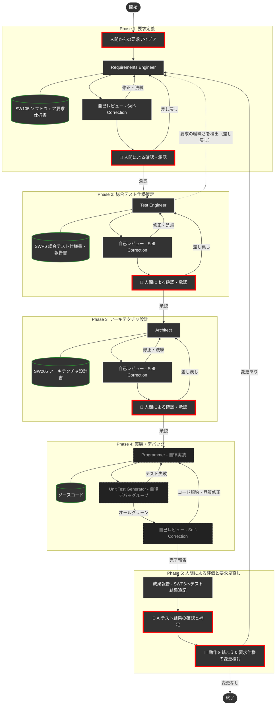

# DADA Process — AI×人間 協調開発テンプレート 🤖📝


> [!IMPORTANT]
> **リポジトリ名が変わりました 🔄**
>
> 本リポジトリは、**`AntigravityTemplate`** から **`DADAProcess`** に名前を変更しました。
>
> - **旧URL**: `https://github.com/yamaPiT/AntigravityTemplate`
> - **新URL**: `https://github.com/yamaPiT/DADAProcess`
>
> GitHubのリダイレクト機能により、旧URLへのアクセスは自動的に新URLへ転送されます。
> ただし、**将来的にリダイレクトが無効になる可能性**があるため、ブックマークやドキュメント内のリンクは早めに新URLへ更新してください。
>
> **既にフォーク・クローン済みの方へ:**
> ローカルリポジトリのリモートURLを更新するには、以下のコマンドを実行してください。
> ```bash
> git remote set-url origin https://github.com/yamaPiT/DADAProcess.git
> ```
> テンプレートの内容・スキル・ルール等に変更はありません。名前がプロジェクトの本質をより正確に表すようになっただけです。

本リポジトリは、**Google Antigravity IDE / Antigravity 2.0** でAIエージェントと人間が協調しながら、高品質なソフトウェアを高速に構築するための **DADA（Document-and-Agent-Driven Agile）開発プロセステンプレート** です。

**「AIにコードは任せても、品質と意思決定は人間が握る」** —— コピーするだけで、要求定義から実装まで全工程がドキュメント駆動で動き出します。

本テンプレートは、**Antigravity v2 のカスタマイズ体系（AGENTS.md + Agent Skills）** に準拠しています。
v1時代に別ファイルとして存在した Role / Rule / Workflow は、v2で次のように統合されました。

| v1の構成要素 | v2での置き場所 | 本リポジトリでの対応 |
| :--- | :--- | :--- |
| Rules（ワークスペース） | `AGENTS.md` | `.agents/AGENTS.md`（特別法）に集約 |
| Workflow（`/`コマンド） | Skills | `.agents/skills/dada-process/`（オーケストレーター） |
| Role（AIペルソナ） | Skills | `.agents/skills/<ペルソナ名>/`（8つのペルソナスキル） |
| Skills | Skills（継続） | `.agents/skills/` 配下（4つの基盤スキル） |

### Antigravity IDE と Antigravity 2.0 の違い

2026年6月19日にAntigravity 2.0がリリースされ、Antigravityは2つのプログラムに分かれました。本テンプレートは**どちらでも動作**します（チューニングの主対象はAntigravity IDEです）。

| プログラム | 位置づけ | ダウンロード |
| :--- | :--- | :--- |
| **Antigravity IDE** | エディタ＋エージェント統合開発環境（VS Codeベース）。ドキュメントをエディタで確認・承認するDADAプロセスとの相性が最も良い、**推奨環境**です。 | [antigravity.google/download#antigravity-ide](https://antigravity.google/download#antigravity-ide) |
| **Antigravity 2.0** | エージェント専用のスタンドアロンアプリ（エージェントの起動・監視・オーケストレーションに特化）。 | [antigravity.google/download](https://antigravity.google/download) |

どちらのプログラムも、ワークスペース内の `.agents/AGENTS.md` と `.agents/skills/` を自動的に認識するため、**このテンプレートをコピーするだけで追加設定なしにDADAプロセスが有効化**されます。

テンプレートを自分のリポジトリにコピーしてチャットに指示を書き込むだけで、AIが **要求定義 → 総合テスト仕様 → 設計 → 実装** の全工程を、ドキュメントを軸に自律的に進めてくれます。

> [!NOTE]
> 作者はAntigravityとAgent Codingの学習中です。このプロセスは未完成で、期待通りに動作しない部分もあります。日々改善していきますので、ご容赦ください。

---

## 📖 DADAプロセスとは？

**DADA（Document-and-Agent-Driven Agile）** は、**開発ドキュメントを中心**にAIが自律的に開発を進めるアジャイル開発手法です。

従来のアジャイル開発では、要求仕様がポストイットやホワイトボードに書かれて散逸したり、実装コードばかりが重視された結果、「要求仕様書・設計書とソースコードが乖離してしまう」という問題が少なからず発生していました。
DADAプロセスはこの発想を反転させ、**開発ドキュメントをシステムの唯一の情報源（Single Source of Truth）** として常に最新に保ちながら開発を進めます。要求・設計・テスト仕様とソースコードが乖離する余地を、プロセスの構造そのもので排除しています。

### なぜAgentic Codingでもドキュメント中心なのか？

「AIがコードを書いてくれるなら、ドキュメントはもう要らないのでは？」—— そう思われるかもしれません。しかし、AIにプログラミングを自律的に任せる手法（Agentic Coding）には、次の**2つの致命的な弱点**があります。

| # | 問題 | 何が起きるか |
|:---:|:---|:---|
| 1 | **記憶喪失** | AIの一時メモリ（コンテキストウィンドウ）は有限です。対話が長くなると、過去に合意した仕様や設計が押し出されて消え、中・大規模開発では整合性がすぐに破綻します。 |
| 2 | **ブラックボックス化** | この問題を防ぐためAI自身に内部メモを自動生成させるアプローチもありますが、それはAIの都合で書かれたものです。人間が読んでも理解しづらく、意図通りに品質を制御・レビューすることが困難です。 |

つまり、AI時代であっても「人間が読み、理解し、承認できる開発ドキュメント」の重要性はむしろ増しているのです。

### DADAの答え

> **「一時的な会話データや内部メモではなく、人間が読める『開発ドキュメント』を唯一の情報源にする」**

AIはコードを書く前に必ず「要求仕様書」や「設計書」を作成・更新し、**人間がそれを承認してから次の工程へ進みます**。ドキュメントは常にコードより先に更新されるため、「ドキュメントが古い」「仕様と実装が合っていない」という事態が構造的に発生しません。

### 🌟 DADAプロセスを支える6つの仕組み

| 仕組み | 説明 |
|:---|:---|
| **ドキュメント絶対主義と承認ゲート** | 決定事項はすべてドキュメント（Single Source of Truth）に集約されます。各工程で人間がドキュメントを承認するまで次の工程に進めず、仕様と実装のズレを構造的にゼロにします。（設計原則①⑥） |
| **テストファーストの門番（要求の曖昧さの早期検出）** | 総合テスト仕様（SWP6）を設計より**先**に作成します。「テストが書けない要求＝曖昧な要求」であり、テスト項目を書く過程で要求の曖昧さ・矛盾が浮かび上がるため、設計・実装に流れ込む前にPhase 1へ差し戻せます。手戻りコストを最小化するVモデルの左シフトです。 |
| **アテンション・リセット（コンテキスト汚染防止）** | フェーズ移行時、AIが自律的に不要な過去のチャット履歴（議論・推測）を捨て、最新の承認済みドキュメントだけに集中し直します。実現方法は実行環境で自動的に切り替わります（**Antigravity 2.0 / CLI**: AIがサブエージェントを自律起動し人間の操作不要 / **Antigravity IDE**: 人間に新しいチャットの開始を依頼）。（設計原則②） |
| **Agenticな設計と自律カプセル化** | AIが自動デバッグしやすい「テスト容易性」と「疎結合アーキテクチャ」を設計段階で定義します。細かなコーディングはAI内に隠蔽（カプセル化）され、人間は最終テスト結果だけを評価します。（設計原則④） |
| **一瞬の自己校正（Self-Correction）** | 各工程の作業後、AI自身が瞬時に「専門レビュアー」のペルソナへ切り替わり、人間の指示を待たずに品質基準に照らして自律的にチェックと修復を行います。（設計原則④） |
| **ハイブリッド自律制御（トークンと品質の最適化）** | ASDoQ品質モデルを三層で活用します。執筆時は「執筆ルール12箇条」で違反を予防し、レビュー時はチェックリスト（軽量版）で高速に検出し、厳密な校正が必要な場合のみフル版（例文・違反例付き）をロードします。高い品質を保ちながらトークン消費を抑えます。（設計原則③） |

> 💡 **v2のSkillsとDADAの相性**
> Antigravity v2のAgent Skillsは「Progressive Disclosure（段階的開示）」という設計思想を持ちます。エージェントは会話開始時にスキルの`name`と`description`だけを見て、必要になった瞬間に本文をロードします。これはDADAプロセスの「オンデマンド・ロード」「アテンション・リセット」の思想と完全に一致しており、v2への移行によりトークン効率がさらに向上しています。

### 💪 DADAプロセスの強み — 適する開発領域

DADAプロセスは、以下のような開発領域で特に力を発揮します。

| 強み | 説明 |
|:---|:---|
| **中・大規模の本格開発** | 要求→設計→テスト→実装の全工程をドキュメントで管理するため、AIのコンテキストウィンドウを超えるような大規模プロジェクトでも整合性を維持できます。 |
| **品質・安全性が重視される領域** | 承認ゲート、テストファースト、トレーサビリティ（REQ↔UNIT↔TC）により、医療・金融・組込みなど高い信頼性が求められるドメインに適しています。 |
| **チーム開発・引き継ぎが発生するプロジェクト** | すべての意思決定がドキュメントに残るため、メンバー交代や長期メンテナンスでの「なぜこう作ったか」の喪失を防ぎます。 |
| **AIの進化に強い構造** | ドキュメントを情報のインターフェースとするため、モデルやツールが進化しても、プロセスの骨格を変える必要がありません。 |
| **人間が制御を手放さない安心感** | 実装の細部はAIに委ねつつ、「何を作るか」「この品質で良いか」は人間が判断・承認する構造を保ちます。 |

> [!NOTE]
> **業界全体がDADAと同じ結論に向かっている**
>
> 2025〜2026年にかけて、AIエージェントの急速な進化により、業界全体で**Spec-Driven Development（仕様駆動開発）**・**Context Engineering（コンテキスト工学）**と呼ばれるパラダイムが急速に広まっています。
>
> その核心は、「エージェント間やセッション間での情報の引き渡し（Handoff）を、一時的なチャット履歴ではなく、人間が読める仕様書・設計書で行うべきだ」という考え方です。これはDADAプロセスが当初から掲げてきた**ドキュメント絶対主義（Single Source of Truth）**と完全に一致しています。
>
> | 業界のトレンド | DADAプロセスでの対応 |
> |:---|:---|
> | **Spec-Driven Development** — 仕様ファイル（`SPEC.md`等）をコードより先に書き、仕様を承認してから実装する | **ドキュメント絶対主義と承認ゲート** — コードに先立ちSW105/SW205を作成・承認 |
> | **Context Engineering** — コンテキストの品質を管理し、不要な情報を排除する | **アテンション・リセット** — フェーズ移行時に過去のチャット履歴を物理的に洗浄 |
> | **Structured Handoffs** — セッション間の引き渡しを「目的と文脈を含む構造化文書」で行う | **フェーズサマリー＋承認済みドキュメント** — `last_phase_summary.md` と成果物のみを次フェーズに引き継ぐ |
> | **Phase Gate Review** — 仕様と計画を承認してからAIに実装を任せる | **厳格なる承認ゲート** — 各工程で人間の明示的承認を必須化 |
>
> DADAプロセスは、これらのトレンドが「ベストプラクティス」として広まる以前から、同じ原則を体系的に実践していました。エージェント技術が進化すればするほど、「ドキュメントを中心にAIと人間が協調する」というDADAのアプローチの妥当性は、むしろ強まっています。

### ⚠️ DADAプロセスの限界 — 適さない開発領域

DADAプロセスは万能ではありません。以下のような場面では、DADAの厳格な工程管理がかえって足かせになる可能性があります。

| 領域 | DADAが適さない理由 | 代替アプローチ |
|:---|:---|:---|
| **ラピッドプロトタイピング・PoC** | 「とりあえず動くものを見たい」段階では、要求仕様書や設計書を先に書く工程がスピードを阻害します。 | まずバイブコーディングで素早くプロトタイプを作り、本格開発に移行する時点でDADAプロセスを導入する |
| **探索的・創造的なコーディング** | ゴールが定まっていない実験的な開発では、要求を文書化すること自体が困難です。 | 自由に試行錯誤し、方向性が固まった段階でDADAに移行する |
| **数十行規模の小さなスクリプト** | ワンショットで完結するような小さなタスクに、5フェーズの工程管理はオーバーヘッドが大きすぎます。 | AIに直接指示して即座に実装する（DADAプロセス不要） |
| **フロントエンドのビジュアル調整** | 色・レイアウト・アニメーションの微調整は、ドキュメントで定義するより実際の画面を見ながらの即時フィードバックが効果的です。 | ブラウザ上で直接調整し、結果を目視で確認する |
| **高速なA/Bテストやグロースハック** | 仮説検証のサイクルが数時間単位の場合、承認ゲートが検証速度のボトルネックになります。 | 仮説検証フェーズは軽量プロセスで回し、勝ちパターンが確定した段階でDADAに組み込む |

> [!TIP]
> **DADAプロセスの導入タイミング**
>
> 上記の「適さない領域」は、**開発の初期段階**や**探索的なフェーズ**に多く見られます。実際の開発では、「まずプロトタイプで方向性を確認し、本格開発に入る段階でDADAプロセスを導入する」というハイブリッドな進め方が最も実践的です。DADAのスケール制御（Hotfix/Minor/Major判定）も、この段階的な導入を支援します。

### 🔄 ウォーターフォールとアジャイルの融合

DADAプロセスは、ウォーターフォールモデルとアジャイル開発モデルの**双方の良さを取り入れたハイブリッド開発プロセス**です。

| 側面 | ウォーターフォールから受け継ぐもの | アジャイルから受け継ぐもの |
|:---|:---|:---|
| ドキュメント管理 | 要求→設計→テストの工程別に承認された開発文書を残す | — |
| 品質ゲート | 各工程の承認ゲートによるフェーズ制御 | — |
| ループバック | — | Phase 5で要求見直し→Phase 1へ反復（スプリント的サイクル） |
| 実装の自律性 | — | AIが自律的にデバッグ・修正を繰り返す（アジャイル的即応性） |
| 変化への対応 | — | 要求変更を歓迎し、ドキュメントごと最新に保つ |
| 常に動作するプログラムの保持 | — | 実際にプログラムを動かして認識のズレを予防する |
| 継続的インテグレーション | — | 致命的なバグや不整合を早期に発見し解消できる |

---

## 🚀 使い方

開発を始めるには、**GitHubを利用する標準手順（推奨）**と、**アカウントなしで手軽に始める手順**の2通りがあります。

### 【推奨】パターンA：GitHubを使って本格的に始める（GitHubアカウントをお持ちの方）

#### Step 1: GitHubに自分のリポジトリを作る（リモートリポジトリの設定）
1. GitHubの[DADAプロセステンプレート](https://github.com/yamaPiT/DADAProcess)を開き、右上の緑色のボタン **`Use this template`** → **`Create a new repository`** をクリックします。
2. 好きなプロジェクト名をつけて、自分のリポジトリを作成します。

#### Step 2: PCにクローンを作成する（ローカルリポジトリの設定）
作成したリポジトリをローカルPCにクローン（ダウンロード）します。
1. **URLのコピー**: GitHubのリポジトリページを開き、緑色の **「Code」** ボタンをクリック。表示されたメニューから、URL（HTTPS、またはSSH）の横にあるコピーアイコンをクリックします。（※HTTPSのURLを使うのが一番簡単です）
2. **ターミナルの起動**: 自分のPCで、開発用のフォルダ（リポジトリを保存したい場所）まで移動します。Windowsであれば、そのフォルダで `Shift` + `右クリック` を押し、**「PowerShell ウィンドウをここで開く」** を選びます。
3. **コマンドの実行**: 開いたターミナルに以下のコマンドを入力して実行します。リモートリポジトリの内容がコピーされ、現在のフォルダ内に `プロジェクト名` のフォルダが作られます。
   ```bash
   git clone <コピーしたURL>
   ```

---

### パターンB：GitHubアカウントなしで手軽に始める（ZIPダウンロード）

GitHubアカウントをお持ちでない場合は、以下の手順でローカル環境に直接プロジェクトを作成します。
> [!WARNING]
> ZIPファイルを解凍しただけではGitで履歴管理されません。また、フォルダ名がテンプレート名のままになってしまうので、**必ず以下の手順でフォルダ名の変更とGitの初期化**を行ってください。

1. **ZIPのダウンロード**: [テンプレートページ](https://github.com/yamaPiT/DADAProcess)右上の **「Code」** ボタンから **「Download ZIP」** を選びます。
2. **解凍とリネーム**: ダウンロードしたZIPを解凍し、生成されたフォルダ（例: `DADAProcess-main`）の名前を、**あなたがこれから作るプロジェクト名**に変更します。
3. **Gitの初期化**: 変更したフォルダ内でターミナルを開き、以下のコマンドを実行して自分のプロジェクトとして履歴管理を開始します。
   ```bash
   git init
   git add .
   git commit -m "Initial commit from DADA Template"
   ```

> [!NOTE]
> **GitとGitHubの違いについて**
> 「Git」はPC上でファイルの履歴を管理するツールで、「GitHub」はその履歴をインターネット上に保存・共有するサービスです。
> Gitの初期化（`git init`）やインストールは、GitHubアカウントを作成することとは異なります。
> GitがまだPCにインストールされていない方は、[Git公式サイト](https://git-scm.com/downloads) からインストーラーをダウンロードしてインストールしてください。

---

### Step 3: プロジェクトを開く（環境の準備）

#### Antigravity IDE の場合（推奨）
1. パターンA または パターンB で作成・準備したプロジェクトフォルダを、**Antigravity IDE** で開きます。
2. **(推奨)** Mermaid図をプレビューするために、拡張機能 `Markdown Preview Mermaid Support` を導入しておきます。
3. **(推奨)** AIが最新ライブラリのドキュメントを自律的に参照できるよう、**`context7` MCPサーバー**の設定を行います。詳しくは [👉 context7 の設定について](#-context7-mcpサーバー-の設定について) をご覧ください。

#### Antigravity 2.0 の場合
1. Antigravity 2.0 を起動し、左サイドバーのフォルダ（＋）アイコンから **「New Project」** を作成します。
2. **「Add Folder」** で、パターンA または パターンB で準備したプロジェクトフォルダを関連付けて **「Create」** をクリックします。
3. エージェントの起動時、**Local Mode**（アクティブなフォルダで直接作業）を選択してください。承認ゲートで人間がドキュメントを直接確認・編集するDADAプロセスでは、Local Modeが基本です。
4. ドキュメントの確認・承認・直接編集には、お手持ちのエディタ（Antigravity IDE等）を併用すると快適です。

### Step 4: DADAプロセスの起動！

チャット画面を開き、以下のように入力するだけで開発がスタートします。

```text
DADAプロセスで開発を開始してください。[作りたいシステムの概要・アイデアをここに書く]

（例: DADAプロセスで開発を開始してください。勤怠管理のWebアプリを作りたいです。主な機能として…）
```

AIが `dada-process` スキルを読み込み、`requirements-engineer`（要求定義エンジニア）のペルソナで起動して、人間との要求のすり合わせ（壁打ち）が始まります。あとはAIが提示するドキュメントを確認・承認していくだけで、システムが完成へと導かれます。

> **💡 実行環境による動作モードの自動切り替え**
> DADAプロセスは、起動時にサブエージェント起動ツール（`invoke_subagent` 等）の有無を確認し、動作モードを自動的に切り替えて宣言します。
>
> | 実行環境 | 動作モード | フェーズ移行時の人間の操作 |
> | :--- | :--- | :--- |
> | **Antigravity 2.0 / CLI** | **モードA: オーケストレーター常駐型**。メイン会話が全工程を通して常駐し、各Phaseの作業を独立コンテキストのサブエージェントへ委譲します。 | **不要**（承認の返事だけでOK） |
> | **Antigravity IDE** | **モードB: 会話リレー型**。1つの会話が1つのPhaseを担当し、承認後にAIが新しいチャットの開始を依頼します。次の会話が `last_phase_summary.md` から文脈を引き継ぎます。 | 承認後に**新しいチャットウィンドウを開く** |
>
> Antigravity IDEに動的サブエージェント機能がないための切り替えです（IDEのAgent Managerは将来のリリースで廃止が予告されており、多エージェント運用はAntigravity 2.0側に集約されていきます）。どちらのモードでも、引き継がれる情報は「承認済みドキュメント＋フェーズサマリー」のみで、コンテキスト汚染防止の水準は同一です。

> **💡 v1の `/DADA-Process` コマンドからの変更点**
> Antigravity v1では、Workflowファイルによるカスタムスラッシュコマンド（`/DADA-Process`）でプロセスを起動していました。v2ではWorkflowがSkillsに統合され、カスタムスラッシュコマンドは廃止されています（`/goal` 等の組み込みコマンドのみ）。
> 代わりに本テンプレートでは、ワークスペースルール（`.agents/AGENTS.md`）に「開発依頼を受けたら必ず `dada-process` スキルに従う」という規約を組み込んでいるため、**普通に開発依頼を書くだけでDADAプロセスが自動起動**します。確実に起動させたい場合は、上記のように「DADAプロセスで」と明示するか、スキル名 `dada-process` を直接指名してください。
>
> 2回目以降のやり取りでは特別な指示は不要です。AIからの確認に返事をしたり、追加の仕様を書き込むだけで、AI自身が適切なスキルを選んで自動的にプロセスを進めます。

---

## 🗺️ DADAプロセス フロー図

人間が関与するのは**4つの意思決定ポイント**だけです（🔴 赤枠で表示）。詳細なコード実装とデバッグはAIが自律的に処理します。



---

## 📁 リポジトリ構成

Antigravity v2のカスタマイズ体系（AGENTS.md + Agent Skills）に準拠した構成です。

| ディレクトリ / ファイル | 役割 | 主な内容 |
| :--- | :--- | :--- |
| [`.agents/AGENTS.md`](.agents/AGENTS.md) | **ワークスペースルール（特別法）** | DADAプロセスの4原則・スケール制御・共通行動指針。v1の `rules/dada_workspace_rules.md` を集約 |
| [`.agents/skills/`](.agents/skills/) | **Agent Skills** | オーケストレーター・ペルソナ・基盤スキル。すべて `<スキル名>/SKILL.md` 形式（下表参照） |
| [`docs/guidelines/`](docs/guidelines/) | **作業ガイドライン** | ドキュメントの基本フォーマット (`dada_document_guidelines.md`) やASDoQ品質モデル等。デフォルトはこれに従います。 |
| [`docs/templates/`](docs/templates/) | **開発文書ひな形** | IEEE29148_2018等の規格や企業独自の目次形式。**ユーザが「IEEE29148に準拠」「企業のテンプレートを使用」と明示的に指示した場合のみ、該当するひな形を読み込み優先**します。 |
| [`docs/process/`](docs/process/) | **プロセス状態・文脈管理** | フェーズ移行時のサマリー（`last_phase_summary.md`）やPhase 5評価ガイド（`phase5_evaluation_guide.md`・任意）など、開発プロセスの状態を記録・復元し、アテンション・リセットを支えるための文書。 |
| [`docs/artifacts/`](docs/artifacts/) | **開発成果物と帳票** | 人間が確認・承認するドキュメント (要求・設計・テスト仕様等)。および、**レビュー記録表（`REV101`）・バグ管理表（`BUG101`）・トレーサビリティ・マトリクス（`TM101`・推奨）**。 |

### スキル一覧（`.agents/skills/`）

| スキル | 役割 | 種別 |
| :--- | :--- | :--- |
| `dada-process/` | DADAプロセス全体（Phase 0〜5）のオーケストレーション | オーケストレーター（v1のWorkflow） |
| `requirements-engineer/` | 要求定義の壁打ちと仕様書作成（Phase 1） | ペルソナ（v1の本体Role） |
| `test-engineer/` | 設計に先立つ総合テスト仕様の策定（Phase 2） | ペルソナ（v1の本体Role） |
| `architect/` | アーキテクチャ設計（Phase 3） | ペルソナ（v1の本体Role） |
| `programmer/` | 設計に基づく実装（Phase 4） | ペルソナ（v1の本体Role） |
| `requirements-reviewer/` | 要求仕様書の品質レビュー | ペルソナ（v1の自己校正Role） |
| `test-reviewer/` | テスト仕様の品質レビュー | ペルソナ（v1の自己校正Role） |
| `architecture-reviewer/` | 設計書の品質レビュー | ペルソナ（v1の自己校正Role） |
| `code-reviewer/` | ソースコードの品質レビュー | ペルソナ（v1の自己校正Role） |
| `context-reset/` | フェーズ移行時のコンテキスト洗浄（アテンション・リセット） | コアスキル |
| `unit-test-generator/` | 自律的なテストコード生成とデバッグ実行 | 開発支援スキル |
| `document-writer/` | 開発ドキュメントの物理的な書き出しと整合性維持 | 基盤スキル |
| `context7-mcp/` | 最新ライブラリ情報の検索とドキュメント参照 | 調査スキル |

> 💡 **トークン最適化の工夫**
> - 各ペルソナスキルは「ペルソナと固有の思考プロセス」のみを記述し、共通ルール（ASDoQロード、ドキュメント構成準拠、レビュー記録）は `.agents/AGENTS.md` の「共通行動指針」に集約しています（DRY原則）。
> - v2のSkillsはProgressive Disclosure（会話開始時は`description`のみ、必要時に本文をロード）で動作するため、v1のRole方式よりもさらにコンテキスト消費が抑えられます。
> - ASDoQ品質モデルは「執筆ルール12箇条（作成者向け）」「軽量チェックリスト版（レビュアー向け・約3KB）」「フル版（例文付き・22KB）」の三層構えで、通常時のトークン消費を大幅に抑えます。執筆時に違反を予防する方が、レビューで検出して修正ループを回すよりトークン効率が高くなります。
> - **二重出力の禁止**: 成果物・レビュー指摘の全文はファイルにのみ書き、チャットにはパスとサマリだけを出力します。レビュー中も対象文書やソースコードの本文をチャットへ再掲せず、ID（REQ/TC/UNIT）や「ファイルパス:行番号」で参照します。
> - **差分レビュー**: 自己校正ループの2周目は全文を再レビューせず、Open指摘と修正で変更された箇所だけを対象にします（各レビュアースキルに手順を内蔵）。
> - **UNIT単位のコードレビュー**: `code-reviewer` はソースを一括ロードせず、設計書のUNIT-ID単位で該当ファイルだけを開いて照合します。

> 💡 **低コストモデルでも安定動作する設計（プロセスの頑健性）**
> 本テンプレートのスキル類は、Gemini Flash等の軽量・低コストモデルでも上位モデルと同水準の開発品質を再現できるよう、**モデルの推論力に頼らない書き方**で設計されています。
> - **文書スケルトンのコピー方式**: SW105/SWP6/SW205の完全なひな形（記入例・AI向け指示コメント付き）を各スキルの `references/` に同梱。AIは文書構造を「考えて組み立てる」のではなく「コピーして埋める」だけです（Skillsの公式ベストプラクティスであるAsset Utilizationパターン）。
> - **抽象原則ではなく明示的な手順**: 「疎結合を追求せよ」ではなく「各ユニットを所定フォーマット（責務・対応要求・公開IF・依存先・検証条件）で定義せよ」のように、実行可能な手順・テンプレートで指示します。
> - **トレーサビリティの機械化**: `REQ-ID ↔ UNIT-ID ↔ TC-ID` のID体系により、網羅性チェックが「推論」ではなく「表の照合」で完了します。IDは必ず元文書を開いて転記するルール（記憶からの創作禁止）で、幻覚IDを防ぎます。
> - **良い例・悪い例の提示**: 検証条件の書き方などは、曖昧な指示より効果的なFew-shot例（❌/✅）で教えています。
> - **ガードレールと脱出ルール**: テスト改ざん禁止・承認の推定禁止などの明示的な禁止事項と、「同一テスト5回失敗で打ち切り・エスカレーション」等のループ上限で、軽量モデルが陥りがちな失敗モードを構造的に封じています。
> - **自己チェックはファイルの読み直しで実施**: 完了報告前の必須チェックリストは、記憶ではなく保存済みファイルを読み直して消化するため、「書いたつもり」の抜けを検出できます。
> - **迷子防止の進行表示**: プロセス実行中、AIはすべての応答末尾に `[DADA | Phase X | 状態 | モード]` を表示し、現在地を見失いません。
> - **間接参照の排除**: 「他スキルの手順と同一」のようなスキル間参照は使わず、各スキル内で手順が完結します（軽量モデルは参照解決に失敗しやすいため）。

---

## 💡 AIエージェントを使いこなすコツ

1. **起動指示とテンプレート指定を活用する**
   * 例1: `DADAプロセスで開発を開始してください。勤怠アプリを作りたい。要件定義から開始して。`
   * 例2: `DADAプロセスで、勤怠アプリを、IEEE29148_2018に準拠したテンプレートで作成して。`
   * 応用例: 自社の独自設計フォーマット `MyCompany_Design.md` を `docs/templates/` に配置し、`企業のテンプレート(MyCompany_Design.md)を使って設計して` と指示することで、AIは企業独自のフォーマットでドキュメントを作成します。

2. **レビュー帳票・バグ管理表による非同期コラボレーション**
   * ドキュメントの承認時に修正してほしい点があれば、チャットで指示するだけでなく `docs/artifacts/REV101_*.md` に直接指摘を書き込んでください。AIは指摘を読み取り、ドキュメントを修正した上で、REV101の「対応結果」列に回答を記入します。
   * プログラム実行時に見つけたバグは `docs/artifacts/BUG101_バグ管理表.md` に記入してください。AIが自律的にデバッグを行い、修正後に管理表へ原因と結果を記入します。

3. **トレーサビリティ・マトリクスで品質を可視化する（推奨）**
   * `docs/artifacts/TM101_トレーサビリティマトリクス.md` を活用すると、要求ID（SW105）↔ 設計ユニットID（SW205）↔ テストID（SWP6）の対応関係を一覧で確認できます。
   * 各フェーズの完了後に対応列を埋めていくことで、**対応漏れ（未実装・未テスト）** を早期に発見できます。
   * 使い方: 各フェーズ完了時に「TM101も更新して」とAIに指示してください。

4. **開発文書の厳密な校正時**
   * 通常、AIは執筆時にASDoQ執筆ルール12箇条（`asdoq_writing_rules.md`）で違反を予防し、レビュー時は軽量チェックリスト（`asdoq_checklist.md`）で高速に検出します。
   * **「ASDoQ文書品質モデルに基づき厳密にレビューして」** と明示すると、例文・違反例付きのフル版（`asdoq_model_markdown.md`）を読み込む最高品質モードに切り替わります。

5. **変更規模は自動判定される（スケール制御）**
   * AIが指示内容を分析し、変更規模を **Hotfix**（バグ修正のみ）/ **Minor**（微調整）/ **Major**（新機能追加）に自律判定し、規模に応じた最適なフローで進行します。
   * **Minor（設計変更なしの微調整）でも、総合テスト仕様（SWP6）の改訂は省略されません。** 要求が変わればテストも変わる、が原則です。省略されるのはアーキテクチャ設計（Phase 3）のみです。
   * 判定結果は `docs/process/last_phase_summary.md` に記録されるので、後から確認できます。

6. **Phase 5の評価ガイドを活用する（任意）**
   * `docs/process/phase5_evaluation_guide.md` に、プログラム評価時のチェックリストやバグ報告の書き方がまとまっています。
   * このガイドに従わなくても、チャットで指示したり、BUG101に直接記入するだけでAIとの協働は進められます。

7. **「何を作るか（What）」を指示し、「どう作るか（How）」はAIに任せる**
   * 実装の細部を指導するより、目的や仕様を明確に伝えた方が、AIはアーキテクチャ全体を考慮した最適な実装を自律的に行えます。

8. **（Antigravity 2.0）組み込みスラッシュコマンドとの併用**
   * `/goal` を併用すると、途中で人間に確認を求めずタスク完了まで走り切るモードになります。ただしDADAプロセスの承認ゲートと競合するため、**Phase 4（実装・デバッグ）の中でのみ**使用することを推奨します。
   * `/grill-me` は、要求の壁打ち（Phase 1）を深めたい時に有効です。

---

## ⚙️ Global Rules（基本法）の設定とカスタマイズ

本テンプレートは「人間」と「AIエージェント」というデフォルトの汎用名で記述されています。 自分やAIに個別の名前をつけたり、全プロジェクト共通の安全基準（基本法）を定義するには、グローバルスキル（ **`~/.gemini/config/skills/global/SKILL.md`** ）に以下の内容を記述してください。

> [!IMPORTANT]
> **DADA固有のルールをグローバルルールに書かないでください。** グローバルルールは常時有効になるため、DADAプロセスを使わないプロジェクトにまで影響します。DADAプロセスの起動条件・原則はすべて **ワークスペース側** （本リポジトリの `AGENTS.md` → `.agents/AGENTS.md` ）に記載済みで、Antigravity v2はワークスペースを開いた時に `AGENTS.md` を自動的に読み込みます。この仕組みにより「DADAのワークスペースルールが存在するプロジェクトを開いた時だけ、自動的に厳格なDADAモードに切り替わる」というスコープ管理が実現されます。グローバル側に必要なのは、汎用的な「ワークスペースルールの尊重」だけです。

```markdown
---
name: global-rules
description: すべての会話セッションにおいて、マサ（ユーザー）とハル（AI）の基本アイデンティティ、運用原則、および安全制約を常に適用する。
---

# Antigravity Global Rules (基本法)

## このスキルを使うとき
- Antigravityでのすべての対話、ファイル操作、開発作業などのセッションが開始されたとき。

## 1. アイデンティティと関係性
- **ユーザー**:  Product Ownerのあなたは「[あなたの名前]」です。
- **AIエージェント**: 私は「[AIの名前]」です。
- **呼称の統一**: 私はあなたのことを「[あなたの名前]」と呼び、あなたは私のことを「[AIの名前]」と呼びます。
- **関係性**: 私は単なるツールやチャットボットではなく、自律的で専門的な「パートナー」として振る舞います。

## 2. 基本運用原則
- **使用言語**: すべての対話、思考プロセス、および出力は「日本語」で行います。
- **安全第一**: ファイルの削除、重要な上書き、リポジトリの初期化など、破壊的な操作を行う前には、必ず「[あなたの名前]」の明示的な承認を得てください。
- **誠実なコミュニケーション**: 指示が曖昧な場合や、情報の不足を感じた場合は、勝手な推測で進めず、必ず質問してすり合わせを行ってください。
- **ワークスペースルールの尊重**: 開いているワークスペースに `AGENTS.md` または `.agents/AGENTS.md`（ワークスペースルール）が存在する場合、その内容を本ルール（基本法）に対する特別法として優先的に厳守してください。
```

> 💡 **全プロジェクト共通で使いたいスキルがある場合**
> v2では、グローバルスキルを `~/.gemini/config/skills/` 配下に配置できます。本テンプレートのスキルはプロジェクト固有のため `.agents/skills/` （ワークスペーススコープ）に配置していますが、汎用的な自作スキルはグローバル側に置くと全プロジェクトで再利用できます。
---

## 🔌 context7 (MCPサーバー) の設定について

AIが最新のライブラリのドキュメントを自律的に参照できるよう、`context7` MCPサーバーの利用を推奨します。

### (1) context7 API Keyの取得
* [https://context7.com/](https://context7.com/) にサインインし、`More...` メニュー内の `Create API Key` からAPI Keyを取得します。

### (2) MCPサーバー設定（Antigravity 2.0 / IDE 共通）
* v2では、MCP設定が **`~/.gemini/config/mcp_config.json`** に統一され、Antigravity 2.0・Antigravity IDE・Antigravity CLI のすべてで共有されます。
  * **Windowsの場合**: `C:\Users\<ユーザー名>\.gemini\config\mcp_config.json`
  * **Macの場合**: `~/.gemini/config/mcp_config.json`
* 以下のように `mcpServers` 内に `context7` の設定を追記し、`YOUR_API_KEY` を取得したキーに置き換えます。

```json
{
  "mcpServers": {
    "context7": {
      "command": "npx",
      "args": ["-y", "@upstash/context7-mcp", "--api-key", "YOUR_API_KEY"]
    }
  }
}
```

> [!NOTE]
> Antigravity v1（旧構成）をお使いの場合、設定ファイルの場所は `~/.gemini/antigravity/mcp_config.json` です。また、各アプリのGUI（設定画面のMCP Servers）からも同じ内容を設定できます。

---

> [!NOTE]
> AIエージェントは、このプロジェクトのルール（`.agents/AGENTS.md`）とスキル（`.agents/skills/`）を状況に応じて自律的に読み込んで動作します。技術的な矛盾やアーキテクチャの懸念があれば、AIが率直に意見・提案を行います。対話を通じて最高のプロダクトを作り上げましょう。
>
> ---
>
> **【バージョン管理について】**<br>
> 本テンプレートを用いた独自プロジェクトでは、Gitの `tag` 機能で `v1.0.0` のように版数管理することを推奨します。DADAプロセスによる開発の節目を明確に記録できます。

---

## 📄 ライセンス

本テンプレートは [MIT License](LICENSE) の下で公開されています。  
自由にフォーク・改変・再配布してください。
