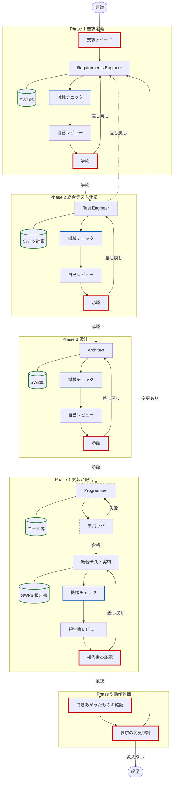
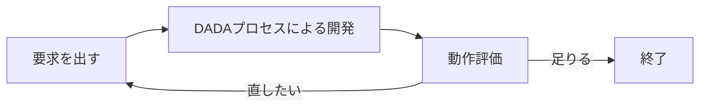
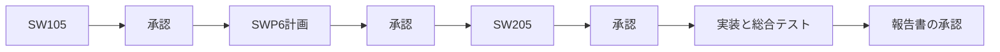
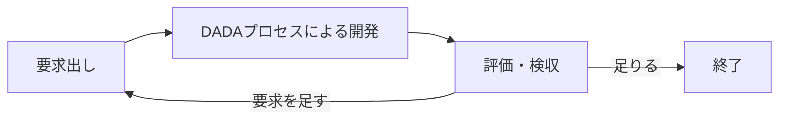
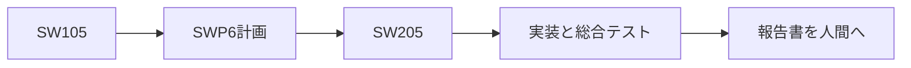

# DADA Process — AI×人間 協調開発テンプレート 🤖📝


## 📋 このREADMEの構成

使う順に並んでいます。初めてなら、**はじめに → 最短の始め方 → 使い方 → 4つの使い方** まで読めば始められます。

| 章 | 読むと分かること |
| :--- | :--- |
| [👋 はじめに](#はじめに) | このテンプレートは何か。2つの進め方 |
| [⚡ 最短の始め方](#最短の始め方) | 今すぐ始める3ステップ |
| [🚀 使い方](#使い方) | リポジトリの用意、アプリの開き方、開発の起動 |
| [💻 モードX と モードY](#モードx-と-モードy) | 開いたアプリで工程の切れ目がどう変わるか |
| [🔧 Antigravityの設定](#antigravityの設定) | 名前・安全基準、context7（全プロジェクト共通） |
| [🎯 4つの使い方](#4つの使い方何を作るか--どう進めるか) | 何を作るか × どう進めるか |
| [📖 DADAプロセスとは？](#dadaプロセスとは) | なぜこの進め方なのか |
| [📁 リポジトリ構成](#リポジトリ構成) | フォルダの意味 |
| [💡 使いこなすコツ](#aiエージェントを使いこなすコツ) | 起動のコツ、帳票、点検ツール |
| [📄 ライセンス](#ライセンス) | MIT License |

---

## 👋 はじめに

本リポジトリは、**Google Antigravity 2.0**（エージェント専用アプリ）および **Antigravity CLI** を主対象に、AIエージェントと人間が協調しながら、高品質なソフトウェアを高速に構築するための **DADA（Document-and-Agent-Driven Agile）開発プロセステンプレート** です。Antigravity IDE でも動きますが、IDE はできたファイルの確認と短い修正のための併用を想定しています。

**「AIに実装は任せても、何を作るかと最終的な良し悪しは人間が握る」** —— このテンプレートを使うだけで、要求定義から実装まで全工程がドキュメント駆動で動き出します。区切りごとに確認するか、完成まで任せるかは、使い方で選べます。

DADAプロセスは、IPAのESPR（[ESPR Ver.2.0：【改訂版】 組込みソフトウェア向け開発プロセスガイド](https://www.ipa.go.jp/archive/publish/secbooks20071119.html)）をベースに開発しています。DADAに従うと「要求仕様書」「アーキテクチャ設計書」「総合テスト仕様書/報告書」がAIによって作成され、各工程をAIと人間が協同で開発していきます。DADAプロセスは、MIT License で公開しており、各社の開発プロセスにカスタマイズしていただくことも可能です。

DADAプロセスは、**人間とAIによる協同開発プロセス**です。進め方は次の2型です。

| 名称 | 略称 | 内容 |
| :--- | :--- | :--- |
| **DADAプロセス承認ゲート型** | 承認ゲート型 | 要所に承認ゲートを設ける。人間の承認が得られた場合に、AIは処理を進める |
| **DADAプロセス自律型** | 自律型 | 要求を受けたあと、AIが自律動作をして開発しきる |

どちらでも、できあがったものを踏まえて、人間がさらに開発Loopを回す場合があります。

この2つの型で開発できる成果物は2種類（合計4通り）あります。1つはC や TypeScript などのプログラム言語で書くソースコード、もう1つは自然言語で書くエージェント定義（AIへの手順書と道具）です。

> [!NOTE]
> 作者はAntigravityとAgent Codingの学習中です。このプロセスは未完成で、期待通りに動作しない部分もあります。日々改善していきますので、ご容赦ください。

### ⚡ 最短の始め方

1. [GitHubのテンプレート](https://github.com/yamaPiT/DADAProcess) から自分のリポジトリを作るか、ZIPを解凍する（詳細はすぐ下の [使い方](#使い方)）。
2. **Antigravity 2.0** でそのフォルダを開きます。書類の確認は、好きなエディタを併用してかまいません。
3. チャットに `DADAプロセスで開発を開始してください。` と、作りたいものの概要を書く。

それ以上の指示を与えなければ、[4つの使い方](#4つの使い方何を作るか--どう進めるか) の **P承認ゲート**で、プログラム開発が始まります。

| 次に知りたいこと | 見る場所 |
| :--- | :--- |
| リポジトリの作り方・アプリの開き方 | すぐ下の [使い方](#使い方) |
| 開いたアプリで動き方がどう変わるか | [モードX と モードY](#モードx-と-モードy) |
| 名前・安全基準、context7（Antigravity共通） | [Antigravityの設定](#antigravityの設定) |
| 4つの使い方のどれか決める | [4つの使い方](#4つの使い方何を作るか--どう進めるか) |
| DADAプロセスの仕組み | [DADAプロセスとは？](#dadaプロセスとは) |

---

## 🚀 使い方

開発を始めるには、**GitHubで始める標準のやり方（推奨）**と、**アカウントなしでZIPから始めるやり方**の2通りがあります。ここでの Step 1 / Step 2 は手順の番号であり、あとの章の **P承認ゲート / A承認ゲート** や、この章の **モードX / モードY** とは無関係です。

| Step | 内容 |
| :--- | :--- |
| 1〜2 | リポジトリを用意する（GitHub 推奨、または ZIP） |
| 3 | プロジェクトを開く（ここでモードX / モードYが決まる） |
| 4 | チャットで DADAプロセスを起動する |

### GitHubで始める（推奨）

#### Step 1: GitHubに自分のリポジトリを作る（リモートリポジトリの設定）
1. GitHubの[DADAプロセステンプレート](https://github.com/yamaPiT/DADAProcess)を開き、右上の緑色のボタン **`Use this template`** → **`Create a new repository`** をクリックします。
2. 好きなプロジェクト名をつけて、自分のリポジトリを作成します。

#### Step 2: PCにクローンを作成する（ローカルリポジトリの設定）
作成したリポジトリをローカルPCにクローン（ダウンロード）します。
1. **URLのコピー**: GitHubのリポジトリページを開き、緑色の **「Code」** ボタンをクリック。表示されたメニューから、URL（HTTPS、またはSSH）の横にあるコピーアイコンをクリックします。（※HTTPSのURLを使うのが一番簡単です）
2. **ターミナルの起動**: 自分のPCで、開発用のフォルダ（リポジトリを保存したい場所）まで移動します。Windowsであれば、そのフォルダで `Shift` + `右クリック` を押し、**「PowerShell ウィンドウをここで開く」** を選びます。
3. **コマンドの実行**: 開いたターミナルに以下のコマンドを入力して実行します。リモートリポジトリの内容がコピーされ、現在のフォルダ内に `プロジェクト名` のフォルダが作られます。
   ```bash
   git clone <コピーしたURL>
   ```

---

### ZIPで始める

GitHubアカウントをお持ちでない場合は、以下の手順でローカル環境に直接プロジェクトを作成します。
> [!WARNING]
> ZIPファイルを解凍しただけではGitで履歴管理されません。また、フォルダ名がテンプレート名のままになってしまうので、**必ず以下の手順でフォルダ名の変更とGitの初期化**を行ってください。

1. **ZIPのダウンロード**: [テンプレートページ](https://github.com/yamaPiT/DADAProcess)右上の **「Code」** ボタンから **「Download ZIP」** を選びます。
2. **解凍とリネーム**: ダウンロードしたZIPを解凍し、生成されたフォルダ（例: `DADAProcess-main`）の名前を、**あなたがこれから作るプロジェクト名**に変更します。
3. **Gitの初期化**: 変更したフォルダ内でターミナルを開き、以下のコマンドを実行して自分のプロジェクトとして履歴管理を開始します。
   ```bash
   git init
   git add .
   git commit -m "Initial commit from DADA Template"
   ```

> [!NOTE]
> **GitとGitHubの違いについて**
> 「Git」はPC上でファイルの履歴を管理するツールで、「GitHub」はその履歴をインターネット上に保存・共有するサービスです。
> Gitの初期化（`git init`）やインストールは、GitHubアカウントを作成することとは異なります。
> GitがまだPCにインストールされていない方は、[Git公式サイト](https://git-scm.com/downloads) からインストーラーをダウンロードしてインストールしてください。

---

GitHub / ZIP のどちらで始めても、**ここから先（Step 3 以降）は共通**です。

自分やAIの名前、全プロジェクト共通の安全基準、context7 はプロジェクトごとではなく Antigravity 側の設定です。[🔧 Antigravityの設定](#antigravityの設定) を見てください。

### Step 3: プロジェクトを開く（環境の準備）

このテンプレートの主戦場は **Antigravity 2.0** です。スキルはワークスペース内の `.agents/` を読むだけで動き、IDE 専用の機能には依存しません。開発の本体はエージェント側で進み、エディタはできたファイルの確認と短い修正に使います。

> [!TIP]
> **なぜ Antigravity 2.0 を主にするか**
> DADA が必要とするのは、ファイルの読み書き、シェル（`python tools/dada_check.py`）、そして可能ならサブエージェントです。フェーズをまたぐときに過去の会話を捨て、承認済みの書類だけを真実にする（アテンション・リセット）は、会話を物理的に分けられる 2.0 の方が強くなります。P自律 / A自律を使うなら、2.0 を選んでください。IDE は書類とコードを目で確認し、短い修正をする面として併用すれば十分です。

#### Antigravity 2.0 の場合（推奨）
1. [Antigravity 2.0](https://antigravity.google/download) を起動し、左サイドバーのフォルダ（＋）アイコンから **「New Project」** を作成します。
2. **「Add Folder」** で、GitHub または ZIP で準備したプロジェクトフォルダを関連付けて **「Create」** をクリックします。
3. エージェントの起動時、**Local Mode**（アクティブなフォルダで直接作業）を選択してください。人が書類を直接確認・編集する使い方では、Local Modeが基本です。
4. **(推奨)** 機械チェック（`tools/dada_check.py`）を使うために **Python 3.8以降**が使える状態にしておきます。ターミナルで `python --version` を実行して確認してください（追加パッケージのインストールは不要です）。Pythonがない環境でもDADAプロセスは動作しますが、AIが機械チェックを手動走査で代替するため、検証の確実性は下がります。
5. **(推奨)** AIが最新ライブラリのドキュメントを自律的に参照できるよう、**`context7` MCPサーバー**の設定を行います。詳しくは [🔧 Antigravityの設定](#antigravityの設定) の [context7](#context7-mcpサーバー-の設定について) を見てください。
6. 書類の中身を目で追ったり、短い修正をしたりするときは、お手持ちのエディタ（Antigravity IDE や VS Code など）を併用してください。必須ではありません。

#### Antigravity IDE の場合
Antigravity IDE でも同じテンプレートが動きます。この場合の動作モードは **モードY** です（意味は次の節）。

1. GitHub または ZIP で作成・準備したプロジェクトフォルダを、**Antigravity IDE** で開きます。
2. Mermaid図をプレビューしたい場合は、拡張機能 `Markdown Preview Mermaid Support` を導入します。
3. **(推奨)** `context7` MCPサーバーと **Python 3.8以降** は、2.0 の場合と同じです。

### 💻 モードX と モードY

プロジェクトを開くアプリによって、工程の切れ目の動き方が変わります。これを **動作モード** と呼びます。**チャットで指定する必要はありません。開いたアプリが自動的に決めます。**

名前を X / Y にしたのは、あとの章の **A承認ゲートの「A」（Agent＝AIの相棒を作る）と混ぜないため**です。次の3つは別々の軸です。

| 軸 | 何を決めるか | だれが決めるか |
| :--- | :--- | :--- |
| **何を作るか**（P / A） | プログラムか、AIの相棒か | あなたが起動時に書く（書かなければプログラム） |
| **どう進めるか**（承認ゲート型 / 自律型） | 区切りごとに確認するか、完成まで任せるか | あなたが起動時に書く（書かなければ承認ゲート型） |
| **動作モード**（モードX / モードY） | 工程の切れ目で会話をどう分けるか | **開いたアプリが自動で決める** |

| | **モードX（推奨）** | **モードY** |
| :--- | :--- | :--- |
| 動く場所 | **Antigravity 2.0** または **Antigravity CLI** | **Antigravity IDE** だけ |
| 工程の切れ目 | AIが工程ごとにサブエージェントを起動する。**あなたは新しいチャットを開かなくてよい** | 同じチャットが、工程の作業そのものも行う |
| 承認ゲート型のとき | メインの会話は「次へ進めてよいか」の確認が中心。作業本体は別のコンテキスト | 工程が終わるたびに、**あなたが新しいチャットを開く** |
| 自律型のとき | サブエージェントで工程を順に進める（過去の雑談が次工程に残りにくい） | 同じ会話の中で論理的に切り替える（洗浄はモードXより弱い） |
| 向いている場面 | 普段の開発。一気に完成まで任せたいとき | 2.0 が使えない。エディタの中だけで完結させたい |

**実行モード**（承認ゲート型 / 自律型）や **実行プロファイル**（Guided / Autonomous）とは別です。4つの使い方のどれを選んでも、動作モードは独立です。

| やりたいこと | 開くもの | 動作モード |
| :--- | :--- | :--- |
| **普段の開発（本筋）** または **一気に完成まで**（P自律 / A自律） | **Antigravity 2.0** でエージェントを動かす。書類とコードの確認・短い修正は、好きなエディタで行う | **モードX（推奨）** |
| **2.0 が使えない**（未導入、社内規定で IDE のみ） | Antigravity IDE だけで進める | **モードY** |
| **エディタの中だけで完結させたい** | Antigravity IDE でチャットも開く | **モードY** |

### Step 4: DADAプロセスの起動！

チャット画面を開き、以下のように入力するだけで開発がスタートします。

```text
DADAプロセスで開発を開始してください。[作りたいシステムの概要・アイデアをここに書く]

（例: DADAプロセスで開発を開始してください。勤怠管理のWebアプリを作りたいです。主な機能として…）
```

AIが `dada-process` スキルを読み込み、開始時に「何を作るか・どう進めるか」を宣言します。何も指定しなければ **P承認ゲート** として、要求のすり合わせ（壁打ち）から始まります。指示文の見本は [4つの使い方](#4つの使い方何を作るか--どう進めるか) と [`docs/examples/prompts_usage.md`](docs/examples/prompts_usage.md) を見てください。開いたアプリに応じた動作モード（モードX / モードY）は、すぐ上の説明のとおり自動で決まります。

2回目以降のやり取りでは特別な指示は不要です。AIからの確認に返事をしたり、追加の仕様を書き込むだけで、AI自身が適切なスキルを選んで自動的にプロセスを進めます。

---

## 🔧 Antigravityの設定

ここはプロジェクトごとではなく、**Antigravity（2.0 / IDE / CLI）共通**の設定です。一度設定すれば、DADAを使うプロジェクトでも使わないプロジェクトでも有効です。開発を急ぐ場合は飛ばして [4つの使い方](#4つの使い方何を作るか--どう進めるか) へ進んでください。

| 設定 | 何のためか |
| :--- | :--- |
| [Global Rules（基本法）](#global-rules基本法の設定とカスタマイズ) | 自分とAIの名前、全プロジェクト共通の安全基準 |
| [context7](#context7-mcpサーバー-の設定について) | AIが最新のライブラリ文書を参照できるようにする |

### Global Rules（基本法）の設定とカスタマイズ

本テンプレートは「人間」と「AIエージェント」というデフォルトの汎用名で書かれています。自分やAIに名前をつけたり、全プロジェクト共通の安全基準（基本法）を決めるには、グローバルスキル（ **`~/.gemini/config/skills/global/SKILL.md`** ）に以下を書いてください。

> [!IMPORTANT]
> **DADA固有のルールをグローバルルールに書かないでください。** グローバルルールは常時有効になるため、DADAプロセスを使わないプロジェクトにまで影響します。DADAプロセスの起動条件・原則はすべて **ワークスペース側**（`.agents/AGENTS.md`）に記載済みで、Antigravity v2はワークスペースを開いた時に `AGENTS.md` または `.agents/AGENTS.md` を自動的に読み込みます。この仕組みにより「DADAのワークスペースルールが存在するプロジェクトを開いた時だけ、自動的に厳格なDADAモードに切り替わる」というスコープ管理が実現されます。グローバル側に必要なのは、汎用的な「ワークスペースルールの尊重」だけです。

```markdown
---
name: global-rules
description: すべての会話セッションにおいて、マサ（ユーザー）とハル（AI）の基本アイデンティティ、運用原則、および安全制約を常に適用する。
---

# Antigravity Global Rules (基本法)

## このスキルを使うとき
- Antigravityでのすべての対話、ファイル操作、開発作業などのセッションが開始されたとき。

## 1. アイデンティティと関係性
- **ユーザー**:  Product Ownerのあなたは「[あなたの名前]」です。
- **AIエージェント**: 私は「[AIの名前]」です。
- **呼称の統一**: 私はあなたのことを「[あなたの名前]」と呼び、あなたは私のことを「[AIの名前]」と呼びます。
- **関係性**: 私は単なるツールやチャットボットではなく、自律的で専門的な「パートナー」として振る舞います。

## 2. 基本運用原則
- **使用言語**: すべての対話、思考プロセス、および出力は「日本語」で行います。
- **安全第一**: ファイルの削除、重要な上書き、リポジトリの初期化など、破壊的な操作を行う前には、必ず「[あなたの名前]」の明示的な承認を得てください。
- **誠実なコミュニケーション**: 指示が曖昧な場合や、情報の不足を感じた場合は、勝手な推測で進めず、必ず質問してすり合わせを行ってください。
- **ワークスペースルールの尊重**: 開いているワークスペースに `AGENTS.md` または `.agents/AGENTS.md`（ワークスペースルール）が存在する場合、その内容を本ルール（基本法）に対する特別法として優先的に厳守してください。
```

> 💡 **全プロジェクト共通で使いたいスキルがある場合**
> v2では、グローバルスキルを `~/.gemini/config/skills/` 配下に配置できます。本テンプレートのスキルはプロジェクト固有のため `.agents/skills/` （ワークスペーススコープ）に配置していますが、汎用的な自作スキルはグローバル側に置くと全プロジェクトで再利用できます。

### 🔌 context7 (MCPサーバー) の設定について

AIが最新のライブラリのドキュメントを自律的に参照できるよう、`context7` MCPサーバーの利用を推奨します。

#### (1) context7 API Keyの取得
* [https://context7.com/](https://context7.com/) にサインインし、`More...` メニュー内の `Create API Key` からAPI Keyを取得します。

#### (2) MCPサーバー設定（Antigravity 2.0 / IDE 共通）
* v2では、MCP設定が **`~/.gemini/config/mcp_config.json`** に統一され、Antigravity 2.0・Antigravity IDE・Antigravity CLI のすべてで共有されます。
  * **Windowsの場合**: `C:\Users\<ユーザー名>\.gemini\config\mcp_config.json`
  * **Macの場合**: `~/.gemini/config/mcp_config.json`
* 以下のように `mcpServers` 内に `context7` の設定を追記し、`YOUR_API_KEY` を取得したキーに置き換えます。

```json
{
  "mcpServers": {
    "context7": {
      "command": "npx",
      "args": ["-y", "@upstash/context7-mcp", "--api-key", "YOUR_API_KEY"]
    }
  }
}
```

> [!NOTE]
> Antigravity v1（旧構成）をお使いの場合、設定ファイルの場所は `~/.gemini/antigravity/mcp_config.json` です。また、各アプリのGUI（設定画面のMCP Servers）からも同じ内容を設定できます。

---

## 🎯 4つの使い方（何を作るか × どう進めるか）

環境の用意ができたら、**何を作るか**と**どう進めるか**を決めます。この2つの組合わせで、DADAプロセスの進み方は4種類に分かれます。ラベルの **P** は Program（プログラム）、**A** は Agent（エージェント定義／AIの相棒）の略です。

### ❓ 質問1：何を作りますか？

| 答え | 具体例 |
| :--- | :--- |
| **プログラム**を作りたい | Webアプリ、スマホアプリ、業務システム、機械を制御するソフト |
| **エージェント定義**を作りたい | 議事録を書くAI、データを分析するAI、コードをレビューするAI、いわばAIの相棒です |

### ❓ 質問2：どう進めますか？

| 答え | どうなるか |
| :--- | :--- |
| **区切りごとに確認したい**（DADAプロセス承認ゲート型） | 各段階が終わるたびにAIが止まり、あなたの承認を待ちます |
| **完成までAIに任せたい**（DADAプロセス自律型） | AIが自分で点検して問題なしと判断できたら、待たずに次へ進み、実装と総合テスト報告書まで一気に仕上げます |

### 4️⃣ 組み合わせると、4つになります

| | **承認ゲート型**（区切りごとに確認） | **自律型**（一気に完成まで） |
| :--- | :--- | :--- |
| **プログラム（P）** | **P承認ゲート**：既定。品質・安全性を重視する本格開発 | **P自律**：早く形にしたいプログラム |
| **AIの相棒（A）** | **A承認ゲート**：手順書と道具を確認しながら作る | **A自律**：AI一式を一気に作る |

👉 **4通りそれぞれの指示文サンプルは [`docs/examples/prompts_usage.md`](docs/examples/prompts_usage.md) にあります。** 

> [!NOTE]
> **何も指定しなくても動きます。** 「DADAプロセスで開発を開始してください。〜」と書くだけなら、**プログラム開発 × 承認ゲート型**（P承認ゲート）として動きます。

### 🤖 「エージェント定義（AIの相棒）を作る」とはどういうことか

エージェント定義は、**プログラムのコードではなく、AIに読ませる日本語の手順書と、それを支える道具（プログラムのコード）**です。この2つは性質が根本的に違うため、確かめ方も変える必要があります。

| | プログラム | AIの相棒（手順書＋道具） |
| :--- | :--- | :--- |
| 振る舞い | 同じ入力なら**いつも同じ結果**になる | 同じ入力でも**結果が毎回ゆれる**（AIが読んで解釈するため）。ただし、道具の動作は一定 |
| 主に書く言葉 | プログラム言語 | **日本語とプログラム言語の2種類** |
| 確かめ方 | テストを流して合否を見る | **テスト＋「何回も試してうまくいった割合」で見る** |
| できあがるもの | ソースコード | `.agents/skills/名前/SKILL.md`、`.agents/AGENTS.md`、参考資料、`tools/*.py` |

日本語の手順書を1回試してうまくいっても、それは「うまくいくことがある」だけの証明です。だから**同じことを何回も試して、合格した割合**で判定します。

「AIの相棒を作る」と判定されると、以下が**自動的に**切り替わります（あなたが指定する必要はありません）。

- 設計の考え方をまとめた `docs/guidelines/agent_design_principles.md` を読み込む
- 下書きの型が `docs/templates/agent/` のものに切り替わる
- テスト仕様が**2種類の確かめ方**を持つようになる（道具はテスト、手順書は採点表）
- 実装後に点検ツール `tools/agent_def_check.py` を動かし、採点の記録を `docs/process/eval_report.md` に残す

> **書類の名前（SW105 / SWP6 / SW205）と番号の付け方（REQ / TC / UNIT）は変わりません。** 確認の関門、テストを先に作ること、AIによる見直し、ASDoQ品質モデルもそのまま適用されます。「日本語だから書きやすい」という理由で工程を飛ばすことは禁止しています。

### 🛡️ 「一気に完成まで」は、放任ではありません

**DADAプロセス自律型**では、AIが要求を受けたあと開発しきります。あなたはできあがったものを評価し、必要ならさらに開発Loop（要求を足して再び開発する外側の繰り返し）を回します。承認ゲート型でも、成果物を踏まえて開発Loopを回す場合があります。

AIが勝手に走り続けるわけではなく、**次の6つをすべて満たしたときだけ**次の段階へ進みます（詳細は `.agents/AGENTS.md` 第10.3節）。

1. あなたが開始時に「DADAプロセス自律型で」（または「自律型で」）と書いている
2. 点検ツール `python tools/dada_check.py all` が**合格（終了コード 0）** を返した ＝ 重大な指摘がゼロ。Phase 4では加えて `python tools/dada_check.py report` も合格であること
3. AI自身の見直しが2回以内で終わり、重大な指摘が残っていない
4. その段階の「終わっていい条件」を全部満たしている
5. （AIの相棒を作る場合）振る舞いの採点が合格ラインを満たしている
6. 下の「必ず止まる場面」に当てはまらない

| | 承認ゲート型（初期設定） | 自律型 |
| :--- | :--- | :--- |
| 各段階の承認 | 人が区切りごとに承認する | 開始時の指示が、Phase 1〜4 の承認の代わりになる（「要求仕様だけ確認する」と書いたときだけ、要求のあとで一度止まる） |
| 進む判断の根拠 | 人の判断 | 点検ツールの合否 ＋ AIの見直し結果 |
| 最後の評価 | 人 | **人**（変わりません） |
| 記録 | REV101 / last_phase_summary.md | 左記 ＋ `docs/process/autoloop_log.md`（判断を1行ずつ記録） |

**必ず止まる場面**（定義の全文は `.agents/AGENTS.md` 第10.4節の9項目です）。分からないところを勝手な想像で埋めて進むことはしません。

- テストの書きようがないほど要求がぼんやりしている
- 設計の不備や矛盾が見つかった
- 見直しを2回やっても重大な指摘が消えない
- 点検の重大指摘が2回続けて消えない
- 同じテストが5回続けて失敗した
- 何を作るか・どう進めるかの判定ができない
- ファイルを消すなど、取り返しのつかない操作が必要になった
- 最初に聞いた話の範囲を超える要求が必要になった
- 同じ段階へのやり直しが2回起きた

> [!WARNING]
> 次の場合は**承認ゲート型を使ってください**（`.agents/AGENTS.md` 第10.7節に定めた適用の限界）。
> - 人の命・お金・法律に関わる開発
> - 高い品質が必要な開発（他でも使い回す、極限まで速くする、認証を取る）
> - 作りたいものが、まだ自分でも固まっていない開発

### 🧭 迷ったときの選び方

| こんなとき | おすすめ |
| :--- | :--- |
| 初めてこのテンプレートを使う | **P承認ゲート**。確認の関門がどう動くかを体感してから、他の使い方へ移る |
| 品質・安全性を重視する本格開発 | **P承認ゲート** |
| とりあえず動くものを早く見たい | **P自律**（PoC や試作も、この使い方で回せます） |
| AIの相棒を、品質を確かめながら作りたい | **A承認ゲート** |
| AIの相棒一式を早く形にして、動かして直したい | **A自律** |
| 人の命・お金・法律に関わる | **承認ゲート型**（P承認ゲート / A承認ゲート） |
| 数十行の小さなスクリプト、画面の色や余白の微調整 | DADAプロセスは使わず、AIに直接指示する |

「まず試作して、本格開発に入ってからDADAを導入する」必要はありません。試作そのものを **P自律 / A自律** で回せます。方向が固まったら承認ゲート型へ切り替えれば、確認の関門が増えます。

### 🗺️ フロー図：承認ゲート型（P承認ゲート / A承認ゲート）

各段階の終わりで、人が書類を読んで承認します（赤枠）。青枠は点検ツール、緑枠は書類、破線枠はAIの内側で進む実装です。総合テストはAIが実施し、人間は**報告書を承認するだけ**です。

**A承認ゲート**も工程の骨格は同じです。違うのは Phase 4 のできあがるもの（ソースコードではなく、手順書と道具と採点記録）です。



### ⏩ フロー図：P自律（プログラムを一気に完成まで）

各段階の終わりの関門が、人の承認から**自律ゲート**（点検ツールが合格 ＋ 自己レビューが問題なし）に置き換わります。止まるときは赤枠で人が判断します。**最後の評価（Phase 5）は、必ず人**が行います。判断の根拠は `docs/process/autoloop_log.md` に1行ずつ残ります。


### 🧩 フロー図：A自律（AIの相棒を一気に完成まで）

P自律と同じ骨格です。追加されるのは、**振る舞いの採点**（評価セットを何回も試す）と、手順書と道具の食い違いを見る点検（`agent_def_check.py`）です。採点が合格ラインに届かないと、自律ゲートは通りません。


オレンジの枠が**自律ゲート**です。6条件をすべて満たしたときだけ PROCEED（次へ進む）になり、1つでも欠ければ HALT（止まって人に聞く）になります。

### 🔁 人間を含めた開発ループ（承認ゲート型 / 自律型）

DADAプロセスは人間とAIの協同です。AIが回す内側と、人間が成果を見て回す外側があります。

| 呼び方 | だれが回すか | 何をするか |
| :--- | :--- | :--- |
| **DADAプロセスによる開発** | AI（承認ゲート型では人が文書で止める） | 要求・テスト計画・設計・実装・総合テスト報告 |
| **人間がDADAプロセスを用いる開発** | 人間 | 要求を出し、できあがったものを動かして評価する。必要なら開発Loopを回す |

#### DADAプロセス承認ゲート型

人間は **DADAプロセスによる開発** の要所で文書を止めます。実装・デバッグ・総合テストの実施はAIです。人間は総合テスト報告書を承認し、外側ではできあがったものを動かして評価します。成果物を踏まえ、さらに開発Loopを回す場合もあります。

| 人がゲートする文書 | AIが自律する作業 |
| :--- | :--- |
| 要求仕様、総合テスト仕様、アーキテクチャ設計、**総合テスト報告書** | 実装、デバッグ、単体／結合テスト、総合テストの実施と報告書作成 |

**人間がDADAプロセスを用いる開発**



**DADAプロセスによる開発（ゲートあり）**



#### DADAプロセス自律型

人間は **DADAプロセスによる開発** の外に出ます。行うのは**要求出し**と、最後の**検収**です。内側に人間の承認ゲートは置きません（止まるときは点検が落ちたときだけ）。総合テスト報告書もAIが完成させてから、人間の評価へ渡します。成果物を踏まえ、さらに開発Loopを回す場合もあります。

**人間がDADAプロセスを用いる開発**



**DADAプロセスによる開発（ゲートなし）**



---

## 📖 DADAプロセスとは？

**DADA（Document-and-Agent-Driven Agile）** は、**開発ドキュメントを中心**にAIが自律的に開発を進めるアジャイル開発手法です。

従来のアジャイル開発では、要求仕様がポストイットやホワイトボードに書かれて散逸したり、実装コードばかりが重視された結果、「要求仕様書・設計書とソースコードが乖離してしまう」という問題が少なからず発生していました。
DADAプロセスはこの発想を反転させ、**開発ドキュメントをシステムの唯一の情報源（Single Source of Truth）** として常に最新に保ちながら開発を進めます。要求・設計・テスト仕様とソースコードが乖離する余地を、プロセスの構造そのもので排除しています。

### なぜAgentic Codingでもドキュメント中心なのか？

「AIがコードを書いてくれるなら、ドキュメントはもう要らないのでは？」—— そう思われるかもしれません。しかし、AIにプログラミングを自律的に任せる手法（Agentic Coding）には、次の**2つの致命的な弱点**があります。

| # | 問題 | 何が起きるか |
|:---:|:---|:---|
| 1 | **記憶喪失** | AIの一時メモリ（コンテキストウィンドウ）は有限です。対話が長くなると、過去に合意した仕様や設計が押し出されて消え、中・大規模開発では整合性がすぐに破綻します。 |
| 2 | **ブラックボックス化** | この問題を防ぐためAI自身に内部メモを自動生成させるアプローチもありますが、それはAIの都合で書かれたものです。人間が読んでも理解しづらく、意図通りに品質を制御・レビューすることが困難です。 |

つまり、AI時代であっても「人間が読み、理解し、承認できる開発ドキュメント」の重要性はむしろ増しているのです。

### DADAの答え

> **「一時的な会話データや内部メモではなく、人間が読める『開発ドキュメント』を唯一の情報源にする」**

AIはコードや手順書を書く前に必ず「要求仕様書」や「設計書」を作成・更新します。**承認ゲート型では人がそれを承認してから次の工程へ進み、自律型では点検ツールと自己レビューが同じ役割を果たします。** ドキュメントは常に実装より先に更新されるため、「ドキュメントが古い」「仕様と実装が合っていない」という事態が構造的に発生しません。

### 🌟 DADAプロセスを支える8つの仕組み

| 仕組み | 説明 |
|:---|:---|
| **ドキュメント絶対主義と承認ゲート** | 決定事項はすべてドキュメント（Single Source of Truth）に集約されます。次の工程へ進む関門は、承認ゲート型では人の承認、自律型では点検ツールの合格と自己レビューです。どちらでも、仕様と実装のズレを構造的にゼロにします。（設計原則①⑥） |
| **テストファーストの門番（要求の曖昧さの早期検出）** | 総合テスト仕様（SWP6）を設計より**先**に作成します。「テストが書けない要求＝曖昧な要求」であり、テスト項目を書く過程で要求の曖昧さ・矛盾が浮かび上がるため、設計・実装に流れ込む前にPhase 1へ差し戻せます。手戻りコストを最小化するVモデルの左シフトです。 |
| **アテンション・リセット（コンテキスト汚染防止）** | フェーズ移行時、AIが自律的に不要な過去のチャット履歴（議論・推測）を捨て、最新の承認済みドキュメントだけに集中し直します。**モードX（Antigravity 2.0 / CLI。推奨）** ではサブエージェントを自律起動するため、人間の操作は不要です。**モードY（Antigravity IDE）** では、承認ゲート型なら新しいチャットの開始を依頼し、P自律 / A自律なら同一会話の論理リセット（方式C）で進みます。（設計原則②） |
| **機械的検証の委譲（ハルシネーション対策）** | 「全要求にテスト項目があるか」「曖昧語が残っていないか」といった**網羅的な照合作業を、AIの推論から決定論的なスクリプト（`tools/dada_check.py`）へ移します**。AIは文書を全文読んで数える代わりにコマンドを1回実行し、短い結果を読むだけで済みます。取りこぼしと「確認したつもり」の虚偽報告を構造的に防ぎ、同時にトークンも節約します。 |
| **Agenticな設計と自律カプセル化** | AIが自動デバッグしやすい「テスト容易性」と「疎結合アーキテクチャ」を設計段階で定義します。細かなコーディングはAI内に隠蔽（カプセル化）されます。総合テストもAIが実施して報告書を書き、承認ゲート型では人間がその報告書を承認します。Phase 5ではできあがったものを動かして評価します。（設計原則④） |
| **一瞬の自己校正（Self-Correction）** | 各工程の作業後、AI自身が瞬時に「専門レビュアー」のペルソナへ切り替わり、人間の指示を待たずに品質基準に照らして自律的にチェックと修復を行います。機械が形式を保証した後なので、レビュアーの思考は**内容の妥当性**に集中します。（設計原則④） |
| **ハイブリッド自律制御（トークンと品質の最適化）** | ASDoQ品質モデルを三層で活用します。執筆時は「執筆ルール12箇条」で違反を予防し、レビュー時はチェックリスト（軽量版）で高速に検出し、厳密な校正が必要な場合のみフル版（例文・違反例付き）をロードします。高い品質を保ちながらトークン消費を抑えます。（設計原則③） |
| **不変条件と手順の分離（モデル進化への追随）** | ルールを「絶対に守る**不変条件**」と「品質の下限を保証する**手順**」の2層に分けています。手順は低性能モデルでも一定品質に届くよう細かく分解されていますが、**下限であって上限ではありません**。モデルが賢くなれば、不変条件を守ったまま手順を統合・最適化する「Autonomousプロファイル」へ切り替わり、能力を出し切れます。 |

> 💡 **v2のSkillsとDADAの相性**
> Antigravity v2のAgent Skillsは「Progressive Disclosure（段階的開示）」という設計思想を持ちます。エージェントは会話開始時にスキルの`name`と`description`だけを見て、必要になった瞬間に本文をロードします。これはDADAプロセスの「オンデマンド・ロード」「アテンション・リセット」の思想と完全に一致しており、v2への移行によりトークン効率がさらに向上しています。

### 💪 DADAプロセスの強み — 適する開発領域

DADAプロセスは、以下のような開発領域で特に力を発揮します。

| 強み | 説明 |
|:---|:---|
| **中・大規模の本格開発** | 要求→設計→テスト→実装の全工程をドキュメントで管理するため、AIのコンテキストウィンドウを超えるような大規模プロジェクトでも整合性を維持できます（**P承認ゲート / A承認ゲート**）。 |
| **品質・安全性が重視される領域** | 承認ゲート、テストファースト、トレーサビリティ（REQ↔UNIT↔TC）により、医療・金融・組込みなど高い信頼性が求められるドメインに適しています（**承認ゲート型**）。 |
| **早く形を見てから直したい開発** | 自律型（**P自律 / A自律**）なら、点検と自己レビューが通る限り人の確認を待たずに実装と総合テスト報告まで走り切れます。PoC や試作も、この使い方で回せます。 |
| **チーム開発・引き継ぎが発生するプロジェクト** | すべての意思決定がドキュメントに残るため、メンバー交代や長期メンテナンスでの「なぜこう作ったか」の喪失を防ぎます。 |
| **AIの進化に強い構造** | ドキュメントを情報のインターフェースとするため、モデルやツールが進化しても、プロセスの骨格を変える必要がありません。 |
| **人間が制御を手放さない安心感** | 実装の細部はAIに委ねつつ、「何を作るか」「この品質で良いか」は人間が判断します。握る粒度は使い方で選べます（区切りごと／完成後）。 |

> [!NOTE]
> **業界全体がDADAと同じ結論に向かっている**
>
> 2025〜2026年にかけて、AIエージェントの急速な進化により、業界全体で**Spec-Driven Development（仕様駆動開発）**・**Context Engineering（コンテキスト工学）**と呼ばれるパラダイムが急速に広まっています。
>
> その核心は、「エージェント間やセッション間での情報の引き渡し（Handoff）を、一時的なチャット履歴ではなく、人間が読める仕様書・設計書で行うべきだ」という考え方です。これはDADAプロセスが当初から掲げてきた**ドキュメント絶対主義（Single Source of Truth）**と完全に一致しています。
>
> | 業界のトレンド | DADAプロセスでの対応 |
> |:---|:---|
> | **Spec-Driven Development** — 仕様ファイル（`SPEC.md`等）をコードより先に書き、仕様を承認してから実装する | **ドキュメント絶対主義と承認ゲート** — コードに先立ちSW105/SW205を作成・承認 |
> | **Context Engineering** — コンテキストの品質を管理し、不要な情報を排除する | **アテンション・リセット** — フェーズ移行時に過去のチャット履歴を情報源から除外する（モードXでは会話を物理的に分ける） |
> | **Structured Handoffs** — セッション間の引き渡しを「目的と文脈を含む構造化文書」で行う | **フェーズサマリー＋承認済みドキュメント** — `last_phase_summary.md` と成果物のみを次フェーズに引き継ぐ |
> | **Phase Gate Review** — 仕様と計画を承認してからAIに実装を任せる | **承認ゲート** — 承認ゲート型では各工程で人の承認。自律型では点検ツールと自己レビューが同じ関門になる |
>
> DADAプロセスは、これらのトレンドが「ベストプラクティス」として広まる以前から、同じ原則を体系的に実践していました。エージェント技術が進化すればするほど、「ドキュメントを中心にAIと人間が協調する」というDADAのアプローチの妥当性は、むしろ強まっています。

### それでも向かない場面

DADAプロセスは万能ではありません。次のような作業には、5段階の工程が大きすぎます。

| 場面 | 理由 | 代わりにやること |
|:---|:---|:---|
| **数十行の小さなスクリプト** | ワンショットで終わる作業に、要求・テスト・設計の書類は過剰です | AIに直接指示して実装する |
| **画面の色・余白・アニメーションの微調整** | 書類で定義するより、画面を見ながら直す方が速いです | ブラウザ上で直接調整する |
| **ゴールが一言も書けない探索** | 要求の種がないと、自律型でも「何を作るか」を埋められず止まります | メモ程度の目的が書けたら **P自律 / A自律** で試作する |

PoC や試作、「とりあえず動くものを見たい」は、かつては DADA の外に置く想定でした。自律型（**P自律 / A自律**）が加わったいまは、**試作そのものを DADA で回せます。** 選び方は [🧭 迷ったときの選び方](#迷ったときの選び方) を見てください。

### 🔄 ウォーターフォールとアジャイルの融合

DADAプロセスは、ウォーターフォールモデルとアジャイル開発モデルの**双方の良さを取り入れたハイブリッド開発プロセス**です。

| 側面 | ウォーターフォールから受け継ぐもの | アジャイルから受け継ぐもの |
|:---|:---|:---|
| ドキュメント管理 | 要求→設計→テストの工程別に承認された開発文書を残す | — |
| 品質ゲート | 各工程の関門（承認ゲート型では人の承認、自律型では点検と自己レビュー） | — |
| ループバック | — | Phase 5で要求見直し→Phase 1へ反復（スプリント的サイクル） |
| 実装の自律性 | — | AIが自律的にデバッグ・修正を繰り返す（アジャイル的即応性） |
| 変化への対応 | — | 要求変更を歓迎し、ドキュメントごと最新に保つ |
| 常に動作するプログラムの保持 | — | 実際にプログラムを動かして認識のズレを予防する |
| 継続的インテグレーション | — | 致命的なバグや不整合を早期に発見し解消できる |

---

## 📁 リポジトリ構成

Antigravity v2のカスタマイズ体系（AGENTS.md + Agent Skills）に準拠した構成です。

| ディレクトリ / ファイル | 役割 | 主な内容 |
| :--- | :--- | :--- |
| [`.agents/AGENTS.md`](.agents/AGENTS.md) | **ワークスペースルール（特別法）** | DADAプロセスの4原則・スケール制御・共通行動指針。**第9節＝何を作るかによる違い（プログラム / AIの相棒）、第10節＝どこまでAIに任せるかの取り決め**。v1の `rules/dada_workspace_rules.md` を集約 |
| [`.agents/skills/`](.agents/skills/) | **Agent Skills** | オーケストレーター・ペルソナ・基盤スキル。すべて `<スキル名>/SKILL.md` 形式（下表参照） |
| [`docs/guidelines/`](docs/guidelines/) | **作業ガイドライン** | ドキュメントの基本フォーマット (`dada_document_guidelines.md`) やASDoQ品質モデル等。デフォルトはこれに従います。**AIの相棒を作るときは `agent_design_principles.md`**（Anthropic公式の三原則と5つの設計パターン、日本語で書く部分とプログラムで書く部分の役割分担、2種類の確かめ方、うっかり防止の工夫）が追加で読み込まれます。 |
| [`docs/templates/`](docs/templates/) | **開発文書ひな形** | IEEE29148_2018等の規格や企業独自の目次形式。**ユーザが「IEEE29148に準拠」「企業のテンプレートを使用」と明示的に指示した場合のみ、該当するひな形を読み込み優先**します。**`agent/` の中身だけは例外**で、AIの相棒を作ると判定された時点で自動的に使われます（あなたが指定する必要はありません）。 |
| [`docs/examples/`](docs/examples/) | **指示文（プロンプト）の見本集** | [`prompts_usage.md`](docs/examples/prompts_usage.md)：4つの使い方（**P承認ゲート / P自律 / A承認ゲート / A自律**。PはProgram、AはAgentの略）について、そのままコピーできる指示文、やさしい言葉で書いた版、各行の意味、できあがるファイル、選び方の目安、用語のやさしい言い換え表。 |
| [`docs/process/`](docs/process/) | **プロセス状態・文脈管理** | 段階の引き継ぎメモ（`last_phase_summary.md`）、実装の進捗表（`impl_progress.md`）、点検ツールの結果（`check_report.md`）、**AIが自分で進んだ判断の記録（`autoloop_log.md`）**、**振る舞いの採点記録（`eval_report.md`）**、評価ガイド（`phase5_evaluation_guide.md`・任意）。開発の状態を**AIの記憶の外に**書き出しておくことで、記憶が消えても続きから再開できます。 |
| [`docs/artifacts/`](docs/artifacts/) | **開発成果物と帳票** | 人間が確認・承認するドキュメント (要求・設計・テスト仕様等)。および、**レビュー記録表（`REV101`）・バグ管理表（`BUG101`）・トレーサビリティ・マトリクス（`TM101`・推奨）**。 |
| [`tools/`](tools/) | **点検ツール** | `dada_check.py`：要求とテストと設計の対応漏れ、曖昧な言葉の残り、表の空欄、作り忘れた部品を、AIの記憶や勘ではなくコマンド1回で確実に洗い出します。**AIの相棒を作るときは `agent_def_check.py`** も走り、参照先ファイルのリンク切れ、手順書に書いたコマンドと実物のズレ、番号の書き漏れ、採点記録の不足を見つけます。どちらもPython標準機能だけで動くため、追加インストールは不要です。 |

### スキル一覧（`.agents/skills/`）

| スキル | 役割 | 種別 |
| :--- | :--- | :--- |
| `dada-process/` | DADAプロセス全体（Phase 0〜5）のオーケストレーション。開始時の3つの判定（何を作るか・どう進めるか・作業量）と、AIが自分で次へ進む際の合否判定を制御 | オーケストレーター（v1のWorkflow） |
| `requirements-engineer/` | 要求定義の壁打ちと仕様書作成（Phase 1） | ペルソナ（v1の本体Role） |
| `test-engineer/` | 設計に先立つ総合テスト仕様の策定（Phase 2） | ペルソナ（v1の本体Role） |
| `architect/` | アーキテクチャ設計（Phase 3） | ペルソナ（v1の本体Role） |
| `programmer/` | 設計に基づく実装（Phase 4） | ペルソナ（v1の本体Role） |
| `requirements-reviewer/` | 要求仕様書の品質レビュー | ペルソナ（v1の自己校正Role） |
| `test-reviewer/` | テスト仕様の品質レビュー | ペルソナ（v1の自己校正Role） |
| `architecture-reviewer/` | 設計書の品質レビュー | ペルソナ（v1の自己校正Role） |
| `code-reviewer/` | ソースコードの品質レビュー | ペルソナ（v1の自己校正Role） |
| `context-reset/` | フェーズ移行時のコンテキスト洗浄（アテンション・リセット） | コアスキル |
| `dada-check/` | 機械的検証（ID対応照合・曖昧語走査・未実装検出）のスクリプトへの委譲 | コアスキル |
| `unit-test-generator/` | 自律的なテストコード生成とデバッグ実行 | 開発支援スキル |
| `document-writer/` | 開発ドキュメントの物理的な書き出しと整合性維持 | 基盤スキル |
| `context7-mcp/` | 最新ライブラリ情報の検索とドキュメント参照 | 調査スキル |

> 💡 **トークン最適化の工夫**
> - **機械作業のスクリプトへの委譲**: 「全REQ-IDに対応するTC-IDがあるか」の照合のために3つの文書を全文読み込む代わりに、`python tools/dada_check.py all` を1回実行して短い結果を読みます。文書が長くなるほど効果が大きく、しかも取りこぼしません。
> - 各ペルソナスキルは「ペルソナと固有の思考プロセス」のみを記述し、共通ルール（ASDoQロード、ドキュメント構成準拠、レビュー記録）は `.agents/AGENTS.md` の「共通行動指針」に集約しています（DRY原則）。
> - v2のSkillsはProgressive Disclosure（会話開始時は`description`のみ、必要時に本文をロード）で動作するため、v1のRole方式よりもさらにコンテキスト消費が抑えられます。
> - ASDoQ品質モデルは「執筆ルール12箇条（作成者向け）」「軽量チェックリスト版（レビュアー向け・約3KB）」「フル版（例文付き・22KB）」の三層構えで、通常時のトークン消費を大幅に抑えます。執筆時に違反を予防する方が、レビューで検出して修正ループを回すよりトークン効率が高くなります。
> - **二重出力の禁止**: 成果物・レビュー指摘の全文はファイルにのみ書き、チャットにはパスとサマリだけを出力します。レビュー中も対象文書やソースコードの本文をチャットへ再掲せず、ID（REQ/TC/UNIT）や「ファイルパス:行番号」で参照します。
> - **差分レビュー**: 自己校正ループの2周目は全文を再レビューせず、Open指摘と修正で変更された箇所だけを対象にします（各レビュアースキルに手順を内蔵）。
> - **UNIT単位のコードレビュー**: `code-reviewer` はソースを一括ロードせず、設計書のUNIT-ID単位で該当ファイルだけを開いて照合します。実装進捗台帳からファイルパスを取得するため、ファイル探索も不要です。
> - **状態復元の省トークン化**: 新しい会話の開始時は、承認済み文書を読み直す前に `python tools/dada_check.py all --summary` を実行し、1行で文書の実在と健全性を確認します。

> 💡 **低コストモデルでも安定動作する設計（プロセスの頑健性）**
> 本テンプレートのスキル類は、Gemini Flash等の軽量・低コストモデルでも上位モデルと同水準の開発品質を再現できるよう、**モデルの推論力に頼らない書き方**で設計されています。
> - **機械作業をモデルの外へ出す**: 網羅的な照合・走査は、モデルの能力差がもっとも露骨に出る作業です。これを決定論的なスクリプト（`tools/dada_check.py`）へ委譲することで、**モデルの性能に関係なく検証結果が同一**になります。低性能モデルでも「要求20件の対応漏れをすべて検出する」ことが確実に達成できます。
> - **文書スケルトンのコピー方式**: SW105/SWP6/SW205の完全なひな形（記入例・AI向け指示コメント付き）を各スキルの `references/` に同梱。AIは文書構造を「考えて組み立てる」のではなく「コピーして埋める」だけです（Skillsの公式ベストプラクティスであるAsset Utilizationパターン）。
> - **抽象原則ではなく明示的な手順**: 「疎結合を追求せよ」ではなく「各ユニットを所定フォーマット（責務・対応要求・公開IF・依存先・検証条件）で定義せよ」のように、実行可能な手順・テンプレートで指示します。
> - **トレーサビリティの機械化**: `REQ-ID ↔ UNIT-ID ↔ TC-ID` のID体系により、網羅性チェックが「推論」ではなく「スクリプトによる照合」で完了します。IDは必ず元文書を開いて転記するルール（記憶からの創作禁止）に加え、**存在しないIDへの参照（幻覚ID）をスクリプトが検出**します。
> - **良い例・悪い例の提示**: 検証条件の書き方などは、曖昧な指示より効果的なFew-shot例（❌/✅）で教えています。
> - **ガードレールと脱出ルール**: テスト改ざん禁止・承認の推定禁止などの明示的な禁止事項と、「同一テスト5回失敗で打ち切り・エスカレーション」等のループ上限で、軽量モデルが陥りがちな失敗モードを構造的に封じています。
> - **状態の外部化による中断耐性**: Phase 4は最も長くコンテキストを消費します。実装状況を `docs/process/impl_progress.md`（実装進捗台帳）へ1ユニットごとに書き出すため、**会話が中断してもコンテキストが尽きても、やり直しではなく続きから再開**できます。コンテキストウィンドウの小さいモデルほど効果が大きい仕組みです。
> - **自己チェックはファイルの読み直しで実施**: 完了報告前の必須チェックリストは、記憶ではなく保存済みファイルを読み直して消化するため、「書いたつもり」の抜けを検出できます。さらに承認ゲートの報告には**機械チェックの要約行の貼り付けが必須**で、「確認したつもり」の虚偽報告ができない構造になっています。
> - **迷子防止の進行表示**: プロセス実行中、AIはすべての応答末尾に `[DADA | Phase N | 状態 | モードX/Y | プロファイル]` を表示し、現在地を見失いません。
> - **間接参照の排除**: 「他スキルの手順と同一」のようなスキル間参照は使わず、各スキル内で手順が完結します（軽量モデルは参照解決に失敗しやすいため）。

> 💡 **モデルが賢くなったときに足かせにならない設計（不変条件と手順の分離）**
> 手順を細かく固定するほど低性能モデルは安定しますが、そのままでは将来の高性能モデルの能力を縛ってしまいます。DADAプロセスはこのジレンマを、ルールを2層に分けることで解いています（詳細は `.agents/AGENTS.md` 第4節）。
>
> | 層 | 内容 | 扱い |
> | :--- | :--- | :--- |
> | **不変条件 (Invariants)** | 承認ゲート、ドキュメント絶対主義、アテンション・リセット、ID体系、各スキルの禁止事項・完了条件・自己チェック、機械的検証 | **常に絶対。省略・緩和は不可** |
> | **手順 (Procedure)** | 各スキルの作業手順・レビュー手順のステップの順序と粒度 | **品質の下限を保証する足場。下限であって上限ではない** |
>
> - **Guidedプロファイル（既定）**: 手順を1ステップずつ逐語的に実行します。低性能モデルでも下限品質に必ず到達します。
> - **Autonomousプロファイル**: Product Ownerが「自律的に進めて」と指示した場合、またはAIが手順を上回る手段を説明できる場合に切り替わります。不変条件を守る範囲で、手順の統合・順序変更・より深い分析・代替案の提示を行えます。
>
> つまり、**モデルが賢くなればプロセスを書き換えずに賢いまま動ける**一方で、**どのモデルでも品質の下限と安全性は同一**に保たれます。切り替えは宣言が必須で、無断の手順省略はプロセス違反として扱われます。

---

## 💡 AIエージェントを使いこなすコツ

1. **起動指示とテンプレート指定を活用する**
   * 例1: `DADAプロセスで開発を開始してください。勤怠アプリを作りたい。要件定義から開始して。`
   * 例2: `DADAプロセスで、勤怠アプリを、IEEE29148_2018に準拠したテンプレートで作成して。`
   * 例3（一気に完成まで）: `DADAプロセス自律型で進めてください。勤怠アプリの試作を作りたい。主な機能は…`
   * 例3のあと「要求仕様だけ確認する」と足すと、要求の段階のあとで一度だけ止まります。
   * 応用例: 自社の独自設計フォーマット `MyCompany_Design.md` を `docs/templates/` に配置し、`企業のテンプレート(MyCompany_Design.md)を使って設計して` と指示することで、AIは企業独自のフォーマットでドキュメントを作成します。
   * コピー用の文面は [`docs/examples/prompts_usage.md`](docs/examples/prompts_usage.md) にあります。

2. **レビュー帳票・バグ管理表による非同期コラボレーション**
   * ドキュメントの承認時に修正してほしい点があれば、チャットで指示するだけでなく `docs/artifacts/REV101_*.md` に直接指摘を書き込んでください。AIは指摘を読み取り、ドキュメントを修正した上で、REV101の「対応結果」列に回答を記入します。
   * プログラム実行時に見つけたバグは `docs/artifacts/BUG101_バグ管理表.md` に記入してください。AIが自律的にデバッグを行い、修正後に管理表へ原因と結果を記入します。

3. **トレーサビリティ・マトリクスで品質を可視化する（推奨）**
   * `docs/artifacts/TM101_トレーサビリティマトリクス.md` を活用すると、要求ID（SW105）↔ 設計ユニットID（SW205）↔ テストID（SWP6）の対応関係を一覧で確認できます。
   * 各フェーズの完了後に対応列を埋めていくことで、**対応漏れ（未実装・未テスト）** を早期に発見できます。
   * 使い方: 各フェーズ完了時に「TM101も更新して」とAIに指示してください。

4. **自分でも文書の健全性を確認できる（機械チェック）**
   * ターミナルで `python tools/dada_check.py all` を実行すると、要求↔テスト↔設計のID対応漏れ、曖昧語の残存、表の空欄、未実装ユニットが一覧で表示されます（結果は `docs/process/check_report.md` にも保存されます）。
   * Phase 4のゲート前は、続けて `python tools/dada_check.py report` で総合テスト報告書（SWP6の5〜6章）の完成を見ます。この検査は `all` には含まれません（計画時点の空の5〜6章を欠陥にしないためです）。
   * AIは各フェーズの承認ゲートの前に必ずこれを実行し、**結果の要約行を報告に貼り付けます**。「本当に全部確認したのか？」という疑いを、証拠で解消できます。
   * 追加インストールは不要です（Python標準ライブラリのみ）。詳しくは [`tools/README.md`](tools/README.md) をご覧ください。

5. **長い実装フェーズが中断しても、続きから再開できる**
   * Phase 4（実装・総合テスト報告）でAIは `docs/process/impl_progress.md`（実装進捗台帳）を1ユニットごとに更新します。
   * 会話が長くなりすぎた場合は、新しいチャットで「実装進捗台帳の続きから再開して」と指示するだけで、完了済みのユニットを作り直さずに続行できます。

6. **開発文書の厳密な校正時**
   * 通常、AIは執筆時にASDoQ執筆ルール12箇条（`asdoq_writing_rules.md`）で違反を予防し、レビュー時は軽量チェックリスト（`asdoq_checklist.md`）で高速に検出します。
   * **「ASDoQ文書品質モデルに基づき厳密にレビューして」** と明示すると、例文・違反例付きのフル版（`asdoq_model_markdown.md`）を読み込む最高品質モードに切り替わります。

7. **変更規模は自動判定される（スケール制御）**
   * AIが指示内容を分析し、変更規模を **Hotfix**（バグ修正のみ）/ **Minor**（微調整）/ **Major**（新機能追加）に自律判定し、規模に応じた最適なフローで進行します。
   * **Minor（設計変更なしの微調整）でも、総合テスト仕様（SWP6）の改訂は省略されません。** 要求が変わればテストも変わる、が原則です。省略されるのはアーキテクチャ設計（Phase 3）のみです。
   * 判定結果は `docs/process/last_phase_summary.md` に記録されるので、後から確認できます。

8. **Phase 5の評価ガイドを活用する（任意）**
   * `docs/process/phase5_evaluation_guide.md` に、プログラム評価時のチェックリストやバグ報告の書き方がまとまっています。総合テスト報告書は Phase 4 で完成済みなので、ここでは読んで確認し、SWP6には追記しません。
   * このガイドに従わなくても、チャットで指示したり、BUG101に直接記入するだけでAIとの協働は進められます。

9. **「何を作るか（What）」を指示し、「どう作るか（How）」はAIに任せる**
   * 実装の細部を指導するより、目的や仕様を明確に伝えた方が、AIはアーキテクチャ全体を考慮した最適な実装を自律的に行えます。

10. **（Antigravity 2.0）組み込みスラッシュコマンドとの併用**
   * `/goal` を併用すると、途中で人間に確認を求めずタスク完了まで走り切るモードになります。ただし承認ゲート型の承認ゲートと競合するため、**Phase 4（実装・総合テスト報告）の中でのみ**使うか、最初から **P自律 / A自律** を選んでください。
   * `/grill-me` は、要求の壁打ち（Phase 1）を深めたい時に有効です。

11. **高性能モデルを使うときは自律性を上げる（実行プロファイル）**
   * 既定の **Guided** プロファイルでは、AIはスキルの手順を1ステップずつ忠実に実行します。低性能モデルでも品質の下限を確保するための設定です。
   * 高性能モデルを使っていて手順が窮屈に感じる場合は、**「Autonomousプロファイルで進めて」** と指示してください。承認ゲートや自己チェック等の不変条件は維持したまま、AIが手順の統合やより深い分析を自律的に行えるようになります。
   * どちらで動作しているかは、応答末尾の進行表示（`[DADA | Phase N | … | Guided/Autonomous]`）で常に確認できます。
   * これは「P自律 / A自律」（工程を人の確認なしで進める）とは別の設定です。前者は手順の粒度、後者は工程の関門の話です。

---

> [!NOTE]
> AIエージェントは、このプロジェクトのルール（`.agents/AGENTS.md`）とスキル（`.agents/skills/`）を状況に応じて自律的に読み込んで動作します。技術的な矛盾やアーキテクチャの懸念があれば、AIが率直に意見・提案を行います。対話を通じて最高のプロダクトを作り上げましょう。
>
> ---
>
> **【バージョン管理について】**<br>
> 本テンプレートを用いた独自プロジェクトでは、Gitの `tag` 機能で `v1.0.0` のように版数管理することを推奨します。DADAプロセスによる開発の節目を明確に記録できます。

---

## 📢 お知らせ：リポジトリ名の変更

本リポジトリは、**`AntigravityTemplate`** から **`DADAProcess`** に名前を変更しました。

- **旧URL**: `https://github.com/yamaPiT/AntigravityTemplate`
- **新URL**: `https://github.com/yamaPiT/DADAProcess`

GitHubのリダイレクト機能により、旧URLへのアクセスは自動的に新URLへ転送されます。将来リダイレクトが無効になる可能性があるため、ブックマークやドキュメント内のリンクは早めに新URLへ更新してください。

既にフォーク・クローン済みの場合は、次のコマンドでリモートURLを更新できます。

```bash
git remote set-url origin https://github.com/yamaPiT/DADAProcess.git
```

## 📄 ライセンス

本テンプレートは [MIT License](LICENSE) の下で公開されています。  
自由にフォーク・改変・再配布してください。
