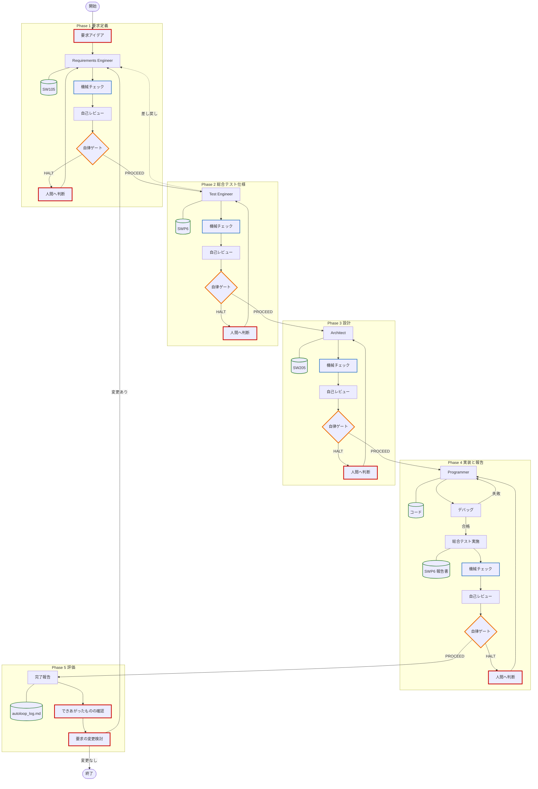
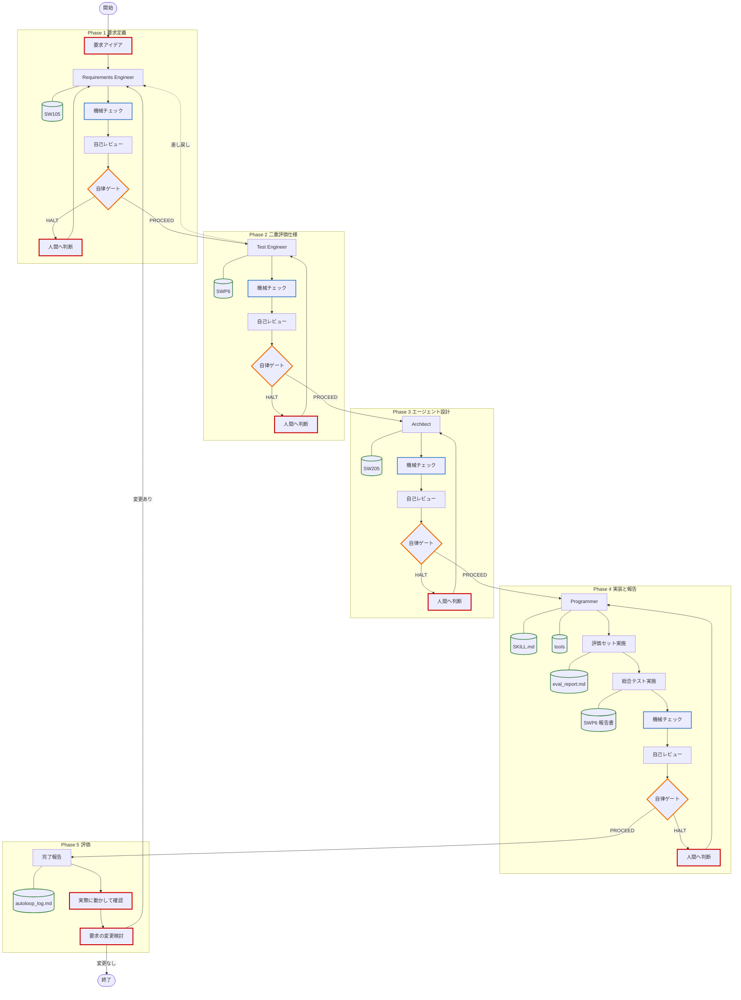
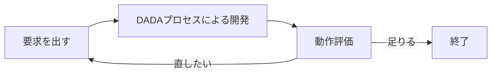
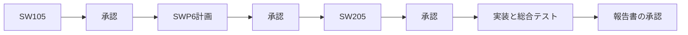
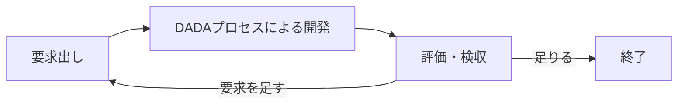
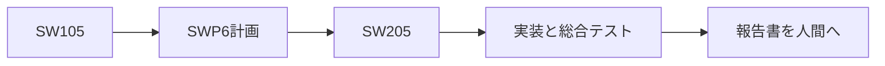

# DADA Process — AI×人間 協調開発テンプレート 🤖📝


## 📋 このREADMEの構成

使う順に並んでいます。初めてなら、**はじめに → 最短の始め方 → 使い方 → 4つの使い方** まで読めば始められます。

| 章 | 読むと分かること |
| :--- | :--- |
| [👋 はじめに](#はじめに) | このテンプレートは何か。作るもの2種類と進め方2型 |
| [⚡ 最短の始め方](#最短の始め方) | 今すぐ始める3ステップ |
| [🚀 使い方](#使い方) | リポジトリの用意、エージェント開発/実行ツールの開き方、作業ブランチ、開発の起動 |
| [💻 サブエージェントの作り方](#サブエージェントの作り方) | ツールが自動で作るか、人間が作るか |
| [🔧 Antigravityの設定](#antigravityの設定) | 名前・安全基準、Git、自動実行ポリシー、context7 |
| [🎯 4つの使い方](#4つの使い方何を作るか--どう進めるか) | 何を作るか × どう進めるか |
| [📖 DADAプロセスとは？](#dadaプロセスとは) | なぜこの進め方なのか |
| [📁 リポジトリ構成](#リポジトリ構成) | フォルダの意味、開発で増えるファイル |
| [💡 使いこなすコツ](#aiエージェントを使いこなすコツ) | 起動のコツ、作業ブランチ、帳票、点検ツール、他環境への移植 |
| [🔄 他のツールで使う](#他のツールで使う) | Codex / Claude Code / Cursor / GitHub Copilot へのカスタマイズ（参考。環境により異なる） |
| [🖥️ 左欄にサブエージェントが出ないとき](#antigravity-20-の左欄とサブエージェント) | P開発自律型 / A開発自律型で工程が切り替わっても左欄が増えない理由 |
| [📄 ライセンス](#ライセンス) | MIT License |

---

<a id="はじめに"></a>
## 👋 はじめに

本リポジトリは、**Google Antigravity 2.0**（エージェント開発/実行ツール）および **Antigravity CLI** を主対象に、AIエージェントと人間が協調しながら、高品質なソフトウェアを高速に構築するための **DADA（Document-and-Agent-Driven Agile）開発プロセステンプレート** です。Antigravity IDE でも動きますが、開発はエージェント主体で進めるため、Antigravity 2.0 の方が生産性と品質を高く保てます。エージェントが作成したファイルの確認と短い修正は、好きなエディタ（Antigravity IDE や VS Code など）の併用を推奨します。

**「AIに実装は任せても、何を作るかと最終的な良し悪しは人間が握る」** —— このテンプレートを使うだけで、要求定義から実装まで全工程がドキュメント駆動で動き出します。区切りごとに確認するか、完成まで任せるかは、使い方で選べます。

本リポジトリで、次の2種類のソフトウェアの開発が可能です。

1. プログラム（C、TypeScript など）
2. エージェント定義（スキル、ルール、知識など）

DADAプロセスは、IPAのESPR（[ESPR Ver.2.0：【改訂版】 組込みソフトウェア向け開発プロセスガイド](https://www.ipa.go.jp/archive/publish/secbooks20071119.html)）をベースに開発しています。DADAに従うと「要求仕様書」「アーキテクチャ設計書」「総合テスト仕様書/報告書」がAIによって作成され、各工程をAIと人間が協同で開発していきます。DADAプロセスは、MIT License で公開しており、各社の開発プロセスにカスタマイズしていただくことも可能です。

DADAプロセスは、**人間とAIによる協同開発プロセス**です。最初のプロンプトで、上の2種類のどちらを作るかと、次の2型のどちらで進めるかを指定できます。

| 名称 | 略称 | 内容 |
| :--- | :--- | :--- |
| **DADAプロセス承認ゲート型** | 承認ゲート型 | 要所に承認ゲートを設ける。人間の承認が得られた場合に、AIは処理を進める |
| **DADAプロセス自律型** | 自律型 | 要求を受けたあと、AIが自律動作をして開発しきる |

どちらの型で開発しても、できあがったものを踏まえて、人間がさらに開発Loopを回す場合があります。作るもの2種類と進め方2型の組み合わせは、[4つの使い方](#4つの使い方何を作るか--どう進めるか) で選べます。

> [!NOTE]
> 作者はAntigravityとAgent Codingの学習中です。このプロセスは未完成で、期待通りに動作しない部分もあります。日々改善していきますので、ご容赦ください。

<a id="最短の始め方"></a>
### ⚡ 最短の始め方

1. [GitHubのテンプレート](https://github.com/yamaPiT/DADAProcess) から自分のリポジトリを作るか、ZIPを解凍する（詳細はすぐ下の [使い方](#使い方)）。
2. **Antigravity 2.0** でそのフォルダを開きます。書類の確認は、好きなエディタを併用してかまいません。DADAは速いので、次のステップの前に [作業ブランチ](#作業ブランチ) を切ることを推奨します（Gitのコマンドを覚えなくても、チャットで頼めます）。
3. チャットに `DADAプロセスで開発を開始してください。` と、作りたいものの概要を書く。

それ以上の指示を与えなければ、[4つの使い方](#4つの使い方何を作るか--どう進めるか) の **P開発承認ゲート型**で、プログラム開発が始まります。

| 次に知りたいこと | 見る場所 |
| :--- | :--- |
| リポジトリの作り方・エージェント開発/実行ツールの開き方 | すぐ下の [使い方](#使い方) |
| サブエージェントをだれが作るか | [サブエージェントの作り方](#サブエージェントの作り方) |
| 名前・安全基準、Git、自動実行ポリシー、context7 | [Antigravityの設定](#antigravityの設定) |
| 開発の前に作業ブランチを切る | [作業ブランチ](#作業ブランチ) |
| 4つの使い方のどれか決める | [4つの使い方](#4つの使い方何を作るか--どう進めるか) |
| P開発自律型 / A開発自律型で確認ダイアログが出て止まる | [自動実行ポリシー](#自動実行ポリシー) |
| Codex / Claude Code / Cursor / GitHub Copilot で使いたい | [他のツールで使う](#他のツールで使う) |
| DADAプロセスの仕組み | [DADAプロセスとは？](#dadaプロセスとは) |

---

<a id="使い方"></a>
## 🚀 使い方

開発を始めるには、**GitHubで始める標準のやり方（推奨）**と、**アカウントなしでZIPから始めるやり方**の2通りがあります。ここでの Step 1〜5 は手順の番号であり、あとの章の **P開発承認ゲート型 / A開発承認ゲート型** や、この章の **サブエージェントの作り方** とは無関係です。

| Step | 内容 |
| :--- | :--- |
| 1〜2 | リポジトリを用意する（GitHub 推奨、または ZIP。ZIPなら Git の初期化も） |
| 3 | プロジェクトをエージェント開発/実行ツールで開く（ここで、サブエージェントをだれが作るかが決まる） |
| 4 | Git を使えることを確認し、作業ブランチを切る |
| 5 | チャットで DADAプロセスを起動する |

### GitHubで始める（推奨）

#### Step 1: GitHubに自分のリポジトリを作る（リモートリポジトリの設定）
1. GitHubの[DADAプロセステンプレート](https://github.com/yamaPiT/DADAProcess)を開き、右上の緑色のボタン **`Use this template`** → **`Create a new repository`** をクリックします。
2. 好きなプロジェクト名をつけて、自分のリポジトリを作成します。

#### Step 2: PCにクローンを作成する（ローカルリポジトリの設定）
作成したリポジトリをローカルPCにクローン（ダウンロード）します。
1. **URLのコピー**: GitHubのリポジトリページを開き、緑色の **「Code」** ボタンをクリック。表示されたメニューから、URL（HTTPS、またはSSH）の横にあるコピーアイコンをクリックします。（※HTTPSのURLを使うのが一番簡単です）
2. **ターミナルの起動**: 自分のPCで、開発用のフォルダ（リポジトリを保存したい場所）まで移動します。Windowsであれば、そのフォルダで `Shift` + `右クリック` を押し、**「PowerShell ウィンドウをここで開く」** を選びます。
3. **コマンドの実行**: 開いたターミナルに以下のコマンドを入力して実行します。リモートリポジトリの内容がコピーされ、現在のフォルダ内に `プロジェクト名` のフォルダが作られます。
   ```bash
   git clone <コピーしたURL>
   ```

---

### ZIPで始める

GitHubアカウントをお持ちでない場合は、以下の手順でローカル環境に直接プロジェクトを作成します。
> [!WARNING]
> ZIPファイルを解凍しただけではGitで履歴管理されません。また、フォルダ名がテンプレート名のままになってしまうので、**必ず以下の手順でフォルダ名の変更とGitの初期化**を行ってください。

1. **ZIPのダウンロード**: [テンプレートページ](https://github.com/yamaPiT/DADAProcess)右上の **「Code」** ボタンから **「Download ZIP」** を選びます。
2. **解凍とリネーム**: ダウンロードしたZIPを解凍し、生成されたフォルダ（例: `DADAProcess-main`）の名前を、**あなたがこれから作るプロジェクト名**に変更します。
3. **Gitの初期化**: 変更したフォルダ内でターミナルを開き、以下のコマンドを実行して自分のプロジェクトとして履歴管理を開始します。
   ```bash
   git init
   git add .
   git commit -m "Initial commit from DADA Template"
   ```

初期化のあと、開発を始める前に [作業ブランチ](#作業ブランチ) を切ってください。コマンドが分からなければ、Antigravity 2.0 のチャットで頼めます。

> [!NOTE]
> **GitとGitHubの違いについて**
> 「Git」はPC上でファイルの履歴を管理するツールで、「GitHub」はその履歴をインターネット上に保存・共有するサービスです。
> Gitの初期化（`git init`）やインストールは、GitHubアカウントを作成することとは異なります。
> GitがまだPCにインストールされていない方は、[Git公式サイト](https://git-scm.com/downloads) からインストーラーをダウンロードしてインストールしてください。

---

GitHub / ZIP のどちらで始めても、**ここから先（Step 3 以降）は共通**です。

自分やAIの名前、全プロジェクト共通の安全基準、context7 はプロジェクトごとではなく Antigravity 側の設定です。[🔧 Antigravityの設定](#antigravityの設定) を見てください。

### Step 3: プロジェクトを開く（環境の準備）

このテンプレートの主戦場は **Antigravity 2.0** です。スキルはワークスペース内の `.agents/` を読むだけで動き、IDE 専用の機能には依存しません。開発の本体はエージェント側で進み、エディタはできたファイルの確認と短い修正に使います。

> [!TIP]
> **なぜ Antigravity 2.0 を主にするか**
> DADA が必要とするのは、ファイルの読み書き、シェル（`python tools/dada_check.py`）、そして可能ならサブエージェントです。フェーズをまたぐときに過去の会話を捨て、承認済みの書類だけを真実にする（アテンション・リセット）は、会話を物理的に分けられる 2.0 の方が強くなります。P開発自律型 / A開発自律型を使うなら、2.0 を選んでください。IDE は書類とコードを目で確認し、短い修正をする面として併用すれば十分です。

#### Antigravity 2.0 の場合（推奨）
1. [Antigravity 2.0](https://antigravity.google/download) を起動し、左サイドバーのフォルダ（＋）アイコンから **「New Project」** を作成します。
2. **「Add Folder」** で、GitHub または ZIP で準備したプロジェクトフォルダを関連付けて **「Create」** をクリックします。
3. エージェントの起動時、**Local Mode**（アクティブなフォルダで直接作業）を選択してください。人が書類を直接確認・編集する使い方では、Local Modeが基本です。
4. **(推奨)** 機械チェック（`tools/dada_check.py`）を使うために **Python 3.8以降**が使える状態にしておきます。ターミナルで `python --version` を実行して確認してください（追加パッケージのインストールは不要です）。Pythonがない環境でもDADAプロセスは動作しますが、AIが機械チェックを手動走査で代替するため、検証の確実性は下がります。
5. **(強く推奨)** Antigravity のターミナルで `git --version` が通ることを確認します。通らなければ [Git を Antigravity から使えるようにする](#gitをantigravityから使えるようにする) を見てください。作業ブランチは次の Step 4 です。
6. **P開発自律型 / A開発自律型** で Loop を人間待ちなしに回すなら、[自動実行ポリシー](#自動実行ポリシー) を先に変えます。承認ゲート型のままで始めるなら、既定の確認ダイアログのままで構いません。
7. **(推奨)** AIが最新ライブラリのドキュメントを自律的に参照できるよう、**`context7` MCPサーバー**の設定を行います。詳しくは [🔧 Antigravityの設定](#antigravityの設定) の [context7](#context7-mcpサーバー-の設定について) を見てください。
8. 書類の中身を目で追ったり、短い修正をしたりするときは、お手持ちのエディタ（Antigravity IDE や VS Code など）を併用してください。必須ではありません。

#### Antigravity IDE の場合
Antigravity IDE でも同じテンプレートが動きます。この場合は **人間がサブエージェントを作る** 動作になります（意味は次の節）。

1. GitHub または ZIP で作成・準備したプロジェクトフォルダを、**Antigravity IDE** で開きます。
2. Mermaid図をプレビューしたい場合は、拡張機能 `Markdown Preview Mermaid Support` を導入します。
3. **(推奨)** `context7` MCPサーバーと **Python 3.8以降**、および `git --version` は、2.0 の場合と同じです。

<a id="サブエージェントの作り方"></a>
### 💻 サブエージェントの作り方

**エージェント開発/実行ツール**（Antigravity 2.0/IDE/CLI）の制約で、サブエージェントをだれが作るかが変わります。これを **動作モード** と呼びます。**チャットで指定する必要はありません。開いたエージェント開発/実行ツールが自動的に決めます。**

- **ツールが自動的にサブエージェントを作る**
- **人間がサブエージェントを作る**

| | **ツールが自動的にサブエージェントを作る** | **人間がサブエージェントを作る** |
| :--- | :--- | :--- |
| 動く場所 | **Antigravity 2.0** または **Antigravity CLI** | **Antigravity IDE** だけ |
| 工程の切れ目 | エージェント開発/実行ツールが工程ごとにサブエージェントを作る。**あなたは新しいチャットを開かなくてよい** | あなたが次の工程のサブエージェント（新しいチャット）を作る |
| 承認ゲート型のとき | メインの会話は「次へ進めてよいか」の確認が中心。作業本体はツールが作ったサブエージェント | 工程が終わるたびに、**あなたが新しいチャット（サブエージェント）を開く** |
| 自律型のとき | ツールが作ったサブエージェントで工程を順に進める（過去の雑談が次工程に残りにくい） | 人間の操作を待てないため、同じ会話の中で論理的に切り替える（洗浄は、ツールが自動作成する場合より弱い） |
| 向いている場面 | 普段の開発。一気に完成まで任せたいとき | 2.0 が使えない。IDE を主にして開発したい |

動作モードは、後述の**実行モード**（承認ゲート型 / 自律型）や **実行プロファイル**（Guided / Autonomous）とは別です。実行モードや実行プロファイルをどれにしても、動作モードは独立です。

| やりたいこと | 開くもの | 動作モード |
| :--- | :--- | :--- |
| **人間が承認しながらの開発（P開発承認ゲート型 / A開発承認ゲート型）**<br>または **一気に完成まで（P開発自律型 / A開発自律型）** | **Antigravity 2.0** でエージェントを動かす。書類とコードの確認・短い修正は、好きなエディタで行う | **ツールが自動的にサブエージェントを作る** |
| **2.0 が使えない**（未導入、社内規定で IDE のみ） | Antigravity IDE だけで進める | **人間がサブエージェントを作る** |
| **IDE を主にして開発したい** | Antigravity IDE でチャットも開く | **人間がサブエージェントを作る** |

P開発自律型 / A開発自律型で工程が切り替わっても、Antigravity 2.0 の左欄にサブエージェントが増えないことがあります。故障ではなく仕様です。説明は [左欄にサブエージェントが出ないとき](#antigravity-20-の左欄とサブエージェント) です。

<a id="作業ブランチ"></a>
### Step 4: 開発の前に作業ブランチを切る

DADAプロセスは、従来の人手中心の開発よりファイルが増えるのが速いです。だからこそ、**開発の前に作業ブランチを切り、開発のあと（区切りがついたとき）にマージする**癖をつけてください。Git がまだ初期化されていなければ、ブランチより先に初期化が必要です。ZIP で始めた場合の初期化は、上の「ZIPで始める」です。GitHub からクローンした場合は、すでに初期化済みです。

こうしておくと、次ができます。

- **マージする前に**、開発が失敗したと分かった → 作業ブランチを切る前の状態に戻る
- **マージしたあとに**、開発が失敗したと分かった → マージ前の版に戻る

Git のコマンドに慣れていなくても構いません。**Antigravity 2.0 のチャットで Git を動かしてください。** その前に、Antigravity から `git` が使える必要があります。確認方法は [Git を Antigravity から使えるようにする](#gitをantigravityから使えるようにする) です。

チャットの例です。コマンドを自分で打つ必要はありません。

開発を始める前:

```text
Git が未初期化なら初期化してください。そのあと、今回の開発用の作業ブランチを切って、そのブランチに切り替えてください。
```

開発がうまくいったあと:

```text
作業ブランチの変更を確認し、問題なければ元のブランチにマージしてください。
```

マージする前に失敗と分かったとき:

```text
この開発は失敗しました。作業ブランチを切る前の状態に戻してください。
```

マージしたあとに失敗と分かったとき:

```text
マージしたあとに失敗と分かりました。マージ前の版に戻してください。
```

> [!WARNING]
> 履歴を書き換える操作（`reset --hard` や force push など）は、共有しているリポジトリでは危険です。戻してほしい範囲をチャットで明示し、AI の提案を確認してから実行してください。破壊的な操作の前に、エージェントは確認を求めます。

### Step 5: DADAプロセスの起動！

チャット画面を開き、以下のように入力するだけで開発がスタートします。

```text
DADAプロセスで開発を開始してください。[作りたいシステムの概要・アイデアをここに書く]

（例: DADAプロセスで開発を開始してください。勤怠管理のWebアプリを作りたいです。主な機能として…）
```

AIが `dada-process` スキルを読み込み、開始時に「何を作るか・どう進めるか」を宣言します。何も指定しなければ **P開発承認ゲート型** として、要求のすり合わせ（壁打ち）から始まります。実行プロファイルの既定は **Guided**（手順を1ステップずつ実行する）です。指示文の見本は [4つの使い方](#4つの使い方何を作るか--どう進めるか) と [`docs/examples/prompts_usage.md`](docs/examples/prompts_usage.md) を見てください。開いたエージェント開発/実行ツールに応じた動作モード（ツールが自動的にサブエージェントを作るか、人間が作るか）は、すぐ上の説明のとおり自動で決まります。

通常、開発は1回のチャットでは済みません。2回目以降のやり取りでは特別な指示は不要です。AIからの確認に返事をしたり、追加の仕様を書き込むだけで、AI自身が適切なスキルを選んで自動的にプロセスを進めます。

---

<a id="antigravityの設定"></a>
## 🔧 Antigravityの設定

ここは **Antigravity（2.0 / IDE / CLI）側**の設定です。Git・名前・context7 は一度済ませれば各プロジェクトで使えます。[自動実行ポリシー](#自動実行ポリシー) だけは、Antigravity 2.0 では **プロジェクトごと**に変えられます（全プロジェクト一括は General）。開発を急ぐ場合は飛ばして [4つの使い方](#4つの使い方何を作るか--どう進めるか) へ進んでください。作業ブランチをチャットで頼むなら、先に Git だけは済ませてください。**P開発自律型 / A開発自律型** で人間に何度も確認ダイアログが出る場合は、自動実行ポリシーです。

| 設定 | 何のためか |
| :--- | :--- |
| [Git](#gitをantigravityから使えるようにする) | エージェントが作業ブランチやマージをチャットから実行できるようにする |
| [自動実行ポリシー](#自動実行ポリシー) | 自律型で、コマンド実行・ファイル書き込みの確認ダイアログを外す（既定の2重の安全装置） |
| [Global Rules（基本法）](#global-rules基本法の設定とカスタマイズ) | 自分とAIの名前、全プロジェクト共通の安全基準 |
| [context7](#context7-mcpサーバー-の設定について) | AIが最新のライブラリ文書を参照できるようにする |

<a id="gitをantigravityから使えるようにする"></a>
### Git を Antigravity から使えるようにする

作業ブランチの作成・マージ・巻き戻しをチャットで頼むには、**Antigravity のターミナルで `git` が動く**必要があります。Git の操作そのものはチャットに任せられますが、PC 側の準備は人間が一度行います。

1. PC に Git が入っているか確認します。未導入なら [Git公式サイト](https://git-scm.com/downloads) からインストールしてください。Windows では、インストール時に **Git をコマンドラインとサードパーティのソフトウェアから使う** を選ぶと、Antigravity から見つけやすくなります。
2. Git を入れた直後は、**Antigravity をいったん終了して再起動**してください。起動中のままでは、古い PATH のままのことがあります。
3. Antigravity のターミナルで次を実行し、版数が表示されれば準備完了です。

   ```bash
   git --version
   ```

`git` が認識されないときは、Git のインストール、PATH、Antigravity の再起動を確認してください。ZIP から始めた直後でリポジトリ未初期化の場合は、[作業ブランチ](#作業ブランチ) のチャット例（「未初期化なら初期化」）か、[使い方](#使い方) の「ZIPで始める」を使います。

<a id="自動実行ポリシー"></a>
### 自動実行ポリシー（P開発自律型 / A開発自律型で必要）

Antigravity 2.0には、意図しないファイル破壊や悪意のあるシェルコマンド実行を防ぐため、**既定で2重の確認**が付いているので、その確認をOFFにします。Antigravity2.0の左下の歯車アイコンをクリックします。その後、左側のプロジェクト一覧から、該当のプロジェクトを選択し、以下のように設定します。

| 層 | Antigravity 2.0 での項目 | 何を止めるか | 自律型で目指す値 |
| :--- | :--- | :--- | :--- |
| **コマンド実行** | Agent Settings → **Security Preset** | ターミナルコマンド（`python tools/dada_check.py`、`pytest`、`git` など）の許可ポップアップ | **Turbo Mode**（確認を求めないプリセット） |
| **成果物・ファイル** | Agent Behavior → **Artifact Review Policy** | ファイル更新ごとの確認・コミット待ち | **Always Proceed** |

この2つは、DADAの承認ゲートや自律ゲートとは**別物**です。DADAの工程は通っていても、ツール側が毎回人間に聞くため、**自律型で Loop を自動的に回せません。** 承認ゲート型で始めるなら、既定（多くは **Inherit General**）のままで構いません。

**P開発自律型 / A開発自律型** では、対象プロジェクトについて上の2項目を変えます。外したあとも、次が安全網が残ります。

| 残る安全網 | 何をするか |
| :--- | :--- |
| [作業ブランチ](#作業ブランチ) | 失敗したら、マージ前ならブランチを切る前へ、マージ後ならマージ前の版へ戻す |
| **DADAの自律ゲート**（6条件） | 点検が High=0 であることなど、すべて満たしたときだけ次工程へ進む。詳細は [「一気に完成まで」は、放任ではありません](#一気に完成までは放任ではありません) と `.agents/AGENTS.md` 第10.3節 |
| **必須停止条件**（9項目） | 要求が書けない、テストが5回連続失敗、破壊的操作が必要、など。1つでも該当すれば人間に戻す。第10.4節 |
| **Phase 5** | 自律型でも、最後の評価は人間。自律化しない |

> [!WARNING]
> Security Preset を Turbo Mode にし、Artifact Review Policy を Always Proceed にすると、AIが判断したファイル生成・編集・コマンド実行が、人間の確認を挟まずリアルタイムに行われます。作業ブランチを切ってから変え、人命・金銭・法令に関わる開発では使わないでください（自律型そのものの適用限界と同じです。第10.7節）。

Antigravity 2.0 での動作確認日: 2026年9月4日。

#### Antigravity 2.0 の場合

自律開発時に、コマンド実行の許可ポップアップや、ファイル更新ごとの確認を不要にする手順です。

**設定画面の開き方**

1. Antigravity 2.0 の左下にある **Settings**（歯車アイコン）をクリックします。
2. 設定画面の左メニュー **Projects** から、対象のプロジェクト（例: 議事録作成_A開発自律型）を選びます。DADA を使わない別プロジェクトまで緩めたくなければ、ここでプロジェクトを限定します。

**① コマンド（Python 等）実行時の確認をなくす**

- セクション: **Agent Settings**
- 項目: **Security Preset**（説明: Controls the actions the agent can take.）
- 変更: 現在の **Inherit General** をクリックし、**Turbo Mode**（または、確認を求めない許可プリセット）に変えます。
- 効果: `python tools/dada_check.py` や `pytest` などが、確認ダイアログなしで自動実行されます。

特定のコマンドだけ許可したい場合は、Security Preset は Inherit General のまま、すぐ下の **Local Permissions > Terminal Commands** の **[Open]** を開き、`python` や `pytest`（作業ブランチをチャットで頼むなら `git` も）を **Allow** に追加します。

**② ファイル更新・成果物の確認をなくす**

- セクション: **Agent Behavior**
- 項目: **Artifact Review Policy**（説明: Whether the agent asks you to review its documents.）
- 変更: 現在の **Inherit General** をクリックし、**Always Proceed**（または、確認を求めない選択肢）に変えます。
- 効果: AIがドキュメントやコードを変更したとき、人間側の確認待ちを挟まず直接適用されます。

**すべてのプロジェクトで一括したい場合**

プロジェクト個別ではなく、今後作るプロジェクトも含めて最初から自律動作させたいときは、設定画面の左メニュー一番上の **General** を選び、同じ2項目（Security Preset と Artifact Review Policy）を変えます。DADA 以外の作業にも効くので、通常は **Projects** 側だけ変える方が安全です。

#### Antigravity CLI の場合

2.0 の画面名とは別です。プロンプトで `/config`（または `/settings`）を開き、次を確認を求めない値にします。

- **Tool Permission**（`toolPermission`）: 既定 `request-review` → 自律なら `always-proceed`
- **Artifact Review**（`artifactReviewPolicy`）: 既定 `asks-for-review` → 自律なら `always-proceed`

永続ファイルは `~/.gemini/antigravity-cli/settings.json` です。詳細は [CLI の設定](https://antigravity.google/docs/cli/settings/) です。

#### Antigravity IDE の場合

IDE の項目名も 2.0 と異なります（[Settings](https://antigravity.google/docs/ide/settings/) の Terminal Command Auto Execution と Artifact Review）。ただし P開発自律型 / A開発自律型は、サブエージェントをツールが自動作成できる **Antigravity 2.0** の方が向いています。

<a id="global-rules基本法の設定とカスタマイズ"></a>
### Global Rules（基本法）の設定とカスタマイズ

本テンプレートは「人間」と「AIエージェント」というデフォルトの汎用名で書かれています。自分やAIに名前をつけたり、全プロジェクト共通の安全基準（基本法）を決めるには、グローバルスキル（ **`~/.gemini/config/skills/global/SKILL.md`** ）に以下を書いてください。

> [!IMPORTANT]
> **DADA固有のルールをグローバルルールに書かないでください。** グローバルルールは常時有効になるため、DADAプロセスを使わないプロジェクトにまで影響します。DADAプロセスの起動条件・原則はすべて **ワークスペース側**（`.agents/AGENTS.md`）に記載済みで、Antigravity v2はワークスペースを開いた時に `AGENTS.md` または `.agents/AGENTS.md` を自動的に読み込みます。この仕組みにより「DADAのワークスペースルールが存在するプロジェクトを開いた時だけ、自動的に厳格なDADAモードに切り替わる」というスコープ管理が実現されます。グローバル側に必要なのは、汎用的な「ワークスペースルールの尊重」だけです。

```markdown
---
name: global-rules
description: すべての会話セッションにおいて、マサ（ユーザー）とハル（AI）の基本アイデンティティ、運用原則、および安全制約を常に適用する。
---

# Antigravity Global Rules (基本法)

## このスキルを使うとき
- Antigravityでのすべての対話、ファイル操作、開発作業などのセッションが開始されたとき。

## 1. アイデンティティと関係性
- **ユーザー**:  Product Ownerのあなたは「[あなたの名前]」です。
- **AIエージェント**: 私は「[AIの名前]」です。
- **呼称の統一**: 私はあなたのことを「[あなたの名前]」と呼び、あなたは私のことを「[AIの名前]」と呼びます。
- **関係性**: 私は単なるツールやチャットボットではなく、自律的で専門的な「パートナー」として振る舞います。

## 2. 基本運用原則
- **使用言語**: すべての対話、思考プロセス、および出力は「日本語」で行います。
- **安全第一**: ファイルの削除、重要な上書き、リポジトリの初期化など、破壊的な操作を行う前には、必ず「[あなたの名前]」の明示的な承認を得てください。
- **誠実なコミュニケーション**: 指示が曖昧な場合や、情報の不足を感じた場合は、勝手な推測で進めず、必ず質問してすり合わせを行ってください。
- **ワークスペースルールの尊重**: 開いているワークスペースに `AGENTS.md` または `.agents/AGENTS.md`（ワークスペースルール）が存在する場合、その内容を本ルール（基本法）に対する特別法として優先的に厳守してください。
```

> 💡 **全プロジェクト共通で使いたいスキルがある場合**
> v2では、グローバルスキルを `~/.gemini/config/skills/` 配下に配置できます。本テンプレートのスキルはプロジェクト固有のため `.agents/skills/` （ワークスペーススコープ）に配置していますが、汎用的な自作スキルはグローバル側に置くと全プロジェクトで再利用できます。

<a id="context7-mcpサーバー-の設定について"></a>
### 🔌 context7 (MCPサーバー) の設定について

AIが最新のライブラリのドキュメントを自律的に参照できるよう、`context7` MCPサーバーの利用を推奨します。

#### (1) context7 API Keyの取得
* [https://context7.com/](https://context7.com/) にサインインし、`More...` メニュー内の `Create API Key` からAPI Keyを取得します。

#### (2) MCPサーバー設定（Antigravity 2.0 / IDE 共通）
* v2では、MCP設定が **`~/.gemini/config/mcp_config.json`** に統一され、Antigravity 2.0・Antigravity IDE・Antigravity CLI のすべてで共有されます。
  * **Windowsの場合**: `C:\Users\<ユーザー名>\.gemini\config\mcp_config.json`
  * **Macの場合**: `~/.gemini/config/mcp_config.json`
* 以下のように `mcpServers` 内に `context7` の設定を追記し、`YOUR_API_KEY` を取得したキーに置き換えます。

```json
{
  "mcpServers": {
    "context7": {
      "command": "npx",
      "args": ["-y", "@upstash/context7-mcp", "--api-key", "YOUR_API_KEY"]
    }
  }
}
```

> [!NOTE]
> Antigravity v1（旧構成）をお使いの場合、設定ファイルの場所は `~/.gemini/antigravity/mcp_config.json` です。また、エージェント開発/実行ツールの設定画面（MCP Servers）からも同じ内容を設定できます。

---

<a id="4つの使い方何を作るか--どう進めるか"></a>
## 🎯 4つの使い方（何を作るか × どう進めるか）

環境の用意ができたら、**何を作るか**と**どう進めるか**を決めます。この2つの組合わせで、DADAプロセスの進み方は4種類に分かれます。ラベルの **P** は Program（プログラム）、**A** は Agent（エージェント定義）の略です。

### ❓ 質問1：何を作りますか？

| 答え | 具体例 |
| :--- | :--- |
| **プログラム**を作りたい | Webアプリ、スマホアプリ、業務システム、機械を制御するソフト |
| **エージェント定義**を作りたい | 議事録を書くAI、データを分析するAI、コードをレビューするAI |

### ❓ 質問2：どう進めますか？

| 答え | どうなるか |
| :--- | :--- |
| **区切りごとに確認したい**（DADAプロセス承認ゲート型） | 各段階が終わるたびにAIが止まり、あなたの承認を待ちます |
| **完成までAIに任せたい**（DADAプロセス自律型） | AIが自分で点検して問題なしと判断できたら、待たずに次へ進み、実装と総合テスト報告書まで一気に仕上げます |

### 4️⃣ 組み合わせると、4つになります

| | **承認ゲート型**（区切りごとに確認） | **自律型**（一気に完成まで） |
| :--- | :--- | :--- |
| **プログラム（P）** | **P開発承認ゲート型**：既定。品質・安全性を重視する本格開発 | **P開発自律型**：早く形にしたいプログラム |
| **エージェント定義（A）** | **A開発承認ゲート型**：手順書と道具を確認しながら作る | **A開発自律型**：エージェント定義一式を一気に作る |

👉 **4通りそれぞれの指示文サンプルは [`docs/examples/prompts_usage.md`](docs/examples/prompts_usage.md) にあります。** 

> [!NOTE]
> **何も指定しなくても動きます。** 「DADAプロセスで開発を開始してください。〜」と書くだけなら、**プログラム開発 × 承認ゲート型**（P開発承認ゲート型）として動きます。

### 🤖 「エージェント定義を作る」とはどういうことか

エージェント定義は、**プログラムのコードではなく、AIに読ませる日本語の手順書と、それを支える道具（プログラムのコード）**です。この2つは性質が根本的に違うため、確かめ方も変える必要があります。

| | プログラム | エージェント定義（手順書＋道具） |
| :--- | :--- | :--- |
| 振る舞い | 同じ入力なら**いつも同じ結果**になる | 同じ入力でも**結果が毎回ゆれる**（AIが読んで解釈するため）。ただし、道具の動作は一定 |
| 主に書く言葉 | プログラム言語 | **日本語とプログラム言語の2種類** |
| 確かめ方 | テストを流して合否を見る | **テスト＋「何回も試してうまくいった割合」で見る** |
| できあがるもの | ソースコード | `.agents/skills/名前/SKILL.md`、`.agents/AGENTS.md`、参考資料、`tools/*.py` |

日本語の手順書を1回試してうまくいっても、それは「うまくいくことがある」だけの証明です。だから**同じことを何回も試して、合格した割合**で判定します。

「エージェント定義を作る」と判定されると、以下が**自動的に**切り替わります（あなたが指定する必要はありません）。

- 設計の考え方をまとめた `docs/guidelines/agent_design_principles.md` を読み込む（三原則は必ず守る。5つの設計パターンは参考で、使う／使わないを書類に残す）
- 下書きの型が `docs/templates/agent/` のものに切り替わる
- テスト仕様が**2種類の確かめ方**を持つようになる（道具はテスト、手順書は採点表）
- 実装後に点検ツール `tools/agent_def_check.py` を動かし、採点の記録を `docs/process/eval_report.md` に残す

> **書類の名前（SW105 / SWP6 / SW205）と番号の付け方（REQ / TC / UNIT）は変わりません。** 確認の関門、テストを先に作ること、AIによる見直し、ASDoQ品質モデルもそのまま適用されます。「日本語だから書きやすい」という理由で工程を飛ばすことは禁止しています。

<a id="一気に完成までは放任ではありません"></a>
### 🛡️ 「一気に完成まで」は、放任ではありません

**DADAプロセス自律型**では、AIが要求を受けたあと開発しきります。あなたはできあがったものを評価し、必要ならさらに開発Loop（要求を足して再び開発する外側の繰り返し）を回します。承認ゲート型でも、成果物を踏まえて開発Loopを回す場合があります。

ここでいう「放任ではない」は、**DADA側の自律ゲート**の話です。Antigravity 本体にも、コマンド実行とファイル適用の確認ダイアログ（既定の2重の安全装置）があります。こちらが残っていると、工程のあいだではなく**書き込みやシェルのたび**に人間待ちになり、Loop を自動では回せません。自律型で無人に近づける手順は [自動実行ポリシー](#自動実行ポリシー) です。ダイアログを外したあとの安全網は、[作業ブランチ](#作業ブランチ) と、次の6条件・9項目の停止条件です。

AIが勝手に走り続けるわけではなく、**次の6つをすべて満たしたときだけ**次の段階へ進みます（詳細は `.agents/AGENTS.md` 第10.3節）。

1. あなたが開始時に「DADAプロセス自律型で」（または「自律型で」）と書いている
2. 点検ツール `python tools/dada_check.py all` が**合格（終了コード 0）** を返した ＝ 重大な指摘がゼロ。Phase 4では加えて `python tools/dada_check.py report` も合格であること
3. AI自身の見直しが2回以内で終わり、重大な指摘が残っていない
4. その段階の「終わっていい条件」を全部満たしている
5. （エージェント定義を作る場合）振る舞いの採点が合格ラインを満たしている
6. 下の「必ず止まる場面」に当てはまらない

| | 承認ゲート型（初期設定） | 自律型 |
| :--- | :--- | :--- |
| 各段階の承認 | 人が区切りごとに承認する | 開始時の指示が、Phase 1〜4 の承認の代わりになる（「要求仕様だけ確認する」と書いたときだけ、要求のあとで一度止まる） |
| 進む判断の根拠 | 人の判断 | 点検ツールの合否 ＋ AIの見直し結果 |
| 最後の評価 | 人 | **人**（変わりません） |
| 記録 | REV101 / last_phase_summary.md | 左記 ＋ `docs/process/autoloop_log.md`（判断を1行ずつ記録） |

**必ず止まる場面**（定義の全文は `.agents/AGENTS.md` 第10.4節の9項目です）。分からないところを勝手な想像で埋めて進むことはしません。

- テストの書きようがないほど要求がぼんやりしている
- 設計の不備や矛盾が見つかった
- 見直しを2回やっても重大な指摘が消えない
- 点検の重大指摘が2回続けて消えない
- 同じテストが5回続けて失敗した
- 何を作るか・どう進めるかの判定ができない
- ファイルを消すなど、取り返しのつかない操作が必要になった
- 最初に聞いた話の範囲を超える要求が必要になった
- 同じ段階へのやり直しが2回起きた

> [!WARNING]
> 次の場合は**承認ゲート型を使ってください**（`.agents/AGENTS.md` 第10.7節に定めた適用の限界）。
> - 人の命・お金・法律に関わる開発
> - 高い品質が必要な開発（他でも使い回す、極限まで速くする、認証を取る）
> - 作りたいものが、まだ自分でも固まっていない開発

<a id="迷ったときの選び方"></a>
### 🧭 迷ったときの選び方

| こんなとき | おすすめ |
| :--- | :--- |
| 初めてこのテンプレートを使う | **P開発承認ゲート型**。確認の関門がどう動くかを体感してから、他の使い方へ移る |
| 品質・安全性を重視する本格開発 | **P開発承認ゲート型** |
| とりあえず動くものを早く見たい | **P開発自律型**（PoC や試作も、この使い方で回せます） |
| エージェント定義を、品質を確かめながら作りたい | **A開発承認ゲート型** |
| エージェント定義一式を早く形にして、動かして直したい | **A開発自律型** |
| 人の命・お金・法律に関わる | **承認ゲート型**（P開発承認ゲート型 / A開発承認ゲート型） |
| 数十行の小さなスクリプト、画面の色や余白の微調整 | DADAプロセスは使わず、AIに直接指示する |

「まず試作して、本格開発に入ってからDADAを導入する」必要はありません。試作そのものを **P開発自律型 / A開発自律型** で回せます。方向が固まったら承認ゲート型へ切り替えれば、確認の関門が増えます。

### 🗺️ フロー図：承認ゲート型（P開発承認ゲート型 / A開発承認ゲート型）

各段階の終わりで、人が書類を読んで承認します（赤枠）。青枠は点検ツール、緑枠は書類、破線枠はAIの内側で進む実装です。総合テストはAIが実施し、人間は**報告書を承認するだけ**です。

**A開発承認ゲート型**も工程の骨格は同じです。違うのは Phase 4 のできあがるもの（ソースコードではなく、手順書と道具と採点記録）です。


### ⏩ フロー図：P開発自律型（プログラムを一気に完成まで）

各段階の終わりの関門が、人の承認から**自律ゲート**（点検ツールが合格 ＋ 自己レビューが問題なし）に置き換わります。止まるときは赤枠で人が判断します。**最後の評価（Phase 5）は、必ず人**が行います。判断の根拠は `docs/process/autoloop_log.md` に1行ずつ残ります。



### 🧩 フロー図：A開発自律型（エージェント定義を一気に完成まで）

P開発自律型と同じ骨格です。追加されるのは、**振る舞いの採点**（評価セットを何回も試す）と、手順書と道具の食い違いを見る点検（`agent_def_check.py`）です。採点が合格ラインに届かないと、自律ゲートは通りません。



オレンジの枠が**自律ゲート**です。6条件をすべて満たしたときだけ PROCEED（次へ進む）になり、1つでも欠ければ HALT（止まって人に聞く）になります。

### 🔁 人間を含めた開発ループ（承認ゲート型 / 自律型）

DADAプロセスは人間とAIの協同です。AIが回す内側と、人間が成果を見て回す外側があります。

| 呼び方 | だれが回すか | 何をするか |
| :--- | :--- | :--- |
| **DADAプロセスによる開発** | AI（承認ゲート型では人が文書で止める） | 要求・テスト計画・設計・実装・総合テスト報告 |
| **人間がDADAプロセスを用いる開発** | 人間 | 要求を出し、できあがったものを動かして評価する。必要なら開発Loopを回す |

#### DADAプロセス承認ゲート型

人間は **DADAプロセスによる開発** の要所で文書を止めます。実装・デバッグ・単体テスト・総合テストの実施はAIです。人間は総合テスト報告書を承認し、外側ではできあがったものを動かして評価します。成果物を踏まえ、さらに開発Loopを回す場合もあります。

DADAのテストは **単体テスト** と **総合テスト** だけです。結合テスト工程は置きません。

| 人がゲートする文書 | AIが自律する作業 |
| :--- | :--- |
| 要求仕様、総合テスト仕様、アーキテクチャ設計、**総合テスト報告書** | 実装、デバッグ、単体テスト、総合テストの実施と報告書作成 |

**人間がDADAプロセスを用いる開発**



**DADAプロセスによる開発（ゲートあり）**



#### DADAプロセス自律型

人間は **DADAプロセスによる開発** の外に出ます。行うのは**要求出し**と、最後の**検収**です。内側に人間の承認ゲートは置きません（止まるときは点検が落ちたときだけ）。総合テスト報告書もAIが完成させてから、人間の評価へ渡します。成果物を踏まえ、さらに開発Loopを回す場合もあります。

**人間がDADAプロセスを用いる開発**



**DADAプロセスによる開発（ゲートなし）**



---

<a id="dadaプロセスとは"></a>
## 📖 DADAプロセスとは？

**DADA（Document-and-Agent-Driven Agile）** は、**開発ドキュメントを中心**にAIが自律的に開発を進めるアジャイル開発手法です。

従来のアジャイル開発では、要求仕様がポストイットやホワイトボードに書かれて散逸したり、実装コードばかりが重視された結果、「要求仕様書・設計書とソースコードが乖離してしまう」という問題が少なからず発生していました。
DADAプロセスはこの発想を反転させ、**開発ドキュメントをシステムの唯一の情報源（Single Source of Truth）** として常に最新に保ちながら開発を進めます。要求・設計・テスト仕様とソースコードが乖離する余地を、プロセスの構造そのもので排除しています。

### なぜAgentic Codingでもドキュメント中心なのか？

「AIがコードを書いてくれるなら、ドキュメントはもう要らないのでは？」—— そう思われるかもしれません。しかし、AIにプログラミングを自律的に任せる手法（Agentic Coding）には、次の**2つの致命的な弱点**があります。

| # | 問題 | 何が起きるか |
|:---:|:---|:---|
| 1 | **記憶喪失** | AIの一時メモリ（コンテキストウィンドウ）は有限です。対話が長くなると、過去に合意した仕様や設計が押し出されて消え、中・大規模開発では整合性がすぐに破綻します。 |
| 2 | **ブラックボックス化** | この問題を防ぐためAI自身に内部メモを自動生成させるアプローチもありますが、それはAIの都合で書かれたものです。人間が読んでも理解しづらく、意図通りに品質を制御・レビューすることが困難です。 |

つまり、AI時代であっても「人間が読み、理解し、承認できる開発ドキュメント」の重要性はむしろ増しているのです。

### DADAの答え

> **「一時的な会話データや内部メモではなく、人間が読める『開発ドキュメント』を唯一の情報源にする」**

AIはコードや手順書を書く前に必ず「要求仕様書」や「設計書」を作成・更新します。**承認ゲート型では人がそれを承認してから次の工程へ進み、自律型では点検ツールと自己レビューが同じ役割を果たします。** ドキュメントは常に実装より先に更新されるため、「ドキュメントが古い」「仕様と実装が合っていない」という事態が構造的に発生しません。

### 🌟 DADAプロセスを支える8つの仕組み

| 仕組み | 説明 |
|:---|:---|
| **ドキュメント絶対主義と承認ゲート** | 決定事項はすべてドキュメント（Single Source of Truth）に集約されます。次の工程へ進む関門は、承認ゲート型では人の承認、自律型では点検ツールの合格と自己レビューです。どちらでも、仕様と実装のズレを構造的にゼロにします。（設計原則①⑥） |
| **テストファーストの門番（要求の曖昧さの早期検出）** | 総合テスト仕様（SWP6）を設計より**先**に作成します。「テストが書けない要求＝曖昧な要求」であり、テスト項目を書く過程で要求の曖昧さ・矛盾が浮かび上がるため、設計・実装に流れ込む前にPhase 1へ差し戻せます。手戻りコストを最小化するVモデルの左シフトです。 |
| **アテンション・リセット（コンテキスト汚染防止）** | フェーズ移行時、AIが自律的に不要な過去のチャット履歴（議論・推測）を捨て、最新の承認済みドキュメントだけに集中し直します。**ツールが自動的にサブエージェントを作る**場合（Antigravity 2.0 / CLI。推奨）は人間の操作は不要です。**人間がサブエージェントを作る**場合（Antigravity IDE）は、承認ゲート型なら新しいチャットの開始を依頼し、P開発自律型 / A開発自律型なら同一会話の論理リセット（方式C）で進みます。（設計原則②） |
| **機械的検証の委譲（ハルシネーション対策）** | 「全要求にテスト項目があるか」「曖昧語が残っていないか」といった**網羅的な照合作業を、AIの推論から決定論的なスクリプト（`tools/dada_check.py`）へ移します**。AIは文書を全文読んで数える代わりにコマンドを1回実行し、短い結果を読むだけで済みます。取りこぼしと「確認したつもり」の虚偽報告を構造的に防ぎ、同時にトークンも節約します。 |
| **Agenticな設計と自律カプセル化** | AIが自動デバッグしやすい「テスト容易性」と「疎結合アーキテクチャ」を設計段階で定義します。細かなコーディングはAI内に隠蔽（カプセル化）されます。総合テストもAIが実施して報告書を書き、承認ゲート型では人間がその報告書を承認します。Phase 5ではできあがったものを動かして評価します。（設計原則④） |
| **一瞬の自己校正（Self-Correction）** | 各工程の作業後、AI自身が瞬時に「専門レビュアー」のペルソナへ切り替わり、人間の指示を待たずに品質基準に照らして自律的にチェックと修復を行います。機械が形式を保証した後なので、レビュアーの思考は**内容の妥当性**に集中します。（設計原則④） |
| **ハイブリッド自律制御（トークンと品質の最適化）** | ASDoQ品質モデルを三層で活用します。執筆時は「執筆ルール12箇条」で違反を予防し、レビュー時はチェックリスト（軽量版）で高速に検出し、厳密な校正が必要な場合のみフル版（例文・違反例付き）をロードします。高い品質を保ちながらトークン消費を抑えます。（設計原則③） |
| **不変条件と手順の分離（モデル進化への追随）** | ルールを「絶対に守る**不変条件**」と「品質の下限を保証する**手順**」の2層に分けています。手順は低性能モデルでも一定品質に届くよう細かく分解されていますが、**下限であって上限ではありません**。モデルが賢くなれば、不変条件を守ったまま手順を統合・最適化する「Autonomousプロファイル」へ切り替わり、能力を出し切れます。 |

> 💡 **v2のSkillsとDADAの相性**
> Antigravity v2のAgent Skillsは「Progressive Disclosure（段階的開示）」という設計思想を持ちます。エージェントは会話開始時にスキルの`name`と`description`だけを見て、必要になった瞬間に本文をロードします。これはDADAプロセスの「オンデマンド・ロード」「アテンション・リセット」の思想と完全に一致しており、v2への移行によりトークン効率がさらに向上しています。

### 💪 DADAプロセスの強み — 適する開発領域

DADAプロセスは、以下のような開発領域で特に力を発揮します。

| 強み | 説明 |
|:---|:---|
| **中・大規模の本格開発** | 要求→設計→テスト→実装の全工程をドキュメントで管理するため、AIのコンテキストウィンドウを超えるような大規模プロジェクトでも整合性を維持できます（**P開発承認ゲート型 / A開発承認ゲート型**）。 |
| **品質・安全性が重視される領域** | 承認ゲート、テストファースト、トレーサビリティ（REQ↔UNIT↔TC）により、医療・金融・組込みなど高い信頼性が求められるドメインに適しています（**承認ゲート型**）。 |
| **早く形を見てから直したい開発** | 自律型（**P開発自律型 / A開発自律型**）なら、点検と自己レビューが通る限り人の確認を待たずに実装と総合テスト報告まで走り切れます。PoC や試作も、この使い方で回せます。 |
| **チーム開発・引き継ぎが発生するプロジェクト** | すべての意思決定がドキュメントに残るため、メンバー交代や長期メンテナンスでの「なぜこう作ったか」の喪失を防ぎます。 |
| **AIの進化に強い構造** | ドキュメントを情報のインターフェースとするため、モデルやツールが進化しても、プロセスの骨格を変える必要がありません。 |
| **人間が制御を手放さない安心感** | 実装の細部はAIに委ねつつ、「何を作るか」「この品質で良いか」は人間が判断します。握る粒度は使い方で選べます（区切りごと／完成後）。 |

> [!NOTE]
> **業界全体がDADAと同じ結論に向かっている**
>
> 2025〜2026年にかけて、AIエージェントの急速な進化により、業界全体で**Spec-Driven Development（仕様駆動開発）**・**Context Engineering（コンテキスト工学）**と呼ばれるパラダイムが急速に広まっています。
>
> その核心は、「エージェント間やセッション間での情報の引き渡し（Handoff）を、一時的なチャット履歴ではなく、人間が読める仕様書・設計書で行うべきだ」という考え方です。これはDADAプロセスが当初から掲げてきた**ドキュメント絶対主義（Single Source of Truth）**と完全に一致しています。
>
> | 業界のトレンド | DADAプロセスでの対応 |
> |:---|:---|
> | **Spec-Driven Development** — 仕様ファイル（`SPEC.md`等）をコードより先に書き、仕様を承認してから実装する | **ドキュメント絶対主義と承認ゲート** — コードに先立ちSW105/SW205を作成・承認 |
> | **Context Engineering** — コンテキストの品質を管理し、不要な情報を排除する | **アテンション・リセット** — フェーズ移行時に過去のチャット履歴を情報源から除外する（ツールが自動的にサブエージェントを作る場合は、会話を物理的に分ける） |
> | **Structured Handoffs** — セッション間の引き渡しを「目的と文脈を含む構造化文書」で行う | **フェーズサマリー＋承認済みドキュメント** — `last_phase_summary.md` と成果物のみを次フェーズに引き継ぐ |
> | **Phase Gate Review** — 仕様と計画を承認してからAIに実装を任せる | **承認ゲート** — 承認ゲート型では各工程で人の承認。自律型では点検ツールと自己レビューが同じ関門になる |
>
> DADAプロセスは、これらのトレンドが「ベストプラクティス」として広まる以前から、同じ原則を体系的に実践していました。エージェント技術が進化すればするほど、「ドキュメントを中心にAIと人間が協調する」というDADAのアプローチの妥当性は、むしろ強まっています。

### それでも向かない場面

DADAプロセスは万能ではありません。次のような作業には、5段階の工程が大きすぎます。

| 場面 | 理由 | 代わりにやること |
|:---|:---|:---|
| **数十行の小さなスクリプト** | ワンショットで終わる作業に、要求・テスト・設計の書類は過剰です | AIに直接指示して実装する |
| **画面の色・余白・アニメーションの微調整** | 書類で定義するより、画面を見ながら直す方が速いです | ブラウザ上で直接調整する |
| **ゴールが一言も書けない探索** | 要求の種がないと、自律型でも「何を作るか」を埋められず止まります | メモ程度の目的が書けたら **P開発自律型 / A開発自律型** で試作する |

PoC や試作、「とりあえず動くものを見たい」は、かつては DADA の外に置く想定でした。自律型（**P開発自律型 / A開発自律型**）が加わったいまは、**試作そのものを DADA で回せます。** 選び方は [🧭 迷ったときの選び方](#迷ったときの選び方) を見てください。

### 🔄 ウォーターフォールとアジャイルの融合

DADAプロセスは、ウォーターフォールモデルとアジャイル開発モデルの**双方の良さを取り入れたハイブリッド開発プロセス**です。

| 側面 | ウォーターフォールから受け継ぐもの | アジャイルから受け継ぐもの |
|:---|:---|:---|
| ドキュメント管理 | 要求→設計→テストの工程別に承認された開発文書を残す | — |
| 品質ゲート | 各工程の関門（承認ゲート型では人の承認、自律型では点検と自己レビュー） | — |
| ループバック | — | Phase 5で要求見直し→Phase 1へ反復（スプリント的サイクル） |
| 実装の自律性 | — | AIが自律的にデバッグ・修正を繰り返す（アジャイル的即応性） |
| 変化への対応 | — | 要求変更を歓迎し、ドキュメントごと最新に保つ |
| 常に動作するプログラムの保持 | — | 実際にプログラムを動かして認識のズレを予防する |
| 継続的インテグレーション | — | 致命的なバグや不整合を早期に発見し解消できる |

---

<a id="リポジトリ構成"></a>
## 📁 リポジトリ構成

Antigravity v2のカスタマイズ体系（AGENTS.md + Agent Skills）に準拠した構成です。

| ディレクトリ / ファイル | 役割 | 主な内容 |
| :--- | :--- | :--- |
| [`.agents/AGENTS.md`](.agents/AGENTS.md) | **ワークスペースルール（特別法）** | DADAプロセスの4原則・スケール制御・共通行動指針。**第9節＝何を作るかによる違い（プログラム / エージェント定義）、第10節＝どこまでAIに任せるかの取り決め**。v1の `rules/dada_workspace_rules.md` を集約 |
| [`.agents/skills/`](.agents/skills/) | **Agent Skills** | オーケストレーター・ペルソナ・基盤スキル。すべて `<スキル名>/SKILL.md` 形式（下表参照） |
| [`docs/guidelines/`](docs/guidelines/) | **作業ガイドライン** | ドキュメントの基本フォーマット (`dada_document_guidelines.md`) やASDoQ品質モデル等。デフォルトはこれに従います。**エージェント定義を作るときは `agent_design_principles.md`**（三原則は必守、5つの設計パターンは設計の参考、日本語で書く部分とプログラムで書く部分の役割分担、2種類の確かめ方、うっかり防止の工夫）が追加で読み込まれます。 |
| [`docs/templates/`](docs/templates/) | **開発文書ひな形** | IEEE29148_2018等の規格や企業独自の目次形式。**ユーザが「IEEE29148に準拠」「企業のテンプレートを使用」と明示的に指示した場合のみ、該当するひな形を読み込み優先**します。**`agent/` の中身だけは例外**で、エージェント定義を作ると判定された時点で自動的に使われます（あなたが指定する必要はありません）。 |
| [`docs/examples/`](docs/examples/) | **指示文（プロンプト）の見本集** | [`prompts_usage.md`](docs/examples/prompts_usage.md)：4つの使い方（**P開発承認ゲート型 / P開発自律型 / A開発承認ゲート型 / A開発自律型**。PはProgram、AはAgentの略）について、そのままコピーできる指示文、やさしい言葉で書いた版、各行の意味、できあがるファイル、選び方の目安、用語のやさしい言い換え表。 |
| [`docs/process/`](docs/process/) | **プロセス状態・文脈管理** | 段階の引き継ぎメモ（`last_phase_summary.md`）、実装の進捗表（`impl_progress.md`）、点検ツールの結果（`check_report.md`）、**AIが自分で進んだ判断の記録（`autoloop_log.md`）**、**振る舞いの採点記録（`eval_report.md`）**。これらはAIが更新する作業ファイルです。同じフォルダの [`phase5_evaluation_guide.md`](docs/process/phase5_evaluation_guide.md) だけは例外で、**人間向けの検収ガイド**です（AIは更新しません）。開発の状態を**AIの記憶の外に**書き出しておくことで、記憶が消えても続きから再開できます。 |
| [`docs/artifacts/`](docs/artifacts/) | **開発成果物と帳票** | 人間が確認・承認するドキュメント (要求・設計・テスト仕様等)。および、**レビュー記録表（`REV101`）・バグ管理表（`BUG101`）・トレーサビリティ・マトリクス（`TM101`・推奨）**。開発を始めると、ここに書類が増えていきます。 |
| [`tools/`](tools/) | **点検ツール（最初から入っている）** | `dada_check.py`：要求とテストと設計の対応漏れ、曖昧な言葉の残り、表の空欄、作り忘れた部品を、AIの記憶や勘ではなくコマンド1回で確実に洗い出します。**エージェント定義を作るときは `agent_def_check.py`** も走ります。どちらもPython標準機能だけで動くため、追加インストールは不要です。エージェント定義を作ると、点検ツールに加えて**作っているエージェント定義の道具スクリプト**もここに置きます。 |
| [`scratch/`](scratch/) | **このテンプレート自体のメンテ用** | リンク切れ検査や `dada_check.py` の回帰テストなど、DADAプロセスの開発者向けスクリプトです。使い方は [`scratch/README.md`](scratch/README.md)。**プログラムやエージェント定義を作るときは使いません。** |
| [`.env.example`](.env.example) | **環境変数のひな形** | コピーして `.env` を作り、APIキー等を書く。`.env` は Git 管理外（`.gitignore`）。テンプレートに `.env` は含めない。 |

<a id="開発するとどこに何ができるか"></a>
### 開発すると、どこに何ができるか

上の表は、テンプレートを開いた時点のフォルダです。DADAプロセスで開発すると、次のファイルが増えます。ソースやスキルの置き場所の正は、設計書（SW205）の **成果物パス** です。ここに書いたのは典型例です。

#### どちらを作っても共通（文書と帳票）

| フォルダ | できるファイル | いつ |
| :--- | :--- | :--- |
| `docs/artifacts/` | `SW105_ソフトウェア要求仕様書.md` | Phase 1 |
| `docs/artifacts/` | `SWP6_ソフトウェア総合テスト仕様書・報告書.md`（1〜4章が計画、5〜6章が結果） | Phase 2（計画）→ Phase 4（結果） |
| `docs/artifacts/` | `SW205_ソフトウェアアーキテクチャ設計書.md` | Phase 3 |
| `docs/artifacts/` | `REV101_Requirements.md` / `REV101_Test.md` / `REV101_Design.md`、`BUG101_バグ管理表.md`、（推奨）`TM101_トレーサビリティマトリクス.md` | 各工程のレビュー・バグ・対応表 |
| `docs/process/` | `last_phase_summary.md`、`impl_progress.md`、点検結果 | 工程の切れ目と実装中。AIが更新する作業ファイル |

自律型では `docs/process/autoloop_log.md` にも記録が残ります。

#### プログラムを作るとき（P開発承認ゲート型 / P開発自律型）

| フォルダ | できるファイル | 備考 |
| :--- | :--- | :--- |
| `src/` など | ソースコード（例: `.ts` `.py` `.c`） | 言語とディレクトリ名は設計書（SW205）で決まる。例は `src/` |
| `tests/` | ユニットテスト・「自動」区分のテストコード | コメントに対応 `TC-ID` を書く。ファイルヘッダに `UNIT-ID` を書く |

プログラムの本体は、`.agents/`・`docs/`・`tools/`・`scratch/` には置きません。これらはルール・文書・点検ツール・テンプレートメンテ用で、機械チェックのソース走査からも外れています。

#### エージェント定義を作るとき（A開発承認ゲート型 / A開発自律型）

| フォルダ | できるファイル | 備考 |
| :--- | :--- | :--- |
| `.agents/skills/<name>/SKILL.md` | 日本語の手順書 | 先頭に `name` と「いつ使うか」の `description` が必要 |
| `.agents/skills/<name>/references/` | スキルから参照する知識・ひな形 | 参照パスと実ファイルを一致させる |
| `.agents/AGENTS.md` | 常時効くルール | 既存のDADA用ルールに、作っているエージェント定義の不変条件を足す場合がある |
| `tools/` | 道具のプログラム（例: `tools/<name>.py`） | 最初からある `dada_check.py` などと並べて置く |
| `tests/` | 道具側のテストコード | **`tools/` には置かない**（置くと点検ツールがテストを見つけられない） |
| `docs/process/eval_report.md` | 振る舞いの採点記録 | 同じ入力を何回も試し、合格割合で判定する |

### スキル一覧（`.agents/skills/`）

| スキル | 役割 | 種別 |
| :--- | :--- | :--- |
| `dada-process/` | DADAプロセス全体（Phase 0〜5）のオーケストレーション。開始時の3つの判定（何を作るか・どう進めるか・作業量）と、AIが自分で次へ進む際の合否判定を制御 | オーケストレーター（v1のWorkflow） |
| `requirements-engineer/` | 要求定義の壁打ちと仕様書作成（Phase 1） | ペルソナ（v1の本体Role） |
| `test-engineer/` | 設計に先立つ総合テスト仕様の策定（Phase 2） | ペルソナ（v1の本体Role） |
| `architect/` | アーキテクチャ設計（Phase 3） | ペルソナ（v1の本体Role） |
| `programmer/` | 設計に基づく実装（Phase 4） | ペルソナ（v1の本体Role） |
| `requirements-reviewer/` | 要求仕様書の品質レビュー | ペルソナ（v1の自己校正Role） |
| `test-reviewer/` | テスト仕様の品質レビュー | ペルソナ（v1の自己校正Role） |
| `architecture-reviewer/` | 設計書の品質レビュー | ペルソナ（v1の自己校正Role） |
| `code-reviewer/` | ソースコードの品質レビュー | ペルソナ（v1の自己校正Role） |
| `context-reset/` | フェーズ移行時のコンテキスト洗浄（アテンション・リセット） | コアスキル |
| `dada-check/` | 機械的検証（ID対応照合・曖昧語走査・未実装検出）のスクリプトへの委譲 | コアスキル |
| `unit-test-generator/` | 自律的なテストコード生成とデバッグ実行 | 開発支援スキル |
| `document-writer/` | 開発ドキュメントの物理的な書き出しと整合性維持 | 基盤スキル |
| `context7-mcp/` | 最新ライブラリ情報の検索とドキュメント参照 | 調査スキル |

> `references/` に文書スケルトンを置くのは、成果物が Markdown 文書である作成スキル（`requirements-engineer` / `test-engineer` / `architect`）のみです。`programmer` は言語依存のソースコードが成果物のためスケルトンを持ちません。レビュアースキルは ASDoQ チェックリスト等を `docs/guidelines/` からオンデマンドで読むため、スキル配下に複製しません。

> 💡 **トークン最適化の工夫**
> - **機械作業のスクリプトへの委譲**: 「全REQ-IDに対応するTC-IDがあるか」の照合のために3つの文書を全文読み込む代わりに、`python tools/dada_check.py all` を1回実行して短い結果を読みます。文書が長くなるほど効果が大きく、しかも取りこぼしません。
> - 各ペルソナスキルは「ペルソナと固有の思考プロセス」のみを記述し、共通ルール（ASDoQロード、ドキュメント構成準拠、レビュー記録）は `.agents/AGENTS.md` の「共通行動指針」に集約しています（DRY原則）。
> - v2のSkillsはProgressive Disclosure（会話開始時は`description`のみ、必要時に本文をロード）で動作するため、v1のRole方式よりもさらにコンテキスト消費が抑えられます。
> - ASDoQ品質モデルは「執筆ルール12箇条（作成者向け）」「軽量チェックリスト版（レビュアー向け・約3KB）」「フル版（例文付き・22KB）」の三層構えで、通常時のトークン消費を大幅に抑えます。執筆時に違反を予防する方が、レビューで検出して修正ループを回すよりトークン効率が高くなります。
> - **二重出力の禁止**: 成果物・レビュー指摘の全文はファイルにのみ書き、チャットにはパスとサマリだけを出力します。レビュー中も対象文書やソースコードの本文をチャットへ再掲せず、ID（REQ/TC/UNIT）や「ファイルパス:行番号」で参照します。
> - **差分レビュー**: 自己校正ループの2周目は全文を再レビューせず、Open指摘と修正で変更された箇所だけを対象にします（各レビュアースキルに手順を内蔵）。
> - **UNIT単位のコードレビュー**: `code-reviewer` はソースを一括ロードせず、設計書のUNIT-ID単位で該当ファイルだけを開いて照合します。実装進捗台帳からファイルパスを取得するため、ファイル探索も不要です。
> - **状態復元の省トークン化**: 新しい会話の開始時は、承認済み文書を読み直す前に `python tools/dada_check.py all --summary` を実行し、1行で文書の実在と健全性を確認します。

> 💡 **低コストモデルでも安定動作する設計（プロセスの頑健性）**
> 本テンプレートのスキル類は、Gemini Flash等の軽量・低コストモデルでも上位モデルと同水準の開発品質を再現できるよう、**モデルの推論力に頼らない書き方**で設計されています。
> - **機械作業をモデルの外へ出す**: 網羅的な照合・走査は、モデルの能力差がもっとも露骨に出る作業です。これを決定論的なスクリプト（`tools/dada_check.py`）へ委譲することで、**モデルの性能に関係なく検証結果が同一**になります。低性能モデルでも「要求20件の対応漏れをすべて検出する」ことが確実に達成できます。
> - **文書スケルトンのコピー方式**: SW105/SWP6/SW205の完全なひな形（記入例・AI向け指示コメント付き）を、文書を新規作成する作成スキル（`requirements-engineer` / `test-engineer` / `architect`）の `references/` に同梱。AIは文書構造を「考えて組み立てる」のではなく「コピーして埋める」だけです（Skillsの公式ベストプラクティスであるAsset Utilizationパターン）。`programmer` とレビュアースキルには `references/` を置きません（成果物が言語依存のソースであること、品質基準は `docs/guidelines/` が単一の情報源であること）。
> - **抽象原則ではなく明示的な手順**: 「疎結合を追求せよ」ではなく「各ユニットを所定フォーマット（責務・対応要求・公開IF・依存先・検証条件）で定義せよ」のように、実行可能な手順・テンプレートで指示します。
> - **トレーサビリティの機械化**: `REQ-ID ↔ UNIT-ID ↔ TC-ID` のID体系により、網羅性チェックが「推論」ではなく「スクリプトによる照合」で完了します。IDは必ず元文書を開いて転記するルール（記憶からの創作禁止）に加え、**存在しないIDへの参照（幻覚ID）をスクリプトが検出**します。
> - **良い例・悪い例の提示**: 検証条件の書き方などは、曖昧な指示より効果的なFew-shot例（❌/✅）で教えています。
> - **ガードレールと脱出ルール**: テスト改ざん禁止・承認の推定禁止などの明示的な禁止事項と、「同一テスト5回失敗で打ち切り・エスカレーション」等のループ上限で、軽量モデルが陥りがちな失敗モードを構造的に封じています。
> - **状態の外部化による中断耐性**: Phase 4は最も長くコンテキストを消費します。実装状況を `docs/process/impl_progress.md`（実装進捗台帳）へ1ユニットごとに書き出すため、**会話が中断してもコンテキストが尽きても、やり直しではなく続きから再開**できます。コンテキストウィンドウの小さいモデルほど効果が大きい仕組みです。
> - **自己チェックはファイルの読み直しで実施**: 完了報告前の必須チェックリストは、記憶ではなく保存済みファイルを読み直して消化するため、「書いたつもり」の抜けを検出できます。さらに承認ゲートの報告には**機械チェックの要約行の貼り付けが必須**で、「確認したつもり」の虚偽報告ができない構造になっています。
> - **迷子防止の進行表示**: プロセス実行中、AIはすべての応答末尾に `[DADA | Phase N: フェーズ名 | 状態: 作成中/レビュー中/承認待ち | 対象: プログラム/エージェント定義 | 承認ゲート型/自律型 | ツール自動/人間作成 | Guided/Autonomous]` を表示し、現在地を見失いません。
> - **間接参照の排除**: 「他スキルの手順と同一」のようなスキル間参照は使わず、各スキル内で手順が完結します（軽量モデルは参照解決に失敗しやすいため）。

> 💡 **モデルが賢くなったときに足かせにならない設計（不変条件と手順の分離）**
> 手順を細かく固定するほど低性能モデルは安定しますが、そのままでは将来の高性能モデルの能力を縛ってしまいます。DADAプロセスはこのジレンマを、ルールを2層に分けることで解いています（詳細は `.agents/AGENTS.md` 第4節）。
>
> | 層 | 内容 | 扱い |
> | :--- | :--- | :--- |
> | **不変条件 (Invariants)** | 承認ゲート、ドキュメント絶対主義、アテンション・リセット、ID体系、各スキルの禁止事項・完了条件・自己チェック、機械的検証 | **常に絶対。省略・緩和は不可** |
> | **手順 (Procedure)** | 各スキルの作業手順・レビュー手順のステップの順序と粒度 | **品質の下限を保証する足場。下限であって上限ではない** |
>
> - **Guidedプロファイル（既定）**: 手順を1ステップずつ逐語的に実行します。低性能モデルでも下限品質に必ず到達します。
> - **Autonomousプロファイル**: Product Ownerが「自律的に進めて」と指示した場合、またはAIが手順を上回る手段を説明できる場合に切り替わります。不変条件を守る範囲で、手順の統合・順序変更・より深い分析・代替案の提示を行えます。
>
> つまり、**モデルが賢くなればプロセスを書き換えずに賢いまま動ける**一方で、**どのモデルでも品質の下限と安全性は同一**に保たれます。切り替えは宣言が必須で、無断の手順省略はプロセス違反として扱われます。

---

<a id="aiエージェントを使いこなすコツ"></a>
## 💡 AIエージェントを使いこなすコツ

1. **起動指示とテンプレート指定を活用する**
   * 例1: `DADAプロセスで開発を開始してください。勤怠アプリを作りたい。要件定義から開始して。`
   * 例2: `DADAプロセスで、勤怠アプリを、IEEE29148_2018に準拠したテンプレートで作成して。`
   * 例3（一気に完成まで）: `DADAプロセス自律型で進めてください。勤怠アプリの試作を作りたい。主な機能は…`
   * 例3のあと「要求仕様だけ確認する」と足すと、要求の段階のあとで一度だけ止まります。
   * 自社の要求仕様書・設計書フォーマットを使う手順は、下の「自社で定義した文書フォーマットを使う」を見てください。
   * コピー用の文面は [`docs/examples/prompts_usage.md`](docs/examples/prompts_usage.md) にあります。

2. **レビュー帳票・バグ管理表による非同期コラボレーション**
   * ドキュメントの承認時に修正してほしい点があれば、チャットで指示するだけでなく `docs/artifacts/REV101_*.md` に直接指摘を書き込んでください。AIは指摘を読み取り、ドキュメントを修正した上で、REV101の「対応結果」列に回答を記入します。
   * プログラム実行時に見つけたバグは `docs/artifacts/BUG101_バグ管理表.md` に記入してください。AIが自律的にデバッグを行い、修正後に管理表へ原因と結果を記入します。

3. **トレーサビリティ・マトリクスで品質を可視化する（推奨）**
   * `docs/artifacts/TM101_トレーサビリティマトリクス.md` を活用すると、要求ID（SW105）↔ 設計ユニットID（SW205）↔ テストID（SWP6）の対応関係を一覧で確認できます。
   * 各フェーズの完了後に対応列を埋めていくことで、**対応漏れ（未実装・未テスト）** を早期に発見できます。
   * 使い方: 各フェーズ完了時に「TM101も更新して」とAIに指示してください。

4. **自分でも文書の健全性を確認できる（機械チェック）**
   * ターミナルで `python tools/dada_check.py all` を実行すると、要求↔テスト↔設計のID対応漏れ、曖昧語の残存、表の空欄、未実装ユニットが一覧で表示されます（結果は `docs/process/check_report.md` にも保存されます）。
   * Phase 4のゲート前は、続けて `python tools/dada_check.py report` で総合テスト報告書（SWP6の5〜6章）の完成を見ます。この検査は `all` には含まれません（計画時点の空の5〜6章を欠陥にしないためです）。
   * AIは各フェーズの承認ゲートの前に必ずこれを実行し、**結果の要約行を報告に貼り付けます**。「本当に全部確認したのか？」という疑いを、証拠で解消できます。
   * 追加インストールは不要です（Python標準ライブラリのみ）。詳しくは [`tools/README.md`](tools/README.md) をご覧ください。

5. **長い実装フェーズが中断しても、続きから再開できる**
   * Phase 4（実装・総合テスト報告）でAIは `docs/process/impl_progress.md`（実装進捗台帳）を1ユニットごとに更新します。
   * 会話が長くなりすぎた場合は、新しいチャットで「実装進捗台帳の続きから再開して」と指示するだけで、完了済みのユニットを作り直さずに続行できます。

6. **開発文書の厳密な校正時**
   * 通常、AIは執筆時にASDoQ執筆ルール12箇条（`asdoq_writing_rules.md`）で違反を予防し、レビュー時は軽量チェックリスト（`asdoq_checklist.md`）で高速に検出します。
   * **「ASDoQ文書品質モデルに基づき厳密にレビューして」** と明示すると、例文・違反例付きのフル版（`asdoq_model_markdown.md`）を読み込む最高品質モードに切り替わります。

7. **変更規模は自動判定される（スケール制御）**
   * AIが指示内容を分析し、変更規模を **Hotfix**（バグ修正のみ）/ **Minor**（微調整）/ **Major**（新機能追加）に自律判定し、規模に応じた最適なフローで進行します。
   * **Minor（設計変更なしの微調整）でも、総合テスト仕様（SWP6）の改訂は省略されません。** 要求が変わればテストも変わる、が原則です。省略されるのはアーキテクチャ設計（Phase 3）のみです。
   * 判定結果は `docs/process/last_phase_summary.md` に記録されるので、後から確認できます。

8. **Phase 5の評価ガイドを活用する（任意）**
   * `docs/process/phase5_evaluation_guide.md` に、プログラム評価時のチェックリストやバグ報告の書き方がまとまっています。総合テスト報告書は Phase 4 で完成済みなので、ここでは読んで確認し、SWP6には追記しません。
   * このガイドに従わなくても、チャットで指示したり、BUG101に直接記入するだけでAIとの協働は進められます。

9. **「何を作るか（What）」を指示し、「どう作るか（How）」はAIに任せる**
   * 実装の細部を指導するより、目的や仕様を明確に伝えた方が、AIはアーキテクチャ全体を考慮した最適な実装を自律的に行えます。

10. **（Antigravity 2.0）組み込みスラッシュコマンドとの併用**
    * `/goal` を併用すると、途中で人間に確認を求めずタスク完了まで走り切るモードになります。ただし承認ゲート型の承認ゲートと競合するため、**Phase 4（実装・総合テスト報告）の中でのみ**使うか、最初から **P開発自律型 / A開発自律型** を選んでください。
    * `/grill-me` は、要求の壁打ち（Phase 1）を深めたい時に有効です。

11. **高性能モデルを使うときは自律性を上げる（実行プロファイル）**
    * 既定の **Guided** プロファイルでは、AIはスキルの手順を1ステップずつ忠実に実行します。低性能モデルでも品質の下限を確保するための設定です。
    * 高性能モデルを使っていて手順が窮屈に感じる場合は、チャットで **「Autonomousプロファイルで進めて」** と指示してください。承認ゲートや自己チェック等の不変条件は維持したまま、AIが手順の統合やより深い分析を自律的に行えるようになります。
    * どちらで動作しているかは、応答末尾の進行表示（`[DADA | Phase N | … | Guided/Autonomous]`）で常に確認できます。
    * これは「P開発自律型 / A開発自律型」（工程を人の確認なしで進める）とは別の設定です。前者は手順の粒度、後者は工程の関門の話です。

12. **Antigravity以外のエージェント開発/実行ツールへ移植する**
    * いちばん簡単なのは、使いたいツールでこのリポジトリを開き、チャットに「このリポジトリを ○○ 用にカスタマイズして」と頼むことです。手順の全文、Codex / Claude Code / Cursor / GitHub Copilot ごとの置き場所、終わったあとの確認は [🔄 他のツールで使う](#他のツールで使う) です。置き場所や設定名は **参考情報** であり、ツールのバージョンや環境によって異なる場合があります。

13. **自社で定義した文書フォーマットを使う**
    * 要求仕様書・設計書・テスト仕様書などのひな形を Markdown にし、`docs/templates/` に置きます。置き方の説明は [`docs/templates/README.md`](docs/templates/README.md) にあります。
    * 起動時または文書作成時に、使うファイルを明示します。AIは指定されたひな形の構成を、標準目次より優先します。

      ```text
      DADAプロセスで開発を開始してください。[作りたいものの概要]
      要求仕様書は docs/templates/MyCompany_SRS.md に従ってください。
      設計書は docs/templates/MyCompany_Design.md に従ってください。
      ```

    * 規格準拠の例として `docs/templates/IEEE29148_2018_SRS.md` が入っています。`IEEE29148_2018に準拠したテンプレートで作成して` と指示するだけで使えます。
    * 文書ID（SW105 / SWP6 / SW205）とトレーサビリティID（`REQ` / `TC` / `UNIT`）は変えないでください。目次が変わっても、機械チェックが参照するのはこのIDです。
    * `docs/templates/agent/` はエージェント定義を作るときのひな形で、判定された時点で自動適用されます。自社フォーマットとは別物です。

14. **開発の前後で作業ブランチを使う**
    * DADAプロセスは速いので、起動前に作業ブランチを切り、区切りがついたらマージする癖をつけてください。失敗したら、マージ前ならブランチを切る前へ、マージ後ならマージ前の版へ戻ります。
    * Git のコマンドに慣れていなくても、Antigravity 2.0 のチャットで頼めます。その前に `git --version` が通ること。手順とチャット例は [作業ブランチ](#作業ブランチ) です。
    * **P開発自律型 / A開発自律型** で確認ダイアログを外すときは、先にブランチを切ってから [自動実行ポリシー](#自動実行ポリシー) を変えてください。ダイアログを外しても、DADAの自律ゲート（6条件）と必須停止（9項目）は残ります。

15. **自律型では、Antigravity の確認ダイアログも外す**
    * 既定では、コマンド実行とファイル適用のたびに人間確認が入ります。DADAの工程ゲートとは別なので、自律型の指示だけでは Loop が止まります。
    * Antigravity 2.0 では、対象プロジェクトの **Security Preset** を Turbo Mode、**Artifact Review Policy** を Always Proceed にします。コマンドだけ限定許可するなら Local Permissions の Terminal Commands です。手順は [自動実行ポリシー](#自動実行ポリシー) です。

---

<a id="他のツールで使う"></a>
## 🔄 他のツールで使う（Codex / Claude Code / Cursor / GitHub Copilot）

このリポジトリは **Antigravity** を主対象に作られています。DADAの工程・開発文書（`docs/`）・点検ツール（`tools/`）は、どのツールでも同じです。変わるのは、**そのツールが「ルール」と「スキル」を探すフォルダ**だけです。

> [!NOTE]
> この章の置き場所・ファイル名・設定名・手順は **参考情報** です。各ツールの仕様は、**バージョンや環境**（IDE / CLI / クラウド、組織のポリシー）によって異なる場合があります。作業の直前に、各ツールの公式ドキュメントで最新の置き場所を確認してください。ここに書いた内容と違う場合は、公式の方が正です。合わないときは、下の [いちばん簡単なやり方](#いちばん簡単なやり方チャットに貼る) で、使っているツールに「このリポジトリを ○○ 用にカスタマイズして」と頼む方が、その時点の仕様に合いやすいです。

次の4つへの置き方を説明します。

| 使いたいツール | 会社 |
| :--- | :--- |
| **Codex** | OpenAI |
| **Claude Code** | Anthropic |
| **Cursor** | SpaceXAI |
| **GitHub Copilot** | GitHub / Microsoft |

Git や Python の準備、作業ブランチ、開発の起動文は、Antigravity のときと同じです。[使い方](#使い方) の Step 1〜2（リポジトリを用意する）まで済ませてから、この章へ進んでください。Step 3 で開くものが Antigravity ではなく、上のどれかになります。

### はじめに知っておくこと

AIに「いつも守ってほしいこと」と「この作業のときだけ読んでほしい手順」は、別のファイルに分かれています。

| 種類 | このリポジトリでの場所 | たとえ |
| :--- | :--- | :--- |
| **ルール** | [`.agents/AGENTS.md`](.agents/AGENTS.md) | 職場の就業規則。会話が始まるときから効く |
| **スキル** | [`.agents/skills/`](.agents/skills/) の各フォルダにある `SKILL.md` | 作業マニュアル。必要なときだけ読む |

Antigravity は、この `.agents/` を最初から読みます。Codex / Claude Code / Cursor / GitHub Copilot は、**別のファイル名やフォルダ**を最初に見に行きます（GitHub Copilot のスキルだけは、`.agents/skills/` も公式に読むので、スキルのコピーは不要です）。だから「DADAの中身を書き換える」のではなく、**そのツールが見に行く場所へ、案内を置く**（または同じファイルを置く）のがカスタマイズです。

おすすめは、元の `.agents/` はそのまま残し、案内役のファイルを1つ足す方法です。ルールやスキルを二重に書き写すと、あとから直したときにずれます。

### いちばん簡単なやり方（チャットに貼る）

1. 使いたいツールで、このリポジトリのフォルダを開きます。
2. チャットに、次をコピーして貼ります。`（ツール名）` だけ、Codex / Claude Code / Cursor / GitHub Copilot のどれかに変えてください。

```text
このリポジトリを（ツール名）用にカスタマイズしてください。

やってほしいこと:
- このツールが最初に読む場所へ、DADAのルールとスキルへの案内を置いてください。
- ルールの本文は .agents/AGENTS.md、スキルの本文は .agents/skills/ のままにしてください（コピーして別内容にしない）。
- DADAプロセスの工程、docs/ の開発文書、tools/ の点検ツールは変えないでください。
- 終わったら、どのファイルを追加・変更したかを一覧で教えてください。
```

3. AIがファイルを置いたら、次の [終わったら確認すること](#カスタマイズのあと) を見て、いつもどおり開発を始めます。

フォルダの操作に慣れている人は、下のツール別手順を自分で行っても構いません。

### ツール別：何をどこに置くか

#### Codex（OpenAI）

Codex は、リポジトリの一番上にある **`AGENTS.md`** をルールとして読みます。スキルは、もともと **`.agents/skills/`** を見るため、スキル用のコピーは不要なことが多いです。

1. リポジトリの一番上（`.agents` フォルダと同じ階層）に、`AGENTS.md` というファイルを新規作成します。
2. 中身は次で足ります。

```markdown
# DADA Process（Codex 用の案内）

このプロジェクトのルール本文は `.agents/AGENTS.md` です。作業を始める前に必ずそのファイルを読み、以降はそれに従ってください。

スキルは `.agents/skills/` にあります。ソフトウェアの新規開発・機能追加・修正・バグ対応では、必ずスキル `dada-process`（`.agents/skills/dada-process/SKILL.md`）を読んでから進めてください。
```

3. Codex を再起動するか、フォルダを開き直します。
4. チャットに `DADAプロセスで開発を開始してください。` と、作りたいものの概要を書きます。

スキルが認識されないときは、Codex の設定で Skills が有効かを確認してください。公式の説明は [Customization（Codex）](https://developers.openai.com/codex/concepts/customization) と [AGENTS.md](https://developers.openai.com/codex/guides/agents-md) です。

#### Claude Code（Anthropic）

Claude Code は、ルールとして **`CLAUDE.md`**（リポジトリの一番上、または `.claude/CLAUDE.md`）を読みます。スキルは **`.claude/skills/`** を見ます。`.agents/skills/` は自動では拾わないことが多いので、案内に「スキルは `.agents/skills/` を読む」と書くか、スキルフォルダを `.claude/skills/` へコピー（またはジャンクション）します。

**案内だけ置く方法（推奨）**

1. リポジトリの一番上に `CLAUDE.md` を新規作成します。
2. 中身は次で足ります。

```markdown
# DADA Process（Claude Code 用の案内）

このプロジェクトのルール本文は `.agents/AGENTS.md` です。会話の最初に必ずそのファイルを読み、以降はそれに従ってください。

スキルは `.agents/skills/` にあります。ソフトウェアの新規開発・機能追加・修正・バグ対応では、必ず `.agents/skills/dada-process/SKILL.md` を読んでから進めてください。各工程では、そこに書かれたペルソナスキル（同じ `.agents/skills/` 配下）を読んでください。
```

3. Claude Code でフォルダを開き直します。
4. `DADAプロセスで開発を開始してください。` で起動します。

**スキルを Claude Code のフォルダにも置きたいとき**

自動でスキル一覧に出したい場合は、`.agents/skills/` の中身を `.claude/skills/` へコピーします。本文は `.agents/` 側を正とし、コピーを別内容にしないでください。Windows の例:

```powershell
Copy-Item -Recurse .agents\skills .claude\skills
```

同じフォルダを二重に持たずに済む方法（上級者向け）は、ジャンクションです。

```text
mklink /J .claude\skills .agents\skills
```

公式の説明は [Claude Code のメモリ（CLAUDE.md）](https://code.claude.com/docs/en/memory) と [Skills](https://code.claude.com/docs/en/skills) です。

#### Cursor（SpaceXAI）

Cursor は、ルールとしてリポジトリ一番上の **`AGENTS.md`**（または `.cursor/rules/` の `.mdc`）を読みます。スキルは **`.cursor/skills/`** に加え、**`.agents/skills/` も読む**ことが多いです。

1. リポジトリの一番上に `AGENTS.md` を新規作成します（Codex と同じ案内文で構いません）。

```markdown
# DADA Process（Cursor 用の案内）

このプロジェクトのルール本文は `.agents/AGENTS.md` です。作業を始める前に必ずそのファイルを読み、以降はそれに従ってください。

スキルは `.agents/skills/` にあります。ソフトウェアの新規開発・機能追加・修正・バグ対応では、必ずスキル `dada-process`（`.agents/skills/dada-process/SKILL.md`）を読んでから進めてください。
```

2. Cursor でフォルダを開き直します。
3. `DADAプロセスで開発を開始してください。` で起動します。

`.agents/AGENTS.md` がすでにワークスペースルールとして効いている場合は、案内ファイルを足さなくても動くことがあります。効いていないときだけ、上の `AGENTS.md` を置いてください。

スキルを Cursor 専用フォルダにも置きたいときは `.cursor/skills/` へコピーしますが、通常は `.agents/skills/` のままで足ります。公式の説明は [Cursor の Rules](https://cursor.com/docs/rules) と [Skills](https://cursor.com/help/customization/skills) です。

<a id="github-copilot"></a>
#### GitHub Copilot（GitHub / Microsoft）

GitHub Copilot は、ルールとして **`.github/copilot-instructions.md`**（リポジトリ全体にいつも効く）と、一番上の **`AGENTS.md`** を読みます。スキルは **`.github/skills/`** に加え、**`.agents/skills/` も公式に読む**ため、スキルのコピーは不要です。

向いているのは **VS Code の Agent モード** と **GitHub Copilot CLI** です。Visual Studio や JetBrains IDE の Agent モードでも、同じ案内ファイルが使えます。コード補完だけ（Tab 補完）や、チャットの **Ask モード** ではファイルを書く工程が動かないので、DADAプロセスは始まりません。

> [!NOTE]
> GitHub.com 上のクラウドエージェント（Issue から PR を自動作成する使い方）は、途中で人が書類を読んで承認する使い方（承認ゲート型）には向きません。DADAはチャットで工程を止める想定です。

**案内だけ置く方法（推奨）**

1. `.github` フォルダがなければ作り、その中に `copilot-instructions.md` を新規作成します。
2. 中身は次で足ります。

```markdown
# DADA Process（GitHub Copilot 用の案内）

このプロジェクトのルール本文は `.agents/AGENTS.md` です。作業を始める前に必ずそのファイルを読み、以降はそれに従ってください。

スキルは `.agents/skills/` にあります。ソフトウェアの新規開発・機能追加・修正・バグ対応では、必ずスキル `dada-process`（`.agents/skills/dada-process/SKILL.md`）を読んでから進めてください。各工程では、そこに書かれたペルソナスキル（同じ `.agents/skills/` 配下）を読んでください。
```

3. VS Code でフォルダを開き、Copilot Chat を **Agent** モードにします。または、ターミナルで GitHub Copilot CLI を起動します。
4. `DADAプロセスで開発を開始してください。` で起動します。

スキルが認識されないときは、VS Code のチャットで `/skills` を入力するか、Copilot CLI で `/skills list` を実行し、`dada-process` が出るかを確認してください。フォルダを開き直すか、CLI なら `/skills reload` も試してください。

一番上に `AGENTS.md` を置く方法（Codex / Cursor と同じ案内文）でも、Copilot のコーディングエージェントは読みます。VS Code の Copilot Chat では、**`.github/copilot-instructions.md` の方が確実**です。両方置く場合も、本文は `.agents/AGENTS.md` を指す案内だけにしてください。

**スキルを Copilot 専用フォルダにも置きたいとき**

自動でスキル一覧に出したい場合は、`.agents/skills/` の中身を `.github/skills/` へコピーします。本文は `.agents/` 側を正とし、コピーを別内容にしないでください。通常は `.agents/skills/` のままで足ります。Windows の例:

```powershell
Copy-Item -Recurse .agents\skills .github\skills
```

**P開発自律型 / A開発自律型** で、コマンド実行の確認ダイアログが出て止まるとき:

| 使う場所 | 確認を外す方法 |
| :--- | :--- |
| **VS Code** | チャット入力の権限ピッカーで **Bypass Approvals** または **Autopilot**。ターミナルだけ許可するなら、設定 `chat.tools.terminal.autoApprove` に `python` と `git` を足す |
| **Copilot CLI** | セッション中の `/allow-all`（起動時なら `--allow-all-tools`）。作業ブランチを切ってから使う |

公式の説明は [リポジトリのカスタム指示](https://docs.github.com/en/copilot/how-tos/copilot-on-github/customize-copilot/add-custom-instructions/add-repository-instructions)、[Agent skills](https://docs.github.com/en/copilot/concepts/agents/about-agent-skills)、[VS Code の Agent Skills](https://code.visualstudio.com/docs/agent-customization/agent-skills) です。

### 早見表

| | **ルール（いつも効く）** | **スキル（必要なとき読む）** | このリポジトリで足すもの（推奨） |
| :--- | :--- | :--- | :--- |
| **Antigravity**（標準） | `.agents/AGENTS.md` | `.agents/skills/` | 何も足さない |
| **Codex** | リポジトリ一番上の `AGENTS.md` | `.agents/skills/` | 一番上に案内の `AGENTS.md` |
| **Claude Code** | `CLAUDE.md` または `.claude/CLAUDE.md` | `.claude/skills/`（自動発見）。本文は `.agents/skills/` を読むよう案内する | 一番上に案内の `CLAUDE.md` |
| **Cursor** | リポジトリ一番上の `AGENTS.md`、または `.cursor/rules/` | `.agents/skills/` および `.cursor/skills/` | 一番上に案内の `AGENTS.md`（未設定のとき） |
| **GitHub Copilot** | `.github/copilot-instructions.md`、および一番上の `AGENTS.md` | `.agents/skills/`（公式対応）。必要なら `.github/skills/` | `.github/copilot-instructions.md` に案内 |

個人用の置き場所（`~/.codex/`、`~/.claude/`、`~/.cursor/`、`~/.copilot/`）は、このリポジトリ専用ではなく自分の全プロジェクトに効きます。DADAはこのリポジトリに閉じたいので、**プロジェクト内のファイル**に案内を置いてください。

<a id="カスタマイズのあと"></a>
### 終わったら確認すること

1. 案内ファイル（`AGENTS.md`、`CLAUDE.md`、または `.github/copilot-instructions.md`）が、上表の場所にある。
2. [`.agents/AGENTS.md`](.agents/AGENTS.md) と [`.agents/skills/`](.agents/skills/) が、元の場所に残っている。
3. `docs/` と `tools/` を消したり、中身をツール向けに書き換えていない。
4. チャットに次を書いて、DADAが起動するか見る。

```text
DADAプロセスで開発を開始してください。
（作りたいものの概要）
```

起動に成功すると、AIは「何を作るか・どう進めるか・作業量」を宣言し、応答の末尾に進行表示（`[DADA | Phase …]`）を付けます。

### 変えてはいけないもの・読み替えるもの

| 触らない | 理由 |
| :--- | :--- |
| `docs/` の工程・ひな形・ガイドライン | DADAの本体。ツールが変わっても同じ |
| `tools/dada_check.py` など点検ツール | 同じくツール非依存 |
| `.agents/` の本文を、案内用に別内容へ書き換えること | ずれの原因になる。案内ファイルから参照する |

| ツールごとに読み替える | 例 |
| :--- | :--- |
| Antigravity 2.0 専用の `/goal` や `/grill-me` | 先方に同じ意味のコマンドがあればそれを使う。なければ使わない |
| 全プロジェクト共通の設定（Antigravity では `~/.gemini/...`） | Codex は `~/.codex/`、Claude Code は `~/.claude/`、Cursor は Cursor の Settings、GitHub Copilot は VS Code の Settings または `~/.copilot/` |
| サブエージェントをツールが自動作成できるか | 開いたツールの制約で決まる。[サブエージェントの作り方](#サブエージェントの作り方) と同じ考え方 |

P開発自律型 / A開発自律型で確認ダイアログが出て止まる場合の設定名は、ツールごとに違います。Antigravity での手順は [自動実行ポリシー](#自動実行ポリシー) です。GitHub Copilot での手順は [GitHub Copilot](#github-copilot) の表（VS Code の Bypass Approvals / Autopilot、CLI の `/allow-all`）です。他ツールでは「コマンド実行やファイル更新のたびに人間確認しない」設定を、その製品の画面で探してください。

### うまくいかないとき

| 症状 | まず見ること |
| :--- | :--- |
| 開発を頼んでも、DADAの工程に入らない | 案内ファイルから `.agents/AGENTS.md` と `dada-process` を読む指示があるか。フォルダを開き直したか。GitHub Copilot ならチャットが **Agent** モードか（Ask モードでは工程が始まらない） |
| スキルが無いと言われる | スキル本文が `.agents/skills/` に残っているか。Claude Code なら案内にそのパスを書いたか。GitHub Copilot なら `/skills` または `/skills list` で `dada-process` が出るか |
| ルールが効いていない | ツールが見るファイル名を、上表の場所に置いたか（`.agents` の中の `AGENTS.md` だけだと、ツールによっては見ない）。GitHub Copilot なら `.github/copilot-instructions.md` があるか |
| 点検ツールが動かない | これは移植の問題ではありません。ターミナルで `python --version` が通るかを見てください |

---

> [!NOTE]
> AIエージェントは、このプロジェクトのルール（`.agents/AGENTS.md`）とスキル（`.agents/skills/`）を状況に応じて自律的に読み込んで動作します。技術的な矛盾やアーキテクチャの懸念があれば、AIが率直に意見・提案を行います。対話を通じて最高のプロダクトを作り上げましょう。
>
> ---
>
> **【バージョン管理について】**<br>
> 本テンプレートを用いた独自プロジェクトでは、開発の前後で [作業ブランチ](#作業ブランチ) を使い、節目では Git の `tag` 機能で `v1.0.0` のように版数を残すことを推奨します。DADAプロセスによる開発の切れ目を、履歴として残せます。

---

<a id="antigravity-20-の左欄とサブエージェント"></a>
## 🖥️ Antigravity 2.0 の左欄とサブエージェント

Antigravity 2.0 で **P開発自律型 / A開発自律型**（承認ゲート型でも同じ）を使うと、要求定義からアーキテクチャ設計へ切り替わるときなど、工程の切れ目でツールがサブエージェントを自動生成し、作業を引き継ぎます。過去の会話が次工程に残らないようにするためです（アテンション・リセット）。

このとき、**左欄（会話一覧）には、そのサブエージェントは追加されません。** 人間が新しく会話スレッドを作ったときだけ左欄に行が増える、というのが Antigravity の仕様です。システムは工程のたびにサブエージェントを作るので、すべてを左欄に出すと一覧が見にくくなるための省略です。

開発はメインの会話と、ツールが裏で作ったサブエージェントのあいだで進みます。左欄に増えていなくても、工程の引き継ぎは行われています。サブエージェントの作り方そのものは [💻 サブエージェントの作り方](#サブエージェントの作り方) です。

---

## 📢 お知らせ：リポジトリ名の変更

本リポジトリは、**`AntigravityTemplate`** から **`DADAProcess`** に名前を変更しました。

- **旧URL**: `https://github.com/yamaPiT/AntigravityTemplate`
- **新URL**: `https://github.com/yamaPiT/DADAProcess`

GitHubのリダイレクト機能により、旧URLへのアクセスは自動的に新URLへ転送されます。将来リダイレクトが無効になる可能性があるため、ブックマークやドキュメント内のリンクは早めに新URLへ更新してください。

既にフォーク・クローン済みの場合は、次のコマンドでリモートURLを更新できます。

```bash
git remote set-url origin https://github.com/yamaPiT/DADAProcess.git
```

<a id="ライセンス"></a>
## 📄 ライセンス

本テンプレートは [MIT License](LICENSE) の下で公開されています。  
自由にフォーク・改変・再配布してください。
