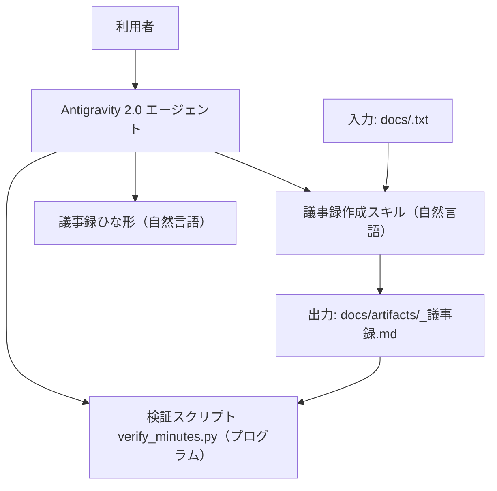

# SW105 ソフトウェア要求仕様書（エージェント定義版）

- **文書ID**: SW105
- **開発対象**: エージェント定義
- **プロジェクト名**: 議事録作成エージェント
- **版数**: 0.1
- **最終更新日**: 2026-09-04
- **承認状態**: 未承認

## 1. 概要
### 1.1 目的と位置づけ
本エージェント定義は、会議の出席者および議事録作成担当者が、テキスト形式の会議メモからMarkdown形式の議事録を作成する業務を自動化するためのソフトウェアである。利用者がAntigravity 2.0の会話スレッドにおいて指示を与えることで、会議メモを解析し、決定事項・TODO・次回議題を抽出した議事録ファイルを所定のパスに生成する。

### 1.2 適用範囲
- **対象（スコープ内）**:
  - 会議メモ（`docs/<FileName>.txt`）の読み込みおよび存在確認
  - 会議メモの解析による会議概要、決定事項、討議内容、TODO一覧、次回議題の抽出
  - Markdown形式の議事録ファイル（`docs/artifacts/<FileName>_議事録.md`）の生成および保存
  - 生成された議事録ファイルの構造および必須見出しの検証
  - 利用者への生成完了報告および未確定事項の通知
- **対象外（スコープ外）**:
  - 音声ファイル（mp3形式）からの音声認識および文字起こし処理
  - Wordファイル（docx形式）の読み込みおよびdocx形式での議事録出力
  - 会議メモに記載のない事実の推測補完（真偽判断は人間が行う）
  - 生成された議事録の最終承認および外部関係者への配信用途（人間が行う）

### 1.3 用語定義
| 用語 | 定義 |
| :--- | :--- |
| 会議メモ | 会議の発言やメモが記録されたテキスト形式の入力ファイル（パス: `docs/<FileName>.txt`）。 |
| 議事録 | 会議メモから抽出・整理されたMarkdown形式の成果物ファイル（パス: `docs/artifacts/<FileName>_議事録.md`）。 |
| Antigravity 2.0 | エージェントが動作する対話型AI実行環境。 |
| TODO | 会議で合意された実行課題。タスク内容、担当者、期限の3要素で構成される。 |
| 決定事項 | 会議において合意された決定内容。 |
| 次回議題 | 次回の会議で議論が予定される項目。 |

## 2. システム全体構成
### 2.1 システム構成概要
利用者がAntigravity 2.0のチャットスレッドを介して指示を発行し、エージェント定義が処理を実行する。自然言語レイヤーのスキルが文脈解釈と抽出を担当し、プログラムレイヤーの検証スクリプトがファイル存在確認およびMarkdown見出し構造の検証を担当する。

### 2.2 ソフトウェアの構成要素
**レイヤー分担の方針**

| レイヤー | 担当する仕事 | 本プロジェクトでの構成要素 |
| :--- | :--- | :--- |
| 自然言語レイヤー | 会議メモの文脈解釈、要約、決定事項とTODOの抽出、対話報告 | `.agents/skills/minutes-generator/SKILL.md`、`references/minutes_template.md` |
| プログラムレイヤー | 入力パス検証、出力ディレクトリ確認、議事録構文検証、終了コード通知 | `tools/verify_minutes.py` |

**振り分けの根拠**: `docs/guidelines/agent_design_principles.md` 第3.2節の判定フローに基づき、出力が一意に決まるファイル存在確認やMarkdown見出し構造の照合はプログラムレイヤーへ配置した。一方、自由な書式の入力テキストからの文脈解釈や要約、TODOの抽出は文脈依存の判断が必要なため自然言語レイヤーへ配置した。

## 3. 制約条件と前提事項
### 3.1 実行環境制約
| 項目 | 内容 |
| :--- | :--- |
| 対象AIエージェント製品 | Antigravity 2.0 |
| 想定モデル | 軽量モデルおよび高性能モデル |
| 利用可能なツール | view_file、write_to_file、run_command |
| 実行言語ランタイム | Python 3.8以降（標準ライブラリのみ使用） |
| コンテキスト制約 | 1回のタスクで読み込むファイルは最大3ファイル、合計100KB以内 |

### 3.2 ソフトウェア環境
- 入力ファイル配置: `docs/<FileName>.txt`
- 出力ファイル配置: `docs/artifacts/<FileName>_議事録.md`
- 対象オペレーティングシステム: Windows、Linux、macOS
- ファイル文字コード: UTF-8（BOMの有無を問わず対応）
- 改行コード: LFおよびCRLF

### 3.3 準拠規格
- GitHub Flavored Markdown仕様
- DADAプロセス ワークスペースルール（`.agents/AGENTS.md`）

## 4. 機能要求
### 4.1 ユースケースとシナリオ
**シナリオ1: 正常系（議事録の新規作成）**
1. 利用者がAntigravity 2.0の会話スレッドで「`docs/sample.txt` から議事録を作成してください」と指示を入力する。
2. エージェントは `tools/verify_minutes.py` を呼び出し、入力ファイルの存在とパス形式を検証する。
3. エージェントは `docs/sample.txt` を読み込み、会議概要、決定事項、討議内容、TODO、次回議題を抽出する。
4. エージェントは抽出した内容をMarkdown形式で整形し、`docs/artifacts/sample_議事録.md` に書き出す。
5. エージェントは `tools/verify_minutes.py` を実行し、生成したファイルの必須見出しを検証する。
6. 検証成功を確認後、エージェントは会話スレッドに生成完了、保存先パス、未定TODO件数を報告する。

**シナリオ2: 異常系（入力ファイルが存在しない場合）**
1. 利用者が存在しないファイルパス「`docs/not_found.txt` から議事録を作成してください」と指示を入力する。
2. エージェントは入力ファイルの検証を実行し、ファイルが存在しないことを検知する。
3. エージェントは議事録生成を行わず、利用者に対してファイルが存在しない旨のエラーメッセージを報告し処理を終了する。

### 4.2 機能詳細

#### REQ-001: 会議メモの入力パス受付と存在確認
- **概要**: 利用者から指定された入力ファイルパスの形式を検査し、ファイルの実在を確認する。
- **レイヤー**: プログラム
- **入力 / 処理 / 出力**: 入力=ファイルパス文字列（`docs/<FileName>.txt`） / 処理=パスが `docs/` ディレクトリ配下の拡張子 `.txt` であることの確認、およびファイルの実在確認 / 出力=検証結果メッセージおよび終了コード（0=正常、2=エラー）
- **異常系**: 指定されたファイルが存在しない場合、エラーメッセージ「入力ファイルが見つかりません: <パス>」を出力し終了コード2を返す。パス形式が不正な場合、エラーメッセージ「入力パスは docs/<FileName>.txt 形式で指定してください」を出力し終了コード2を返す。
- **検証条件 (Acceptance Criteria)**:
  - 実在する `docs/test.txt` を引数に指定してスクリプトを実行したとき、終了コード0を返すこと。
  - 存在しない `docs/not_found.txt` を引数に指定してスクリプトを実行したとき、エラーメッセージを出力し終了コード2を返すこと。
  - 拡張子が異なる `docs/test.docx` を引数に指定してスクリプトを実行したとき、エラーメッセージを出力し終了コード2を返すこと。
- **優先度**: Must

#### REQ-002: 会議メモからの議事録構造化と要約
- **概要**: 会議メモの本文を解析し、会議概要、決定事項、討議内容、TODO一覧、次回議題の5要素を抽出する。
- **レイヤー**: 自然言語
- **入力 / 処理 / 出力**: 入力=会議メモのテキスト本文（最大100KB） / 処理=発言内容から文脈を読み取り、会議概要（日時・場所・出席者・目的）、決定事項、討議内容（議題ごとの論点と要約）、TODO一覧、次回議題を分類・整理する / 出力=分類・整理された議事録データ
- **異常系**:
  - 幻覚対策: 入力メモに存在しない議題、参加者、決定内容を出力に含めない。
  - 逸脱対策: 根拠のない推測による決定事項の創作を行わない。
  - 指示漏れ対策: 会議概要、決定事項、討議内容、TODO一覧、次回議題の5要素のうち1要素も省略せずに出力する。
  - 参照ファイルの欠損: 入力メモが空（0バイト）の場合、議事録生成を中断し「入力ファイルの内容が空です」と報告する。
- **検証条件 (Acceptance Criteria)**:
  - 出力データに「会議概要」「決定事項」「討議内容」「TODO一覧」「次回議題」の5要素がすべて含まれること。
  - 入力メモに記載のない人物名、日付、決定内容が出力データに含まれないこと。
  - 10回の試行のうち9回以上（合格率90%以上）でREQ-002の必須要素条件および禁止要素条件を満たすこと。
- **優先度**: Must

#### REQ-003: TODO項目の抽出と属性補完
- **概要**: 会議メモから合意されたタスクを抽出し、タスク内容、担当者、期限を紐付けた表形式データを構成する。
- **レイヤー**: 自然言語
- **入力 / 処理 / 出力**: 入力=会議メモ内のタスクおよび宿題に関する記述 / 処理=合意されたアクションアイテムを抽出し、タスク内容、担当者、期限を整理する。担当者または期限が特定できない場合は「未定」を設定する / 出力=タスク内容、担当者、期限の列を持つTODO一覧データ
- **異常系**:
  - 幻覚対策: メモに存在しない担当者名や架空の日付を創作して割り当てない。
  - 逸脱対策: 決定事項とTODOを混同せず、実行課題のみをTODOとして抽出する。
  - 指示漏れ対策: メモ内に現れたすべてのアクションアイテムを取りこぼさずに抽出する。
- **検証条件 (Acceptance Criteria)**:
  - 出力されるTODO表の各行に「タスク内容」「担当者」「期限」の3項目が含まれること。
  - 担当者または期限がメモから特定できない項目について、該当箇所に「未定」と記載されること。
  - 入力メモに根拠のない日付および担当者名が出力データに含まれないこと。
  - 10回の試行のうち9回以上（合格率90%以上）でREQ-003に規定した必須要素条件および禁止要素条件を満たすこと。
- **優先度**: Must

#### REQ-004: Markdown形式議事録ファイルの生成と保存
- **概要**: 抽出・整理された議事録データをMarkdown形式に変換し、所定の成果物パスにファイルとして保存する。
- **レイヤー**: プログラム
- **入力 / 処理 / 出力**: 入力=Markdown形式の議事録テキスト、対象ファイル名（`<FileName>`） / 処理=出力先ディレクトリ `docs/artifacts/` の存在を確認し、存在しない場合はディレクトリを作成した上で、`docs/artifacts/<FileName>_議事録.md` にUTF-8形式で書き込む / 出力=保存された議事録ファイル
- **異常系**: 出力先ディレクトリへの書き込み権限がない場合、エラーメッセージを出力し終了コード2を返す。
- **検証条件 (Acceptance Criteria)**:
  - ファイル保存処理の完了後、`docs/artifacts/<FileName>_議事録.md` がストレージ上に実在すること。
  - 保存されたファイルの文字コードがUTF-8であること。
- **優先度**: Must

#### REQ-005: 生成議事録の構文および必須見出し検証
- **概要**: 生成された議事録ファイルが必須見出しおよび日付書式を満たしているかをスクリプトにより検査する。
- **レイヤー**: プログラム
- **入力 / 処理 / 出力**: 入力=議事録ファイルパス（`docs/artifacts/<FileName>_議事録.md`） / 処理=スクリプトにより以下の必須見出しの存在と日付書式(YYYY-MM-DD)を検査する / 出力=検査結果テキストおよび終了コード（0=合格、1=不合格、2=実行エラー）
  検査対象見出し:
  - `# 会議議事録`
  - `## 1. 会議概要`
  - `## 2. 決定事項`
  - `## 3. 討議内容`
  - `## 4. TODO一覧`
  - `## 5. 次回議題`
- **異常系**: 指定ファイルが存在しない場合、終了コード2を返す。必須見出しが1つでも欠落している場合、欠落した見出し名を標準出力に表示し終了コード1を返す。
- **検証条件 (Acceptance Criteria)**:
  - すべての必須見出しを含む正常なファイルを入力したとき、終了コード0を返すこと。
  - 必須見出し「## 2. 決定事項」を欠くファイルを入力したとき、欠落見出し名を出力し終了コード1を返すこと。
  - 存在しないファイルパスを入力したとき、終了コード2を返すこと。
- **優先度**: Must

#### REQ-006: 実行結果報告と未確定事項の通知
- **概要**: 議事録生成および構文検証の完了後、保存先パスと未確定事項（担当者未確定または期限未確定のTODO）の件数を次回確認のために利用者に報告する。
- **レイヤー**: 自然言語
- **入力 / 処理 / 出力**: 入力=生成結果、検証結果、未確定TODOの件数 / 処理=成果物の保存先パス、検証合否、および担当者または期限が未定（次回会議で確認予定）とされたTODO件数をまとめた報告文を作成する / 出力=会話スレッドへの完了報告メッセージ
- **異常系**:
  - 二重出力の禁止: 議事録本文の全文を会話スレッドに出力しない。
  - 逸脱対策: 完了報告以外の雑談や根拠のない推測を出力しない。
  - 指示漏れ対策: 保存先ファイルパスと未確定TODO件数（次回確認対象）の報告を省略しない。
- **検証条件 (Acceptance Criteria)**:
  - 報告文に保存先ファイルパス（`docs/artifacts/<FileName>_議事録.md`）、検証合格の旨、未確定TODO件数（次回確認対象。0件の場合は0件と明記）の3要素が含まれること。
  - 報告文に議事録本文の全文再掲が含まれないこと。
  - 10回の試行のうち9回以上（合格率90%以上）でREQ-006の必須要素条件および禁止要素条件を満たすこと。
- **優先度**: Must

## 5. 外部インタフェース要求
### 5.1 ユーザインタフェース (UI)
- 起動方法: 利用者がAntigravity 2.0の会話スレッドにおいて、自然言語により対象の会議メモファイルパスを指定して実行を指示する。
- 報告形式: 処理完了時に、保存先ファイルパス、必須見出し検証の成否、未確定TODO件数（次回確認対象）を含む要約メッセージを表示する。
- 二重出力の禁止: 議事録本文の全文は成果物ファイルにのみ書き出し、会話スレッドには要約とファイルパスのみを出力する。

### 5.2 ハードウェアインタフェース
なし

### 5.3 ソフトウェアインタフェース
- ツール連携: Antigravity 2.0の標準ツール（view_file、write_to_file、run_command）を介してファイル操作およびコマンド実行を行う。
- 検証スクリプト連携: `tools/verify_minutes.py` をコマンドライン引数および終了コード（0=正常、1=不合格、2=エラー）を介して実行・制御する。

## 6. 非機能要求（性能・品質等）
### 6.1 性能・効率性
- 応答時間: 10KB以内の会議メモ入力に対し、ファイル読み込みから議事録生成および検証完了まで60秒以内で完了すること。
- ファイルアクセス数: 1回の議事録作成タスクにおいて読み込むファイル数は最大3ファイル以内とすること。

### 6.2 信頼性・安全性
| 項目 | 要求 |
| :--- | :--- |
| 確率的振る舞いの許容範囲 | Must要求（自然言語レイヤー）は10回試行中9回以上合格（合格率90%以上）とすること。 |
| 幻覚への対策 | 入力メモに存在しない人物名、日付、発言内容、決定事項を出力ファイルに含めないこと。 |
| 逸脱への対策 | スコープ外に定めた音声ファイル処理やWordファイル変換の実行を拒否し、利用者に報告すること。 |
| 破壊的操作の扱い | 既存の議事録ファイルを上書きする場合は、書き込み前に利用者の確認を求めること。 |
| 停止条件 | スクリプトの実行エラーまたは同一の検証失敗が3回連続した場合は処理を中断し利用者に報告すること。 |

### 6.3 保守性・拡張性
- 1スキル1責務の原則を遵守し、議事録作成の手順は `.agents/skills/minutes-generator/SKILL.md` 単体で完結させること。
- 検証スクリプトは外部ライブラリに依存せず、Python標準ライブラリのみで構成すること。

### 6.4 セキュリティ
- 会議メモの内容および生成された議事録をワークスペース外部のサーバーへ送信しないこと。
- APIキーその他の秘密情報をソースコードおよび議事録ファイルに直接記載しないこと。

## 7. その他・特記事項
| # | TBD項目 / 引き継ぎ事項 | 状態 |
| :--- | :--- | :--- |
| 1 | なし | 解決済 |
