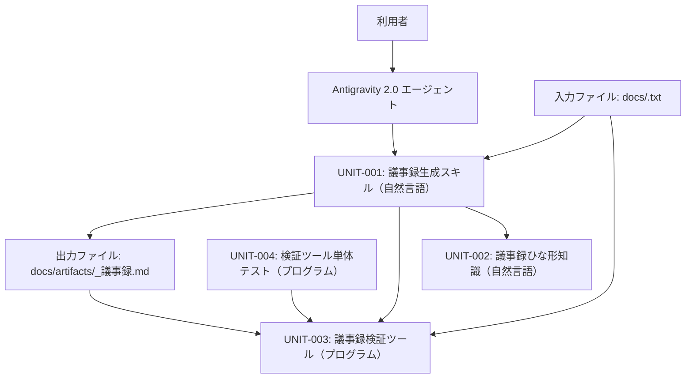
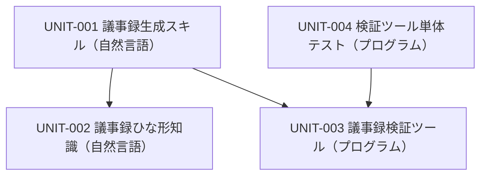
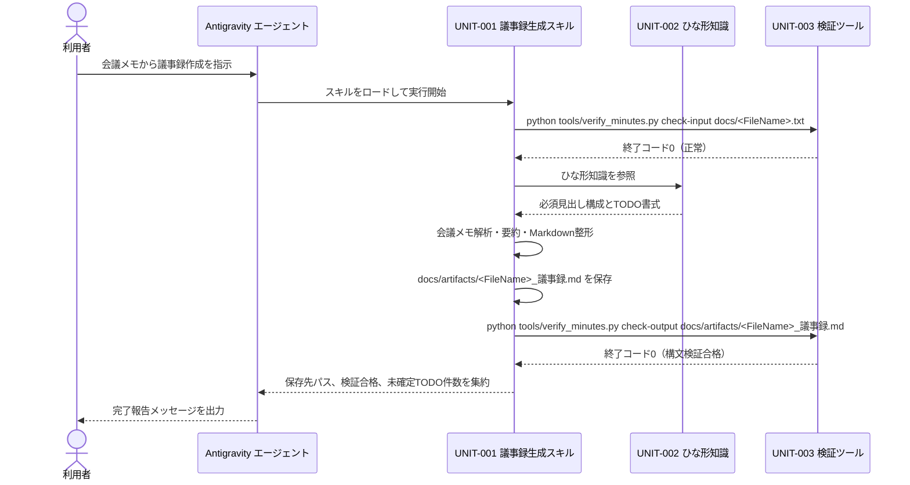

# SW205 ソフトウェアアーキテクチャ設計書（エージェント定義版）

- **文書ID**: SW205
- **開発対象**: エージェント定義
- **プロジェクト名**: 議事録作成エージェント
- **版数**: 0.1
- **最終更新日**: 2026-09-04
- **承認状態**: 未承認

## 1. 概要
### 1.1 目的と位置づけ
本書は、テキスト形式の会議メモからMarkdown形式の議事録を自動生成する議事録作成エージェント定義一式のソフトウェアアーキテクチャを定義する文書である。要求仕様書（SW105）および総合テスト仕様書（SWP6）を技術的に具現化し、自然言語レイヤーとプログラムレイヤーの責務分担、機能ユニット分割、公開インターフェース、Agent-Computer Interface（ACI）仕様、およびポカヨケ設計を定める。

### 1.2 適用範囲
- 対象AIエージェント製品: Antigravity 2.0
- 想定モデル: 軽量モデルおよび高性能モデル
- 成果物配置先:
  - 自然言語レイヤー: `.agents/skills/minutes-generator/` ディレクトリ配下
  - プログラムレイヤー: `tools/` ディレクトリ配下および `tests/` ディレクトリ配下
- 処理対象: `docs/<FileName>.txt` 形式の会議メモテキストファイル
- 出力成果物: `docs/artifacts/<FileName>_議事録.md` 形式のMarkdownファイル

### 1.3 参照ドキュメント
- `docs/artifacts/SW105_ソフトウェア要求仕様書.md`（版数: 0.1）
- `docs/artifacts/SWP6_ソフトウェア総合テスト仕様書・報告書.md`（版数: 0.1）
- `docs/guidelines/agent_design_principles.md`
- `docs/guidelines/asdoq_writing_rules.md`

### 1.4 用語定義
| 用語 | 定義 |
| :--- | :--- |
| スキル | エージェントに特定の役割や処理手順を与える自然言語の指示書ファイル（`SKILL.md`）。 |
| frontmatter | スキルファイルの先頭に記述するYAML形式のメタデータ（`name` および `description`）。 |
| ACI | Agent-Computer Interfaceの略称。エージェントがプログラムレイヤーのツールを正確に呼び出すためのコマンド仕様と契約。 |
| ポカヨケ | AIエージェントの誤操作、幻覚、逸脱、指示漏れを構造的に防止する設計手法。 |

## 2. システム構成
### 2.1 システム全体構成
利用者はAntigravity 2.0の会話スレッドを介してエージェントに指示を与える。エージェントは自然言語レイヤーの議事録生成スキル（UNIT-001）を実行し、議事録ひな形知識（UNIT-002）を参照して議事録本文を生成する。エージェントはプログラムレイヤーの議事録検証ツール（UNIT-003）を呼び出して入力パスの確認および生成成果物の構文検証を実行し、検証ツールの単体テスト（UNIT-004）によってツールの決定論的品質を担保する。



### 2.2 主たるソフトウェア要素
| 要素 | レイヤー | 役割 |
| :--- | :--- | :--- |
| UNIT-001 議事録生成スキル | 自然言語 | 会議メモの文脈解釈、5大要素の抽出、議事録の整形、および完了報告を担当する。 |
| UNIT-002 議事録ひな形知識 | 自然言語 | 議事録の標準Markdown見出し構造およびTODO表の書式定義を提供する。 |
| UNIT-003 議事録検証ツール | プログラム | 入力パスとファイル実在の検証、および生成議事録の必須見出しと日付書式の検査を担当する。 |
| UNIT-004 検証ツール単体テスト | プログラム | 議事録検証ツールの各検証機能に対する決定論的なテストケースを実行する。 |

## 3. ソフトウェア構成（静的構造）
### 3.1 ソフトウェア全体構成

**採用する設計パターン**

| 適用箇所 | 採用パターン | 採用理由 |
| :--- | :--- | :--- |
| 議事録作成処理の全体制御 | Prompt Chaining | 入力検証、テキスト抽出、議事録生成、構文検証、完了報告という処理手順が事前に固定順序として決定できるため。 |
| 構文検証の品質改善 | Evaluator-Optimizer | 検証スクリプトによる評価結果（終了コード1）に基づき、見出し欠落を最大2回の自己修正ループで改善するため。 |

**成果物のファイル構成**

```text
.agents/
  skills/
    minutes-generator/
      SKILL.md                                 # UNIT-001
      references/
        minutes_template.md                    # UNIT-002
tools/
  verify_minutes.py                            # UNIT-003
tests/
  test_verify_minutes.py                       # UNIT-004
```

**スキル分割方針**: 議事録作成に関する文脈解釈と手順制御を `.agents/skills/minutes-generator/SKILL.md` の1スキルに集約し、1スキル1責務の原則を遵守する。スキルの発動条件（`description`）を「会議メモから議事録を作成する依頼を受けたとき」と明確に定義し、他スキルとの発動条件の重複を防止する。書式定義は `references/minutes_template.md` に外部化し、手順記述の簡潔性と保守性を確保する。

**レイヤー間の依存方向**



### 3.2 機能ユニットの定義

#### UNIT-001: 議事録生成スキル
- **責務**: 利用者の指示に応じて会議メモの文脈を解釈し、ひな形知識と検証ツールを用いて議事録ファイルを生成し、完了報告を行う。
- **レイヤー**: 自然言語
- **成果物パス**: `.agents/skills/minutes-generator/SKILL.md`
- **対応要求**: REQ-002, REQ-003, REQ-006
- **公開インターフェース**:
  - 発動条件: 会議メモから議事録を作成する依頼を受けたとき（frontmatterの `description` に明記）
  - 入力: 会議メモファイル（`docs/<FileName>.txt`）、およびUNIT-002のひな形ファイル（`references/minutes_template.md`）
  - 出力: 議事録ファイル（`docs/artifacts/<FileName>_議事録.md`）、および会話スレッドへの要約完了報告
  - 呼び出すツール: UNIT-003（`tools/verify_minutes.py`）
- **依存先**: UNIT-002, UNIT-003
- **検証条件**: 会議メモから会議概要、決定事項、討議内容、TODO一覧、次回議題の5要素を抽出した議事録を生成し、UNIT-003の終了コード0を確認した上で、保存先パス、検証合格、未確定TODO件数を含む報告メッセージを出力すること。また、0バイトの空ファイルが入力された場合は議事録生成を行わず、空ファイル通知を出力すること。
- **適用するポカヨケ**: 思考過程の強制、ルート固定パス、二重出力の禁止、statusコード制御、ラベルの固定、ループ上限とエスカレーション、禁止事項の明示、完了条件のチェックリスト化

#### UNIT-002: 議事録ひな形知識
- **責務**: 議事録のMarkdown必須見出し構成、項目仕様、およびTODO表のフォーマット定義を提供する。
- **レイヤー**: 自然言語
- **成果物パス**: `.agents/skills/minutes-generator/references/minutes_template.md`
- **対応要求**: REQ-002, REQ-003
- **公開インターフェース**:
  - 発動条件: UNIT-001が議事録フォーマットの参照を必要とするとき
  - 入力: なし
  - 出力: 6つの必須見出し（`# 会議議事録`、`## 1. 会議概要`、`## 2. 決定事項`、`## 3. 討議内容`、`## 4. TODO一覧`、`## 5. 次回議題`）およびTODO表（列名: タスク内容、担当者、期限）を含むMarkdownテンプレートテキスト
  - 呼び出すツール: なし
- **依存先**: なし
- **検証条件**: ひな形テキストが6つの必須見出し、日付書式(YYYY-MM-DD)、およびTODO表の3列ヘッダーを過不足なく定義していること。
- **適用するポカヨケ**: ルート固定パス、ラベルの固定、禁止事項の明示

#### UNIT-003: 議事録検証ツール
- **責務**: 入力会議メモのパス形式と実在性を確認し、生成された議事録ファイルの必須見出しおよび日付書式を決定論的に検査する。
- **レイヤー**: プログラム
- **成果物パス**: `tools/verify_minutes.py`
- **対応要求**: REQ-001, REQ-004, REQ-005
- **公開インターフェース**:
  - コマンド行: `python tools/verify_minutes.py <subcommand> <file_path>`
  - 引数: サブコマンド（`check-input` または `check-output`）、ファイルパス文字列
  - 標準出力: 検査結果要約1行テキスト
  - 終了コード: 0（合格・正常）、1（構文不合格）、2（実行エラー・パス不正・ファイル非存在）
- **依存先**: なし
- **検証条件**: 実在する `docs/sample.txt` に対する `check-input` で終了コード0を返し、存在しないファイルや `.docx` 拡張子に対してエラーメッセージと終了コード2を返すこと。全必須見出しを含む議事録に対する `check-output` で終了コード0を返し、見出し欠落ファイルに対して欠落見出し名と終了コード1を返すこと。
- **適用するポカヨケ**: ルート固定パス、二重出力の禁止、statusコード制御、ラベルの固定、禁止事項の明示

#### UNIT-004: 検証ツール単体テスト
- **責務**: 議事録検証ツール（UNIT-003）の全サブコマンドおよび正常系・異常系テストケースを決定論的に実行し、品質を検証する。
- **レイヤー**: プログラム
- **成果物パス**: `tests/test_verify_minutes.py`
- **対応要求**: REQ-001, REQ-004, REQ-005
- **公開インターフェース**:
  - コマンド行: `python -m unittest tests/test_verify_minutes.py`
  - 引数: なし
  - 標準出力: unittest実行結果テキスト
  - 終了コード: 0（全テストPass）、1（テストFailまたはError）
- **依存先**: UNIT-003
- **検証条件**: SWP6に定義されたTC-001からTC-004、およびTC-011からTC-016に対応する全単体テストケースを実行し、全件Passすること。
- **適用するポカヨケ**: statusコード制御、完了条件のチェックリスト化

## 4. 制御方式（動的振る舞いとリソース割り当て）
### 4.1 メモリ構成とレイアウト
本システムにおけるコンテキスト管理方針を以下に定める。

| 項目 | 方針 |
| :--- | :--- |
| ロード方針 | UNIT-001（スキル）は会話開始時の指示に応じてロードする。UNIT-002（ひな形知識）は議事録生成の執筆直前にのみロードし、コンテキストの肥大を防止する。 |
| 引き継ぐ情報 | 会話スレッド内では入力ファイルパス、抽出した構造化データ、検証ツールの終了コードのみを引き継ぎ、無関係な過去ログを排除する。 |
| 状態の外部化 | 生成途中および完成した議事録は直ちに `docs/artifacts/<FileName>_議事録.md` へ書き出し、コンテキストメモリ内に全文を滞留させない。 |

### 4.2 ソフトウェア制御方式
利用者の起動指示から議事録生成および完了報告に至る制御フローを以下のシーケンス図に示す。



**ループと停止条件**

| ループ | 上限 | 打ち切り後の行き先 |
| :--- | :--- | :--- |
| 構文検証不合格（終了コード1）に対する自己校正ループ | 2回 | 修正を打ち切り、欠落見出し名と未解決状態を明記して利用者へエスカレーション報告を行う。 |
| スクリプト実行エラー（終了コード2） | 1回 | 即座に処理を中断し、エラーメッセージをそのまま利用者へ報告して指示を仰ぐ。 |

### 4.3 性能見積り
- 読み込みファイル数: 1タスクあたり最大3ファイル（会議メモテキスト、ひな形知識ファイル、生成後検証対象ファイル）。
- 想定トークン量: 会議メモテキスト（最大100KB、約25,000トークン）、ひな形知識（約1,000トークン）、生成議事録（約3,000トークン）。合計約29,000トークンであり、モデルの許容コンテキスト窓（128,000トークン以上）に十分に収まる。
- 応答ステップ数: 入力検証（1ステップ）、議事録生成と保存（1ステップ）、構文検証（1ステップ）、完了報告（1ステップ）の計4ステップで完了する。

## 5. 機能ユニット詳細（ACI仕様）

### 5.1 議事録検証ツール（UNIT-003）のACI仕様
| 項目 | 内容 |
| :--- | :--- |
| 対応UNIT-ID | UNIT-003 |
| コマンド行 | `python tools/verify_minutes.py <subcommand> <file_path>` |
| 引数 | 1. `subcommand` / 文字列 / 必須 / 既定値なし / `check-input`（入力パス検証）または `check-output`（議事録構文検証）のいずれか<br>2. `file_path` / 文字列 / 必須 / 既定値なし / 検証対象ファイルの相対パス |
| 標準出力 | 検査結果の要約1行テキスト（例: `入力検証合格: docs/sample.txt`、`検証合格: docs/artifacts/sample_議事録.md`、`必須見出しが欠落しています: ## 2. 決定事項`） |
| レポート出力先 | なし |
| 終了コード | 共通: 2=実行エラー（ファイル非存在、拡張子不正、パス形式不正）<br>`check-input`: 0=正常（入力パス形式合致およびファイル実在）<br>`check-output`: 0=合格（全必須見出しおよび日付書式合致）、1=不合格（必須見出し欠落または日付書式不正） |
| 想定エラーと復旧 | 終了コード1が返された場合、エージェントは標準出力に示された欠落見出しを補完する修正を行い、最大2回まで再検証を実行する。終了コード2が返された場合、エージェントは推測で処理を続行せず、エラーメッセージを利用者へ報告して処理を中断する。 |
| 使用例 | 入力検証: `python tools/verify_minutes.py check-input docs/sample.txt`<br>構文検証: `python tools/verify_minutes.py check-output docs/artifacts/sample_議事録.md` |

### 5.2 検証ツール単体テスト（UNIT-004）のACI仕様
| 項目 | 内容 |
| :--- | :--- |
| 対応UNIT-ID | UNIT-004 |
| コマンド行 | `python -m unittest tests/test_verify_minutes.py` |
| 引数 | なし |
| 標準出力 | unittest実行結果テキスト（テスト件数、実行時間、Pass/Fail表示） |
| レポート出力先 | なし |
| 終了コード | 0=全単体テストPass<br>1=単体テスト失敗または実行エラー |
| 想定エラーと復旧 | 終了コード1が返された場合、出力されたスタックトレースに基づき `tools/verify_minutes.py` の不具合箇所を修正し、テストを再実行する。 |
| 使用例 | `python -m unittest tests/test_verify_minutes.py` |

## 6. システムで扱うデータ
本システムで読み書きするファイルの一覧と仕様を以下に定義する。

| ファイル | 書式 | 書く主体 | 読む主体 |
| :--- | :--- | :--- | :--- |
| `docs/<FileName>.txt` | プレーンテキスト（UTF-8） | 利用者 | UNIT-001, UNIT-003 |
| `.agents/skills/minutes-generator/SKILL.md` | Markdown（YAML frontmatter付き） | 開発者（Phase 4） | Antigravity エージェント |
| `.agents/skills/minutes-generator/references/minutes_template.md` | Markdown | 開発者（Phase 4） | UNIT-001 |
| `tools/verify_minutes.py` | Pythonスクリプト | 開発者（Phase 4） | UNIT-001, UNIT-004 |
| `tests/test_verify_minutes.py` | Python単体テストコード | 開発者（Phase 4） | AIテスト実行者 |
| `docs/artifacts/<FileName>_議事録.md` | Markdown（UTF-8） | UNIT-001 | 利用者, UNIT-003 |

## 7. 例外・異常処理一覧

| # | 異常ケース | 検知方法 | リカバリ手順 | 対応要求 |
| :--- | :--- | :--- | :--- | :--- |
| 1 | 指定された入力ファイルが存在しない | UNIT-003の `check-input` 実行による終了コード2検知 | 議事録生成を行わず、利用者へ「入力ファイルが見つかりません: <パス>」と通知して処理を終了する。 | REQ-001 |
| 2 | 入力パスの拡張子が `.txt` ではない、または `docs/` 配下ではない | UNIT-003の `check-input` 実行による終了コード2検知 | 議事録生成を行わず、利用者へ「入力パスは docs/<FileName>.txt 形式で指定してください」と通知して処理を終了する。 | REQ-001 |
| 3 | 入力ファイルの内容が0バイト（空）である | UNIT-001によるファイルサイズ確認 | 議事録ファイルを新規生成せず、利用者へ「入力ファイルの内容が空です」と通知して処理を終了する。 | REQ-002 |
| 4 | 会議メモに存在しない架空の決定事項や人物名が出力されそうになる（幻覚） | UNIT-001の完了前自己チェックによる入力メモとの照合 | 入力メモに記載のない決定事項や人物名を削除し、合意されていない事項は「決定事項なし」と表記する。 | REQ-002 |
| 5 | 会議決定とTODO項目が混同される（逸脱） | UNIT-001の完了前自己チェックによる分類照合 | アクションアイテムのみをTODO表へ配置し、合意事項は決定事項の節へ再配置する。 | REQ-003 |
| 6 | 生成議事録の必須見出しが欠落している、または日付書式が不正 | UNIT-003の `check-output` 実行による終了コード1検知 | 標準出力に示された欠落見出しまたは日付書式を修正し、最大2回まで再検証を実行する。解消しない場合は利用者に報告する。 | REQ-005 |
| 7 | 会話スレッドに議事録本文の全文を出力しそうになる（二重出力） | UNIT-001の完了前自己チェック | 会話スレッドへの出力を保存先パス、検証結果、未確定TODO件数の要約のみに限定し、本文再掲を排除する。 | REQ-006 |
| 8 | 検証スクリプトの実行環境障害（Python未導入、権限不足等） | スクリプト実行失敗または終了コード2検知 | 処理を中断し、環境エラーの内容を利用者へ報告して手動確認を依頼する。 | REQ-001, REQ-005 |

## 8. その他・特記事項
### 8.1 アーキテクチャ決定記録（ADR）

#### ADR-001: 議事録構文検証処理のプログラムレイヤー委譲
- **背景**: 生成された議事録が6つの必須見出しおよび日付書式(YYYY-MM-DD)を満たしているかの判定を自然言語レイヤーで行うと、モデルの出力揺れにより見落としが発生するリスクがある。
- **決定**: 判定処理をPythonスクリプト `tools/verify_minutes.py` へ委譲し、終了コード（0=合格、1=不合格、2=エラー）で合否を返す。
- **理由**: `docs/guidelines/agent_design_principles.md` 第3.2節の問1（出力が一意に決まるか）および問2（網羅的な照合か）がともにYesであり、決定論的な検証に適しているため。
- **捨てた選択肢**: 自然言語レイヤーでの自己検査のみ（見出し欠落の見落としリスクが残るため却下）。

#### ADR-002: 単体テストフレームワークとしてPython標準のunittestを採用
- **背景**: SWP6においてプログラムレイヤーの単体テストフレームワークがTBDとされていたため確定が必要であった。
- **決定**: Python標準ライブラリの `unittest` を採用する。
- **理由**: SW105第3.1節および第6.3節において外部ライブラリへの依存を排除し、標準ライブラリのみで構成することが要求されているため。
- **捨てた選択肢**: `pytest`（外部パッケージのインストールが必要となり実行環境制約に抵触するため却下）。

#### ADR-003: ワークフロー制御パターンとしてPrompt Chainingを採用
- **背景**: 議事録作成処理の全体制御アーキテクチャを決定する必要があった。
- **決定**: Prompt Chaining パターンを採用する。
- **理由**: 入力検証、テキスト抽出、議事録生成、構文検証、完了報告という処理手順が事前に固定順序として決定可能であり、自律的な探索ループを必要としないため。
- **捨てた選択肢**: Orchestrator-Subagents パターン（本タスクは単一スキル内で直列実行可能な規模であり、サブエージェント分割は過剰な複雑性をもたらすため却下）。

### 8.2 SWP6のTBD解消
| SWP6のTBD項目 | 確定内容 |
| :--- | :--- |
| 単体テストフレームワーク | Python標準ライブラリの `unittest` を使用する |
| 評価セットの実行方法 | 新規の会話スレッドにおいてエージェントを起動し、SWP6第4.3節に定義された各評価IDの入力プロンプトを投入し、出力結果を `docs/process/eval_report.md` に記録する |

### 8.3 トレーサビリティ表（REQ ↔ UNIT）

| 要求ID (SW105) | レイヤー | 対応設計ユニットID |
| :--- | :--- | :--- |
| REQ-001 | プログラム | UNIT-003, UNIT-004 |
| REQ-002 | 自然言語 | UNIT-001, UNIT-002 |
| REQ-003 | 自然言語 | UNIT-001, UNIT-002 |
| REQ-004 | プログラム | UNIT-003, UNIT-004 |
| REQ-005 | プログラム | UNIT-003, UNIT-004 |
| REQ-006 | 自然言語 | UNIT-001 |

### 8.4 ポカヨケ適用状況

| # | ポカヨケ基準 | 適用したユニット | 適用なしの理由 |
| :--- | :--- | :--- | :--- |
| 1 | 思考過程の強制 | UNIT-001 | なし |
| 2 | ルート固定パス | UNIT-001, UNIT-002, UNIT-003 | なし |
| 3 | 二重出力の禁止 | UNIT-001, UNIT-003 | なし |
| 4 | statusコード制御 | UNIT-001, UNIT-003, UNIT-004 | なし |
| 5 | ラベルの固定 | UNIT-001, UNIT-002, UNIT-003 | なし |
| 6 | ループ上限とエスカレーション | UNIT-001 | なし |
| 7 | 禁止事項の明示 | UNIT-001, UNIT-002, UNIT-003 | なし |
| 8 | 完了条件のチェックリスト化 | UNIT-001, UNIT-004 | なし |
