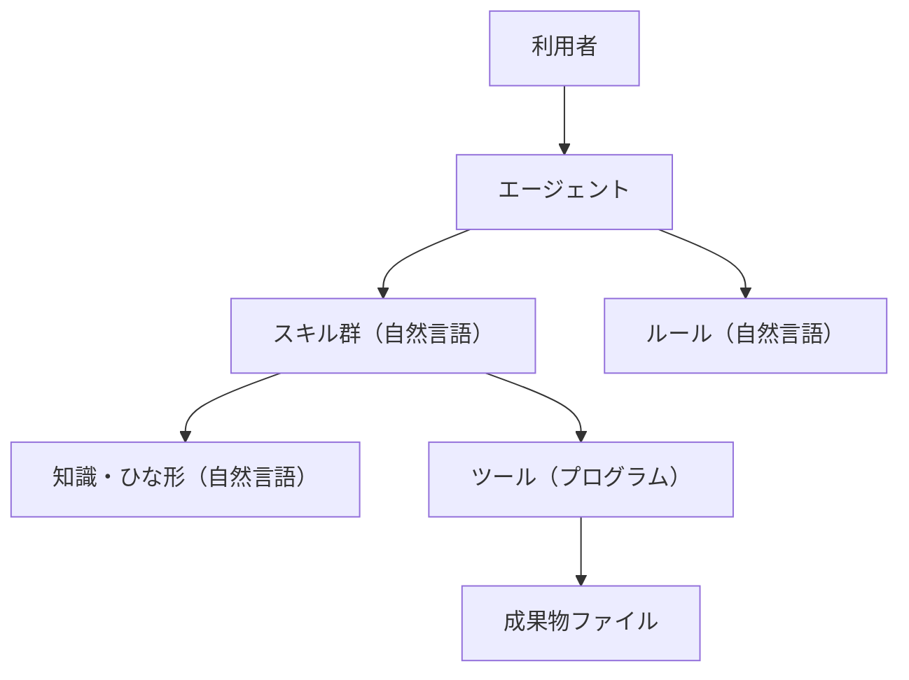

# SW105 ソフトウェア要求仕様書（エージェント定義版）

> 【AIへの指示】開発対象が「エージェント定義」の場合、本ひな形をコピーして `docs/artifacts/SW105_ソフトウェア要求仕様書.md` を作成すること。`（…）` のプレースホルダを埋め、**2階層目（`##`）の見出しは追加・削除・順序変更をしない**（機械チェックが標準目次と照合する）。`REQ-EX`（記入例）は理解したら削除すること。
> 【AIへの指示】文章は `docs/guidelines/asdoq_writing_rules.md`（執筆ルール12箇条）に従って書くこと。レイヤーの振り分けは `docs/guidelines/agent_design_principles.md` の第3章「振り分け判定フロー」に従うこと。
> 【AIへの指示】**`- **概要**:` `- **入力 / 処理 / 出力**:` `- **異常系**:` `- **検証条件 (Acceptance Criteria)**:` `- **優先度**:` のラベルは一字一句変えないこと**（機械チェックがこの表記で読み取る）。

- **文書ID**: SW105
- **開発対象**: エージェント定義
- **プロジェクト名**: （プロジェクト名）
- **版数**: 0.1（承認ごとに更新）
- **最終更新日**: （YYYY-MM-DD）
- **承認状態**: 未承認

## 1. 概要
### 1.1 目的と位置づけ
（このエージェント定義が解決する課題と、利用者の業務における役割を2〜5文で。「誰が」「どの場面で」「何のために」使うかを含める）

### 1.2 適用範囲
- **対象（スコープ内）**: （このエージェントが担当するタスク。箇条書き）
- **対象外（スコープ外）**: （エージェントに任せないタスク。人間が行うこと。Product Ownerと合意したもののみ）

### 1.3 用語定義
| 用語 | 定義 |
| :--- | :--- |
| （用語） | （定義。同じ概念に複数の呼び名を使わない） |

## 2. システム全体構成

> 【AIへの指示】エージェント定義は「自然言語レイヤー」と「プログラムレイヤー」の二重構造である。ここで分担の方針を定め、4章の各要求はこの方針に従ってレイヤーを割り当てる。

### 2.1 システム構成概要
（エージェント本体・スキル・ルール・知識・ツール・外部システムの関係。Mermaid図を推奨）

### 2.2 ソフトウェアの構成要素
**レイヤー分担の方針**

| レイヤー | 担当する仕事 | 本プロジェクトでの構成要素 |
| :--- | :--- | :--- |
| 自然言語レイヤー | 文脈依存の知的な意思決定、意図の解釈、ワークフローの制御 | （例: `.agents/skills/<name>/SKILL.md`、`AGENTS.md`、`references/` 配下のひな形） |
| プログラムレイヤー | 厳密な変換、網羅的な照合、決定論的な検証、集計 | （例: `tools/<name>.py`） |

**振り分けの根拠**: （`agent_design_principles.md` 第3.2節の3問に基づく判断を1〜3文で。「出力が一意に決まる処理と網羅的な照合はプログラムレイヤーへ置いた」等）

## 3. 制約条件と前提事項
### 3.1 実行環境制約
| 項目 | 内容 |
| :--- | :--- |
| 対象AIエージェント製品 | （例: Antigravity 2.0 / Antigravity IDE / CLI。複数の場合は全て列挙） |
| 想定モデル | （例: 軽量モデルでも動作すること。不明な場合はTBDとして7章へ） |
| 利用可能なツール | （ファイル読み書き、コマンド実行、ブラウザ操作、サブエージェント起動の可否） |
| 実行言語ランタイム | （プログラムレイヤーの前提。例: Python 3.8以降・標準ライブラリのみ） |
| コンテキスト制約 | （1回の会話で読み込める文書量の想定。オンデマンド・ロードの必要性） |

### 3.2 ソフトウェア環境
（ファイル配置の制約、既存リポジトリとの共存条件、OS、文字コード。Product Ownerが指定したもののみ書く）

### 3.3 準拠規格
（社内規約、既存プロセス、業界標準。なければ「特になし」）

## 4. 機能要求

> 【AIへの指示】機能要求は1件ずつ以下のブロック形式で書く。REQ-IDは `REQ-001` から連番（`REQ-NL-001` のような独自書式にしないこと。機械チェックが読めなくなる）。
> 【AIへの指示】`- **レイヤー**:` には「自然言語」「プログラム」「両方」のいずれかを書く。「両方」の場合は、どの部分がどちらかを本文で分けて書く。
> 【AIへの指示】検証条件は、レイヤーによって書き方を変える。プログラムレイヤーは「条件＋数値＋期待結果」で決定論的に書く。自然言語レイヤーは**確率的な揺れを前提に、必須要素・禁止要素・試行回数・合格率**で書く。
> 【AIへの指示】曖昧語（適切に・高速に・使いやすく・柔軟に・基本的に）は禁止。

### 4.1 ユースケースとシナリオ
（利用者がエージェントを起動してから成果物を得るまでの流れ。起動プロンプトの例文を含めると、Phase 2の評価セットの入力として再利用できる）

### 4.2 機能詳細

#### REQ-EX: （記入例・自然言語レイヤー）会議メモからの議事録生成
- **概要**: 利用者が貼り付けた会議メモから、決定事項・TODO・次回議題を抽出した議事録を生成する。
- **レイヤー**: 自然言語
- **入力 / 処理 / 出力**: 入力=会議メモの本文（書式自由、最大10,000文字） / 処理=発言から決定事項とTODOを分類し、担当者と期限を紐づける / 出力=Markdown形式の議事録ファイル（`docs/minutes/YYYY-MM-DD.md`）
- **異常系**: 会議メモに担当者名が現れないTODOがある場合、担当者欄に「未定」と記載し、生成後の報告に未定件数を明示する。メモが空の場合は生成せず、入力が空である旨を報告する。
- **検証条件 (Acceptance Criteria)**:
  - 出力に見出し「決定事項」「TODO」「次回議題」の3つが含まれること。
  - TODOの各行に担当者名と期限が含まれること（担当者が特定できない場合は「未定」と記載されること）。
  - 入力メモに存在しない人名・日付が出力に含まれないこと。
  - 上記3条件を、10回の試行のうち9回以上（合格率90%以上）で満たすこと。
- **優先度**: Must

#### REQ-EX2: （記入例・プログラムレイヤー）議事録の書式検証
- **概要**: 生成された議事録ファイルが必須見出しと日付書式を満たすかを検証する。
- **レイヤー**: プログラム
- **入力 / 処理 / 出力**: 入力=議事録ファイルのパス / 処理=必須見出しの存在と日付書式（YYYY-MM-DD）を検査する / 出力=標準出力への検査結果と終了コード（0=合格、1=不合格、2=実行エラー）
- **異常系**: 指定パスのファイルが存在しない場合、標準エラー出力にパスを表示し終了コード2を返す。
- **検証条件 (Acceptance Criteria)**:
  - 必須見出しを3つ含むファイルを入力すると、終了コード0を返すこと。
  - 見出しを1つ削除したファイルを入力すると、欠落した見出し名を出力し終了コード1を返すこと。
  - 存在しないパスを入力すると、終了コード2を返すこと。
- **優先度**: Must

#### REQ-001: （要求名）
- **概要**: （1〜2文）
- **レイヤー**: 自然言語 / プログラム / 両方
- **入力 / 処理 / 出力**: （それぞれ具体的に）
- **異常系**: （「なし」は原則禁止。不要な場合は理由を書く。自然言語レイヤーでは「幻覚・逸脱・指示漏れが起きたときにどう振る舞うべきか」を書く）
- **検証条件 (Acceptance Criteria)**: （プログラム=条件＋数値＋期待結果 / 自然言語=必須要素・禁止要素・試行回数・合格率）
- **優先度**: Must / Should / Could

## 5. 外部インタフェース要求
### 5.1 ユーザインタフェース (UI)
（利用者との対話の仕様。起動方法、エージェントが人間に確認を求める点、報告の定型、進行表示の要否。なければ「特になし」）

### 5.2 ハードウェアインタフェース
（実機・デバイス操作を伴う場合のみ。なければ「特になし」）

### 5.3 ソフトウェアインタフェース
（ツール・外部API・MCPサーバー・他エージェントとの連携仕様。他エージェントへの引き継ぎがある場合は、引き継ぎ文書のパスと項目を書く。なければ「特になし」）

## 6. 非機能要求（性能・品質等）

> 【AIへの指示】必ず数値目標を書く。数値が決められない場合はTBDとして7章に記録し、Product Ownerに確認する。
> 【AIへの指示】6.2には**確率的振る舞いの許容範囲**を必ず書く（エージェント定義固有の必須項目）。

### 6.1 性能・効率性
（応答までの時間、1タスクあたりのトークン消費の上限、読み込む文書量の上限。例: 通常の1タスクで読み込む文書は3ファイル以内とする）

### 6.2 信頼性・安全性
| 項目 | 要求 |
| :--- | :--- |
| 確率的振る舞いの許容範囲 | （例: Must要求は10回試行で合格率90%以上、Should要求は5回試行で80%以上） |
| 幻覚への対策 | （例: 入力に存在しない固有名詞を出力しない。IDは元文書から転記し記憶から書かない） |
| 逸脱への対策 | （例: 禁止事項に列挙した操作を行わない。判断できない場合は停止して人間に報告する） |
| 破壊的操作の扱い | （例: ファイル削除・上書きの前に人間の承認を得る） |
| 停止条件 | （例: 同一の失敗が3回連続したら打ち切り、人間へ報告する） |

### 6.3 保守性・拡張性
（スキルの追加・変更のしやすさ、1スキル1責務の維持、他プロジェクトへの流用可否）

### 6.4 セキュリティ
（秘密情報の取り扱い、外部送信の禁止範囲、APIキーの管理方法）

## 7. その他・特記事項
| # | TBD項目 / 引き継ぎ事項 | 状態 |
| :--- | :--- | :--- |
| 1 | （未決定事項。解消の時期と方法を併記する。なければ「なし」と1行書く） | 未解決 |
