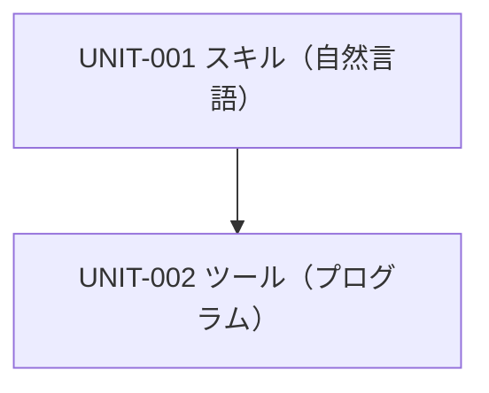
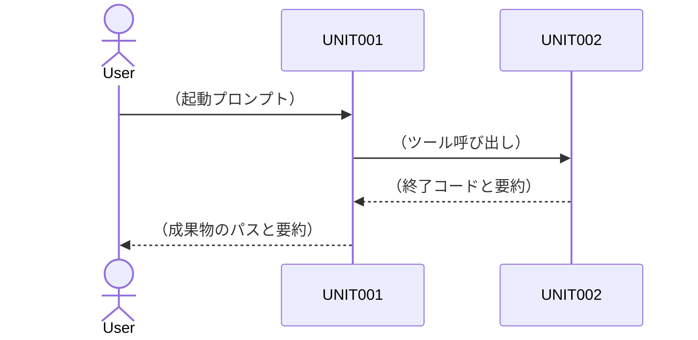

# SW205 ソフトウェアアーキテクチャ設計書（エージェント定義版）

> 【AIへの指示】開発対象が「エージェント定義」の場合、本ひな形をコピーして `docs/artifacts/SW205_ソフトウェアアーキテクチャ設計書.md` を作成すること。**2階層目（`##`）の見出しは追加・削除・順序変更をしない**（機械チェックが標準目次と照合する）。
> 【AIへの指示】`UNIT-EX`・`ADR-EX`（記入例）は理解したら削除すること。文章は `docs/guidelines/asdoq_writing_rules.md`（執筆ルール12箇条）に従って書くこと。
> 【AIへの指示】レイヤーの振り分けとポカヨケ設計基準は `docs/guidelines/agent_design_principles.md` の第3章・第5章に従うこと。
> 【AIへの指示】**`- **責務**:` `- **対応要求**:` `- **公開インターフェース**:` `- **依存先**:` `- **検証条件**:` のラベルは一字一句変えないこと**（機械チェックがこの表記で読み取る）。

- **文書ID**: SW205
- **開発対象**: エージェント定義
- **プロジェクト名**: （プロジェクト名）
- **版数**: 0.1（承認ごとに更新）
- **最終更新日**: （YYYY-MM-DD）
- **承認状態**: 未承認

## 1. 概要
### 1.1 目的と位置づけ
（この設計書が定義する範囲。生成するエージェント定義一式の構造を定義する旨を書く）

### 1.2 適用範囲
（対象とするAIエージェント製品・モデル・配置先リポジトリの境界）

### 1.3 参照ドキュメント
- `docs/artifacts/SW105_ソフトウェア要求仕様書.md`（版数: ）
- `docs/artifacts/SWP6_ソフトウェア総合テスト仕様書・報告書.md`（版数: ）
- `docs/guidelines/agent_design_principles.md`

### 1.4 用語定義
（SW105の用語定義に追加が必要な技術用語のみ。例: スキル、ルール、frontmatter、ACI）

## 2. システム構成
### 2.1 システム全体構成
（エージェント・利用者・外部システム・ツールの境界。Mermaid図推奨）

### 2.2 主たるソフトウェア要素
| 要素 | レイヤー | 役割 |
| :--- | :--- | :--- |
| （例: `dada-process` スキル） | 自然言語 | （役割） |
| （例: `tools/foo_check.py`） | プログラム | （役割） |

## 3. ソフトウェア構成（静的構造）
### 3.1 ソフトウェア全体構成

**採用する設計パターン**（`agent_design_principles.md` 第2.2節の5パターンから選び、理由を書く）

| 適用箇所 | 採用パターン | 採用理由 |
| :--- | :--- | :--- |
| （例: 全体の工程制御） | Prompt Chaining | （手順が事前に固定できるため） |
| （例: 起動時の振り分け） | Routing | （入力の種類で処理が分かれるため） |

**成果物のファイル構成**（生成するファイルをすべて列挙する。パスは実際に生成する位置をそのまま書く）

```text
.agents/
  AGENTS.md                          # UNIT-00X
  skills/
    <skill-name>/
      SKILL.md                       # UNIT-00X
      references/<file>.md           # UNIT-00X
tools/
  <tool-name>.py                     # UNIT-00X
```

**スキル分割方針**: （1スキル1責務の原則に基づく分割理由。スキルの発動条件が重複しないことを説明する）

**レイヤー間の依存方向**



### 3.2 機能ユニットの定義

> 【AIへの指示】ユニットは1件ずつ以下のブロック形式で書く。UNIT-IDは `UNIT-001` から連番（`UNIT-NL-001` のような独自書式にしないこと。機械チェックが読めなくなる）。
> 【AIへの指示】1ユニット＝1ファイルを原則とする（`SKILL.md` 1つ、スクリプト1つ）。ファイル単位に対応させることで、実装漏れを機械チェックで検出できる。
> 【AIへの指示】対応要求のREQ-IDは、SW105を開いて転記する（記憶から書かない）。
> 【AIへの指示】`- **公開インターフェース**:` の書き方は、レイヤーによって変える。自然言語レイヤーは「発動条件（description）／入力（読むファイル）／出力（書くファイル）／呼び出すツール」を書く。プログラムレイヤーは「コマンド行／引数／標準出力／終了コード」を書く。
> 【AIへの指示】**`- **成果物パス**:` は必ず埋めること（省略禁止）。** この欄は機械チェックの入力である。`dada_check.py` の `code` チェックは、成果物パスが書かれているUNITについて「そのパスにファイルが実在し、UNIT-IDが記載されているか」を照合する。エージェント定義の成果物は `.agents/` や `tools/` 配下（ソースツリー走査の除外ディレクトリ）に置かれるため、**この欄が空だと全ユニットが「未実装」と誤検出され、終了コードが 0 にならず承認ゲート・自律ゲートを通過できない。**
> 【AIへの指示】プログラムレイヤーの**テストコードは `tests/` 配下**に置く設計にすること。`tools/` は走査除外のため、そこに置いた「自動」区分のテストコードは機械チェックに検出されない。

#### UNIT-EX: （記入例・自然言語レイヤー）議事録生成スキル
- **責務**: 会議メモから議事録を生成し、指定パスへ書き出す。
- **レイヤー**: 自然言語
- **成果物パス**: `.agents/skills/minutes-writer/SKILL.md`
- **対応要求**: REQ-EX
- **公開インターフェース**: 発動条件=「会議メモから議事録を作る依頼を受けたとき」（frontmatterの `description` に記載） / 入力=利用者が投入した会議メモ本文、`references/minutes_template.md` / 出力=`docs/minutes/YYYY-MM-DD.md` / 呼び出すツール=UNIT-EX2（書式検証）
- **依存先**: UNIT-EX2（書式検証ツール。終了コード0を確認してから完了報告する）
- **検証条件**: 必須見出し3つを含む議事録が生成され、UNIT-EX2の終了コードが0であること。
- **適用するポカヨケ**: ルート固定パス（出力先を literal で固定）／statusコード制御（UNIT-EX2の終了コードで分岐）／完了条件のチェックリスト化

#### UNIT-EX2: （記入例・プログラムレイヤー）議事録書式検証ツール
- **責務**: 議事録ファイルが必須見出しと日付書式を満たすかを検証する。
- **レイヤー**: プログラム
- **成果物パス**: `tools/minutes_check.py`
- **対応要求**: REQ-EX2
- **公開インターフェース**: `python tools/minutes_check.py <path>` / 標準出力=検査結果の要約1行 / 終了コード=0（合格）、1（不合格）、2（実行エラー）
- **依存先**: なし
- **検証条件**: 必須見出しを1つ削除したファイルで終了コード1を返し、欠落した見出し名を出力すること。
- **適用するポカヨケ**: statusコード制御／二重出力の禁止（詳細はレポートファイルへ、標準出力は要約1行）

#### UNIT-001: （ユニット名）
- **責務**: （1文で言い切る）
- **レイヤー**: 自然言語 / プログラム
- **成果物パス**: （生成するファイルのパス）
- **対応要求**: （REQ-ID列挙）
- **公開インターフェース**: （レイヤーに応じた書き方。上記の記入例に倣う）
- **依存先**: （UNIT-ID。なければ「なし」）
- **検証条件**: （単体で合否判定できる条件）
- **適用するポカヨケ**: （`agent_design_principles.md` 第5章の8基準から該当するものを列挙）

## 4. 制御方式（動的振る舞いとリソース割り当て）
### 4.1 メモリ構成とレイアウト
（エージェント定義では「コンテキスト管理」として記述する。オンデマンド・ロードの方針、1タスクで読み込む文書の上限、フェーズ間で引き継ぐ情報の限定。組込み等のメモリ設計が不要な場合は本節をコンテキスト管理の記述に充てる）

| 項目 | 方針 |
| :--- | :--- |
| ロード方針 | （例: 判断基準のガイドラインは執筆・レビューの瞬間にのみロードする） |
| 引き継ぐ情報 | （例: 承認済み文書のパスとサマリーのみ。会話履歴の要約は渡さない） |
| 状態の外部化 | （長時間タスクの進捗を書き出すファイルとその更新頻度） |

### 4.2 ソフトウェア制御方式
（スキルの切替方式、ワークフローの制御、サブエージェント協調の有無、人間の承認点。主要ユースケースのシーケンス図を1つ以上）



**ループと停止条件**

| ループ | 上限 | 打ち切り後の行き先 |
| :--- | :--- | :--- |
| （例: 自己校正ループ） | （2周） | （人間へ残課題として報告） |

### 4.3 性能見積り
（SW105の性能要求に対する見積もり。1タスクあたりの読み込みファイル数、想定トークン量、応答までの段数）

## 5. 機能ユニット詳細（ACI仕様）

> 【AIへの指示】プログラムレイヤーの全ユニット（ツール）について、以下の表を1件ずつ書く。ACI（Agent-Computer Interface）はエージェントがツールを誤用しないための契約であり、省略できない。
> 【AIへの指示】**使用例は、自然言語レイヤーの `SKILL.md` に書くコマンド行と一字一句一致させること**（一貫性の遵守）。

### 5.1 （ツール名）のACI仕様
| 項目 | 内容 |
| :--- | :--- |
| 対応UNIT-ID | UNIT-00X |
| コマンド行 | `python tools/<name>.py <引数>` |
| 引数 | （名前 / 型 / 必須か / 既定値 / 説明） |
| 標準出力 | （形式。要約1行か、構造化データか） |
| レポート出力先 | （詳細を書き出すファイルパス。なければ「なし」） |
| 終了コード | 0=（意味） / 1=（意味） / 2=（意味） |
| 想定エラーと復旧 | （実行できない場合にエージェントが取るべき代替手順） |
| 使用例 | `python tools/<name>.py docs/artifacts/foo.md` |

## 6. システムで扱うデータ
（エージェントが読み書きするファイルの一覧と書式。プロセス状態ファイル、成果物、ログ。ファイルごとに「誰が書き、誰が読むか」を明記する）

| ファイル | 書式 | 書く主体 | 読む主体 |
| :--- | :--- | :--- | :--- |
| （パス） | （Markdown表 / YAML等） | （UNIT-ID） | （UNIT-ID） |

## 7. 例外・異常処理一覧

> 【AIへの指示】SW105の各要求の「異常系」と1対1で対応させる。自然言語レイヤーの異常（幻覚・逸脱・指示漏れ・参照ファイルの欠損）を必ず含める。

| # | 異常ケース | 検知方法 | リカバリ手順 | 対応要求 |
| :--- | :--- | :--- | :--- | :--- |
| 1 | （例: 参照ファイルが存在しない） | （スキル冒頭の実在確認） | （推測で進めず停止して人間へ報告） | REQ-EX |
| 2 | （例: ツールを実行できない） | （終了コード2） | （手動走査へフォールバックし、その事実を報告に明記） | REQ-EX2 |

## 8. その他・特記事項
### 8.1 アーキテクチャ決定記録（ADR）

#### ADR-EX: （記入例）網羅的な照合をプログラムレイヤーへ委譲
- **背景**: 全要求IDと全テストIDの対応照合を自然言語レイヤーで行うと、件数の増加に伴い取りこぼしが発生する。
- **決定**: 照合処理をPythonスクリプトへ委譲し、終了コードで合否を返す。
- **理由**: `agent_design_principles.md` 第3.2節の問2（網羅的な照合か）がYesであるため。決定論的に判定でき、結果がモデルの性能に依存しない。
- **捨てた選択肢**: 自然言語レイヤーでのチェックリスト化（件数が増えると取りこぼす）。

#### ADR-001: （決定事項の名前）
- **背景**: / **決定**: / **理由**: / **捨てた選択肢**:

### 8.2 SWP6のTBD解消
| SWP6のTBD項目 | 確定内容 |
| :--- | :--- |
| 単体テストフレームワーク | （例: pytest） |
| 評価セットの実行方法 | （例: 新しい会話で評価IDの入力プロンプトを投入し、結果を `eval_report.md` に記録する） |

### 8.3 トレーサビリティ表（REQ ↔ UNIT）

> 【AIへの指示】SW105を開き、すべてのREQ-IDを転記してから対応UNIT-IDを埋める。空欄が残る場合は設計漏れである。

| 要求ID (SW105) | レイヤー | 対応設計ユニットID |
| :--- | :--- | :--- |
| REQ-001 | 自然言語 / プログラム | UNIT-001 |

### 8.4 ポカヨケ適用状況

> 【AIへの指示】`agent_design_principles.md` 第5章の8基準について、どのユニットで適用したかを埋める。「適用なし」とする場合は理由を書く。

| # | ポカヨケ基準 | 適用したユニット | 適用なしの理由 |
| :--- | :--- | :--- | :--- |
| 1 | 思考過程の強制 | （UNIT-ID） | — |
| 2 | ルート固定パス | （UNIT-ID） | — |
| 3 | 二重出力の禁止 | （UNIT-ID） | — |
| 4 | statusコード制御 | （UNIT-ID） | — |
| 5 | ラベルの固定 | （UNIT-ID） | — |
| 6 | ループ上限とエスカレーション | （UNIT-ID） | — |
| 7 | 禁止事項の明示 | （UNIT-ID） | — |
| 8 | 完了条件のチェックリスト化 | （UNIT-ID） | — |
